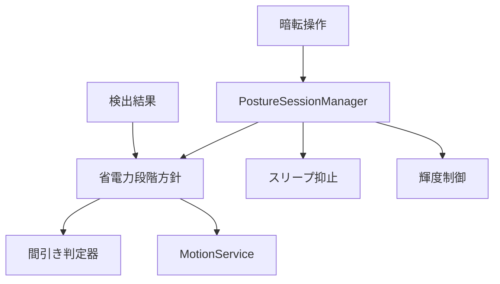
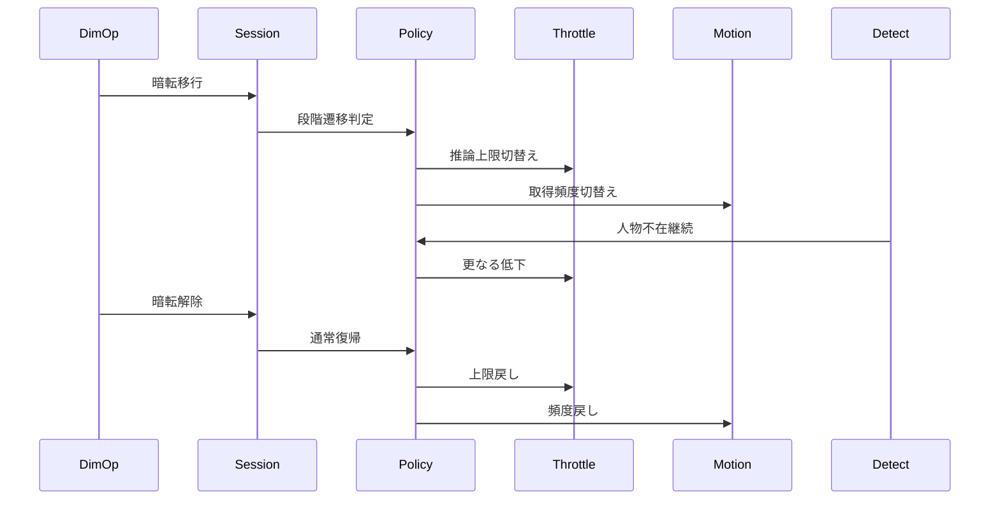
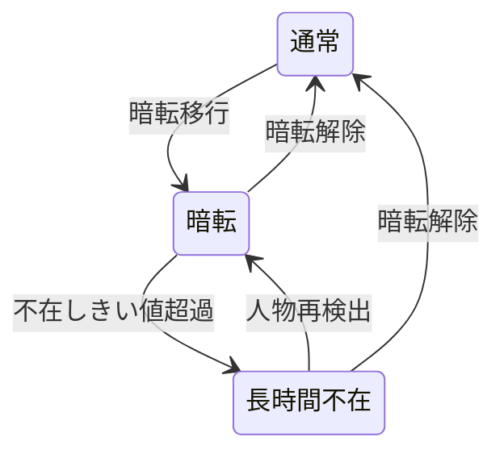

# Design: dim-mode-saving

## Overview

本機能は画面暗転モードを省電力モードの切替点として扱い、通常・暗転・長時間人物不在の3段階に応じて推論実行頻度とセンサー取得頻度を切替える。監視・判定・通知の振る舞いは変えず、頻度低下は上流specの確定方式（推論の時刻ゲート方式、センサーの間隔設定方式）の受口経由でのみ行う。輝度制御・自動スリープ抑止・センサー稼働の従属先は現行のまま分離維持し、カメラ停止は本フェーズで実装しない。

**Purpose**: 本機能は暗転中の不要処理を削減し、監視継続を保ったまま通常モードより低いバッテリー消費を利用者に届ける。

**Users**: 画面を暗くして長時間の姿勢監視を行うデスクワーカーが、暗転・復帰の既存操作のまま省電力の恩恵を受ける。効果を検証する開発者が、条件別の電力・復帰時間・精度を実測で把握する。

**Impact**: 暗転フラグのみで表示を切替えていた現行の暗転経路に、省電力段階の管理と上流方式への切替え指示が加わる。検出結果の意味・確定則・通知仕様・スリープ抑止則は不変である。

### Goals

- 通常・暗転・長時間不在の段階遷移と復帰則を定義し、段階に応じた頻度切替えを行う
- 推論実行頻度を暗転時に低下させ、長時間不在時さらに低下させ、復帰時に通常へ戻す
- センサー取得頻度を暗転時に低下させ、復帰時に通常へ戻す
- 輝度制御・スリープ抑止・センサー稼働の独立制御を維持する
- カメラ停止の評価観点と記録形式を定義する（実装は見送る）
- 条件別の電力・復帰時間・精度を実測記録する

### Non-Goals

- 通常モードの推論・センサー頻度の決定（上流specの選定結果を利用するのみ）
- 判定ロジック・通知仕様・暗転UIデザインの変更
- カメラ停止の実装（評価完了まで見送る）
- バックグラウンド監視の追加、カメラ権限・ライフサイクル仕様の変更
- 状態に応じた自動頻度切替の全体適応化（暗転段階のみ扱う）

## Boundary Commitments

### This Spec Owns

- 省電力段階（通常・暗転・長時間不在）の定義、遷移判定、復帰則
- 段階に応じた推論上限・センサー頻度の切替え指示と復帰時の戻し
- 不在しきい値（暗転中の人物不在から更なる低下へ移る条件）の定義と既定値
- カメラ停止の評価観点と記録形式の定義
- 条件別の実測記録の項目と形式

### Out of Boundary

- 推論間引きの判定則・上限値の選定（vision-fps-throttleが所有し、本specは切替え指示のみ行う）
- センサー頻度候補の選定・省略則・起停則（motion-frequencyが所有し、本specは受口利用のみ行う）
- 3秒確定則・閾値・代替鎖・通知仕様の変更
- カメラ停止の実装（評価完了まで範囲外）
- 輝度制御・スリープ抑止の則の変更（nekoze-fix仕様の既存則を維持する）

### Allowed Dependencies

- 上流制約としてnekoze-fix仕様§6（暗転）・§8.3／§8.4（スリープ抑止）・NFR 9.2（変更は許さない）
- vision-fps-throttleの間引き判定器と上限設定契約、FPS計測器の読出し形式
- 前提インターフェース（他spec側で並行修正中・本specは利用のみ）: `FrameThrottle.setLimit(_:)` 受口（fps側で追加）、`MotionService` の受動公開pull一本化（motion側で修正。Sessionが読取る方向のみとし、本サービスからの呼出しは作らない）
- motion-frequencyの頻度設定契約（許可値・既定値・許可外値の扱い）と計測契約
- 共有則として`setMotionRotationRunning`の起停契約（変更しない）
- 新規依存の追加は許さない

### Revalidation Triggers

- 推論上限設定・センサー頻度設定の契約形状の変更は、本specの切替え結線の再検証を要する
- 上流の許可値・既定値の変更は、不在しきい値を含む段階設定の再確認を要する
- 処理順序「間引き→条件化」の変更は、本specの前提崩壊として再検証を要する
- 不在しきい値の既定値・段階定義の変更は、下流の回帰（復帰時間・通知遅延）の再確認を要する
- 保持期間・変換式・代替鎖への合図の変更は、本specの範囲外として上流側の再確認を要する

## Architecture

### Existing Architecture Analysis

現行は`PostureSessionManager`（Session層・`@MainActor`）がセッション状態の唯一の書込み点であり、`enterDimMode`／`exitDimMode`は輝度保存・復元と`isDimmed`フラグ更新に閉じる。監視・判定は暗転と無関係に継続し、wake lockは監視フェーズに従属する不変条件で強制される。Motion・回転の起停は`setMotionRotationRunning`に一本化され、暗転中継続・背景停止が呼び出し側の則として維持される。推論経路は`captureOutput`先頭の時刻ゲート（vision-fps-throttle）に従い、重力取得は`MotionService`の間隔設定（motion-frequency）に従う。依存方向はTypes → Domain → Services → Session → UIであり、本変更はSession層の段階管理と新規の純粋値型に閉じる。

### Architecture Pattern & Boundary Map



**Architecture Integration**:

- Selected pattern: 段階方針の値型隔離＋上流受口への切替え指示（Sessionは適用結線のみ担う）
- Domain/feature boundaries: 段階遷移則の所有は新規の段階方針、頻度低下方式の所有は上流各方式、輝度・スリープ則の所有は既存の暗転・ライフサイクル則
- Existing patterns preserved: Session唯一書込み点、間引き→条件化の順序、起停一本化、wake lock不変条件、依存方向
- New components rationale: 遷移則を純粋な値型に隔離し、カメラなしで単体検証できるようにする
- Steering compliance: 新規依存なし、実測なき効果記載なし、3秒確定の意味不変、監視継続の期待変更なし

### Technology Stack

| Layer | Choice / Version | Role in Feature | Notes |
|-------|------------------|-----------------|-------|
| Session / Swift | 既存の管理層と新規の段階方針 | 段階遷移と切替え結線 | 新規依存なし |
| Services / 既存の取得基盤 | 既存の推論・センサー方式 | 上流受口の提供 | 方式自体の変更なし |

## File Structure Plan

### Modified Files

- `NekozeFix/Session/PostureSessionManager.swift` — 段階方針の所有、暗転移行・解除・復帰経路からの切替え結線、不在タイマーの駆動、復帰時の上限・頻度戻し
- `NekozeFix/Session/FrameThrottle.swift` — 上限変更の受口 `setLimit(_:)` の利用のみ（受口自体の追加はvision-fps-throttle側の契約変更であり、本specでは追加しない。上流specの再検証を前提とする）
- `NekozeFix/Services/MotionService.swift` — 頻度設定受口の利用のみ（受動公開pull一本化への修正はmotion-frequency側が所有。本specの実装では変更しない。未実装時は本specの実装に入らない）
- `NekozeFixTests/PostureSessionManagerTests.swift` — 段階遷移・復帰時戻し・戻し忘れ防止の結合検証追加
- `NekozeFixTests/FrameThrottleTests.swift` — 上限変更受口の回帰（既存の判定則回帰を含む）
- `NekozeFixTests/MotionServiceTests.swift` — 既存回帰の維持（全段階条件で再実行）

### Shared File Arbitration（`PostureSessionManager.swift` の適用順調停）

`PostureSessionManager.swift` は4specが編集するため、適用順を固定し競合時の調停則とする。適用順は fps（vision-fps-throttle）→ mainactor（mainactor-throttle）→ motion（motion-frequency）→ dim（本spec）とする。本specのSession編集は先行3specの適用完了版を前提版とし、先行specの結線（間引きゲート結線・ゲート排出と初期化配送・消費時参照記録の付随呼出し）を削除・移動しない。競合時は本spec側がリベースし、復帰時戻しの一本化（解除・開始・復帰経路での戻し）のみを付随させる。先行specの未完了時はtasks 1.1の先行条件確認で実装入りを見送る。

### New Files

- `NekozeFix/Session/DimPowerPolicy.swift` — 新規。段階定義・遷移判定・復帰則・不在しきい値を持つ値型
- `NekozeFixTests/DimPowerPolicyTests.swift` — 新規。遷移判定・復帰則・しきい値境界の単体検証

### Unchanged Files（参照・回帰のみ、変更なし）

- `NekozeFix/Types/PostureTypes.swift` — `isDimmed` フラグの契約は不変
- `NekozeFix/Domain/PostureAnalyzer.swift` — 判定・代替解決は不変
- `NekozeFix/UI/MonitorView.swift` — 暗転切替UIは不変

> 各ファイルは単一責任に収める。判定・表示・輝度・スリープ則のファイルへの変更はなし。検証記録（条件別実測と比較根拠）は Testing Strategy の形式に従い spec 配下に残す。

## System Flows





- 段階遷移は暗転操作と検出結果のみを入力とし、輝度・スリープ抑止の状態には従属しない
- 復帰時の上限・頻度戻しは解除経路（解除操作・監視開始・復帰）に一本化し、戻し忘れを起こさない
- 不在しきい値超過前の人物再検出は段階を進めず、長時間不在中の人物再検出は暗転段階へ戻す

## Requirements Traceability

| Requirement | Summary | Components | Interfaces | Flows |
|-------------|---------|------------|------------|-------|
| 1.1 | 暗転中の監視継続 | 既存暗転・復帰経路 | 変更なし | 状態遷移（不変） |
| 1.2 | 暗転移行 | 既存暗転・復帰経路 | 変更なし | 状態遷移（不変） |
| 1.3 | 暗転解除 | 既存暗転・復帰経路、復帰時戻し | 復帰契約 | 復帰フロー |
| 2.1 | 暗転時の推論低下 | 省電力段階方針、推論頻度連動 | 上限設定契約 | 切替えフロー |
| 2.2 | 不在時の更なる低下 | 省電力段階方針、推論頻度連動 | 上限設定契約 | 切替えフロー |
| 2.3 | 解除時の推論復帰 | 復帰時戻し | 復帰契約 | 復帰フロー |
| 2.4 | 3秒確定の意味維持 | 判定非回帰 | 既存契約 | 変更なし |
| 3.1 | 暗転時の取得低下 | 省電力段階方針、センサー頻度連動 | 頻度設定契約 | 切替えフロー |
| 3.2 | 暗転中の取得継続 | センサー頻度連動、既存起停 | 変更なし | 状態遷移（不変） |
| 3.3 | 解除時の取得復帰 | 復帰時戻し | 復帰契約 | 復帰フロー |
| 4.1 | 暗転中の抑止継続 | 既存抑止則 | 変更なし | 変更なし |
| 4.2 | 停止・退避時の復元 | 既存抑止則 | 変更なし | 変更なし |
| 4.3 | 解除時の輝度復元 | 既存暗転則 | 変更なし | 復帰フロー |
| 4.4 | 非監視時の標準維持 | 既存抑止則 | 変更なし | 変更なし |
| 5.1 | 評価前の停止禁止 | カメラ停止評価 | 評価契約 | 変更なし |
| 5.2 | 採用時の説明可能性 | カメラ停止評価 | 評価契約 | 変更なし |
| 5.3 | 停止採用時の復帰 | カメラ停止評価 | 評価契約 | 復帰フロー |
| 6.1 | 解除後の監視復帰 | 復帰時戻し | 復帰契約 | 復帰フロー |
| 6.2 | 判定則の維持 | 判定非回帰 | 既存契約 | 変更なし |
| 6.3 | 通知仕様の維持 | 判定非回帰 | 既存契約 | 変更なし |
| 7.1 | 条件別の実測記録 | 計測記録 | 計測契約 | 検証記録 |
| 7.2 | 推定記載禁止 | 計測記録 | 計測契約 | 検証記録 |
| 7.3 | 未計測明記 | 計測記録 | 計測契約 | 検証記録 |
| 8.1 | 暗転時の消費低減 | 省電力段階方針、計測記録 | 計測契約 | 検証記録 |
| 8.2 | 実測による低減確認 | 計測記録 | 計測契約 | 検証記録 |

## Components and Interfaces

| Component | Domain/Layer | Intent | Req Coverage | Key Dependencies (P0/P1) | Contracts |
|-----------|--------------|--------|--------------|--------------------------|-----------|
| 省電力段階方針 | Session / DimPowerPolicy | 段階定義・遷移判定・復帰則・不在しきい値 | 2.1, 2.2, 3.1, 8.1 | 推論頻度連動（P0）、センサー頻度連動（P0） | Service, State |
| 推論頻度連動 | Session / PostureSessionManager | 段階に応じた推論上限の切替え | 2.1, 2.2, 2.3 | 省電力段階方針（P0）、間引き判定器（P0） | State |
| センサー頻度連動 | Session / PostureSessionManager | 段階に応じた取得頻度の切替え | 3.1, 3.2, 3.3 | 省電力段階方針（P0）、MotionService（P0） | State |
| 復帰時戻し | Session / PostureSessionManager | 解除経路での上限・頻度の通常戻し | 1.3, 2.3, 3.3, 6.1 | 省電力段階方針（P0） | State |
| カメラ停止評価 | Session / 評価手順 | 停止採用の可否判断の記録形式 | 5.1, 5.2, 5.3 | なし | State |
| 判定非回帰 | Session・Domain / 既存則 | 確定・閾値・代替・通知の現行維持 | 1.1, 1.2, 2.4, 4.1, 4.2, 4.3, 4.4, 6.2, 6.3 | 既存の暗転・抑止・判定則（P0） | State |
| 計測記録 | Session・Services / 既存計測 | 条件別の電力・復帰・精度の実測記録 | 7.1, 7.2, 7.3, 8.1, 8.2 | 既存のFPS・Motion計測（P0） | State |

### Session / DimPowerPolicy

#### 省電力段階方針

| Field | Detail |
|-------|--------|
| Intent | 段階定義・遷移判定・復帰則・不在しきい値を単一に所有する |
| Requirements | 2.1, 2.2, 3.1, 8.1 |

**Responsibilities & Constraints**

- 段階（通常・暗転・長時間不在）の現在値と遷移判定を保持する
- 暗転移行で暗転段階へ進め、暗転解除で通常段階へ戻す
- 暗転中の人物不在がしきい値を超えた場合のみ長時間不在段階へ進める
- 不在しきい値の既定値は仮置きとし、実測記録で見直す

**Dependencies**

- Inbound: Session管理 — 暗転操作と検出結果の受取り（P0）
- Outbound: 推論頻度連動・センサー頻度連動 — 段階通知（P0）

**Contracts**: Service [x] / API [ ] / Event [ ] / Batch [ ] / State [x]

##### Service Interface

```swift
enum DimPowerStage {
    case normal
    case dimmed
    case dimmedAbsent
}

struct DimPowerPolicy {
    mutating func dimmed() -> DimPowerStage
    mutating func restored() -> DimPowerStage
    mutating func tick(isPersonDetected: Bool, now: TimeInterval) -> DimPowerStage
    var stage: DimPowerStage { get }
}
```

- Preconditions: 遷移判定は暗転操作と検出結果のみを入力とする。`now` は単調時刻系（`CACurrentMediaTime` 系、`FrameThrottle.shouldInfer(at:)`・MainHopGateの `submit(kind:phase:aspectRatio:at:)` と同一の `TimeInterval`）とし、`Date`・ wall-clockは用いない。比率変化はゲート内部比較とし、公開引数として扱わない。無効時刻の扱いは検出側の既存則に従う
- Postconditions: 段階遷移時は新段階を返し、遷移なしの場合は現段階を維持する
- Invariants: 不在しきい値は判定中に変わらない。段階は輝度・スリープ抑止の状態に従属しない

##### State Management

- State model: 現在段階、暗転中の連続不在時間、不在しきい値
- Persistence & consistency: プロセス内メモリのみ。判定経路は既存の直列実行に従い錠を新設しない
- Concurrency strategy: 段階判定は既存の検出・管理系列に従い、新規キューを作らない

**Implementation Notes**

- Integration: 検出結果の受取り点に付随させ、判定ロジックへの介入は行わない
- Validation: 遷移判定・復帰則・しきい値境界を単体検証する
- Risks: しきい値既定値の不適合 → 実測記録での見直しを再検証トリガーとして扱う

### Session / PostureSessionManager

#### 推論頻度連動

| Field | Detail |
|-------|--------|
| Intent | 段階に応じて推論上限を切替え、復帰時に通常へ戻す |
| Requirements | 2.1, 2.2, 2.3 |

**Responsibilities & Constraints**

- 暗転段階では通常より低い上限、長時間不在段階では更に低い上限を指示する
- 具体的な上限値は上流の選定結果の範囲内で選び、独自値を定めない
- 上限変更の有無で検出結果の意味と呼出互換を変えない

**Dependencies**

- Inbound: 省電力段階方針 — 段階通知（P0）
- Outbound: 間引き判定器 — 上限設定（P0）

**Contracts**: Service [ ] / API [ ] / Event [ ] / Batch [ ] / State [x]

##### State Management

- State model: 上限設定の適用状態のみ（段階の所有は段階方針）
- Persistence & consistency: 変更なし
- Concurrency strategy: 上限変更は検出キューへ配送し、判定中の変更を起こさない

**Implementation Notes**

- Integration: 上限変更受口 `setLimit(_:)` はvision-fps-throttle側の追加を前提インターフェースとして利用するのみとし、本specでは追加・変更しない。契約変更時は上流specの再検証を前提とする
- Validation: 段階別の上限適用と復帰時の戻しを結合検証する
- Risks: 上流受口の未実装 → 本specの実装に入らず先行完了を待つ

#### センサー頻度連動

| Field | Detail |
|-------|--------|
| Intent | 段階に応じて取得頻度を切替え、復帰時に通常へ戻す |
| Requirements | 3.1, 3.2, 3.3 |

**Responsibilities & Constraints**

- 暗転段階では通常より低い許可値を指示し、取得自体は継続する
- 許可値・既定値・許可外値の扱いは上流契約のまま変えない
- 起停一本化の契約を変更せず、起停と頻度切替えを混同しない

**Dependencies**

- Inbound: 省電力段階方針 — 段階通知（P0）
- Outbound: MotionService — 頻度設定（P0）

**Contracts**: Service [ ] / API [ ] / Event [ ] / Batch [ ] / State [x]

##### State Management

- State model: 頻度設定の適用状態のみ（段階の所有は段階方針）
- Persistence & consistency: 変更なし
- Concurrency strategy: 既存の管理系列に従い、新規キューを作らない

**Implementation Notes**

- Integration: 頻度切替えは開始時に反映する上流則に従い、暗転移行直後の反映遅延は次回開始基準で吸収される。`MotionService` の受動公開pull一本化（Sessionが読取る方向）はmotion-frequency側の修正を前提インターフェースとして利用するのみとし、本specでは変更しない
- Validation: 段階別の頻度適用と復帰時の戻しを結合検証する
- Risks: 反映遅延時の段階不一致 → 適用状態の読出しで検証時に確認する

#### 復帰時戻し

| Field | Detail |
|-------|--------|
| Intent | 解除経路で上限・頻度を通常へ戻し、戻し忘れを起こさない |
| Requirements | 1.3, 2.3, 3.3, 6.1 |

**Responsibilities & Constraints**

- 暗転解除・監視開始・フォアグラウンド復帰の各経路で通常段階への復帰と戻しを行う
- 輝度復元と上限・頻度戻しの順序を保ち、センサー稼働状態を変更しない
- 背景移行時は既存則（停止・退避）を優先し、戻しは復帰経路で行う

**Dependencies**

- Inbound: 解除・開始・復帰経路 — 復帰契機（P0）
- Outbound: 省電力段階方針 — 通常復帰の通知（P0）

**Contracts**: Service [ ] / API [ ] / Event [ ] / Batch [ ] / State [x]

##### State Management

- State model: 変更なし（段階の所有は段階方針）
- Persistence & consistency: 変更なし
- Concurrency strategy: 既存の管理系列に従う

**Implementation Notes**

- Integration: 既存の解除呼出し点（監視開始・停止・背景復帰）に付随させ、新規の解除経路を作らない
- Validation: 全解除経路での戻し完了を結合検証する
- Risks: 経路追加時の戻し漏れ → 解除経路の一覧を検証項目として維持する

### Session / 評価手順

#### カメラ停止評価

| Field | Detail |
|-------|--------|
| Intent | 停止採用の可否判断に必要な評価観点と記録形式を定義する |
| Requirements | 5.1, 5.2, 5.3 |

**Responsibilities & Constraints**

- 評価完了前の停止実装を禁止し、現フェーズでは停止経路を作らない
- 評価観点は復帰時間・再開時の検出遅延・再開コストとし、実測値のみで記録する
- 採用時は評価記録に基づく説明可能性を条件とする

**Dependencies**

- Inbound: なし（実装作業の前提条件として参照されるのみ）
- Outbound: なし

**Contracts**: Service [ ] / API [ ] / Event [ ] / Batch [ ] / State [x]

##### State Management

- State model: なし（実装を持たない手順定義である）
- Persistence & consistency: 評価記録は spec 配下に残し、推定値を含めない
- Concurrency strategy: 該当なし

**Implementation Notes**

- Integration: 本フェーズの実装対象外であり、評価記録の様式のみ提供する
- Validation: 評価未完了の状態で停止経路が存在しないことを検証で確認する
- Risks: 該当なし

## Data Models

本機能は新規の領域情報を作らない。段階方針の状態（現在段階・連続不在時間・不在しきい値）は `DimPowerPolicy` に閉じ、検出結果の型と3値の意味は現行のままである。不在しきい値の単位は秒（`TimeInterval`）、基準時計は単調時刻系（`CACurrentMediaTime` 系）とし、連続不在時間の計測も同一時計の差分で行う。`Date`・wall-clock系との混用はしない。計測値は既存のFPS計測器・Motion計測の形式に従い、永続化と外部送出は行わない。

## Error Handling

### Error Strategy

監視継続を優先し、段階管理の異常時は通常段階側に倒して検出機会を保つ。

### Error Categories and Responses

- 上流受口の未実装・取得不可: 段階遷移を行わず通常頻度を維持し、監視自体は継続する
- 不在判定の入力欠落: 長時間不在への遷移を見送り、暗転段階を維持する
- 復帰時の戻し失敗: 通常段階への復帰を再試行し、輝度復元と監視継続を優先する
- 背景移行・監視停止: 既存則（停止・退避）を優先し、段階状態は復帰経路で再構築する

### Monitoring

段階遷移の適用状態は、既存のFPS計測器・Motion計測の読出しにより検証時に確認する。記録には計測条件を付し、比較の再現性を保つ。

## Testing Strategy

- Unit Tests: 段階遷移判定（通常→暗転→長時間不在）、人物再検出時の戻り、暗転解除時の通常復帰、不在しきい値境界、上限変更受口の境界動作
- Integration Tests: 段階別の上限・頻度適用、復帰時の戻し完了（全解除経路）、3秒確定・猶予・ホールド則の回帰、起停・背景移行・抑止継続の既存回帰、評価未完了時の停止経路の不存在
- E2E/UI Tests（実機）: 暗転移行・復帰の操作回帰、復帰時間の計測、長時間不在からの復帰確認
- Performance/Load（実機）: 通常・暗転・長時間不在・復帰直後・長時間監視の各条件における電力消費・復帰時間・検出精度の記録、通常時との比較、NFR 9.2との整合確認（推定記載なし、未計測明記）

### 実測記録の正準雛形（4spec共通の集約先）

電力・CPU実測の記録は4specに分散するため、条件名・必須項目・記録雛形を本specに集約し、将来参照用とする（現時点で他specからの参照なし。後続で他specに参照1行追加が必要。他specファイルは本修正では触らない）。

- 条件名（固定）: 通常・暗転・長時間不在・復帰直後・長時間監視
- 必須項目（全条件共通）: 電力、復帰時間、精度。測定できない項目は「未計測」と明記し、推定値を記載しない
- 記録雛形:

```text
条件: 通常 / 暗転 / 長時間不在 / 復帰直後 / 長時間監視
電力: <実測値＋条件> / 未計測
復帰時間: <実測値＋条件> / 未計測
精度: <実測値＋条件> / 未計測
比較根拠: <通常時との比較・NFR 9.2との整合>
```

- カメラ停止に関する評価・記録は本雛形とは別枠とし、実装は行わず評価観点と記録形式の定義に留める（評価完了まで停止経路を作らない方針は不変）。
