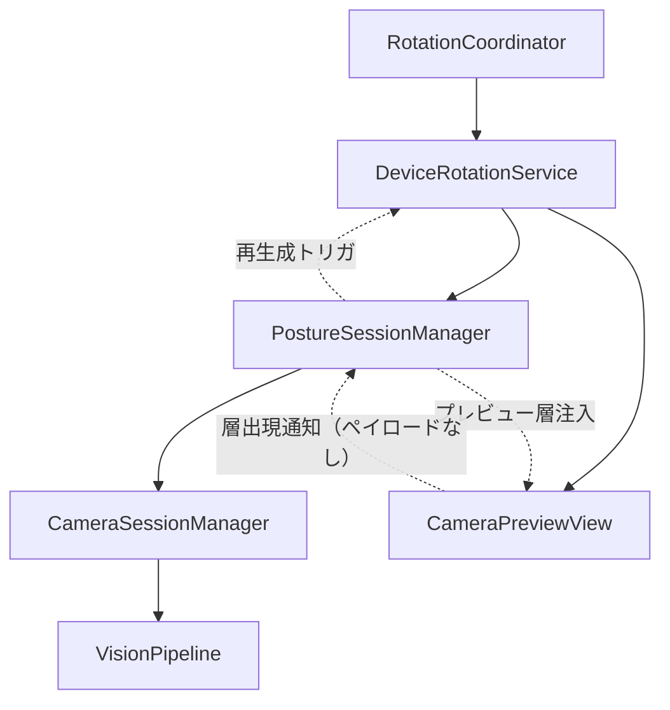
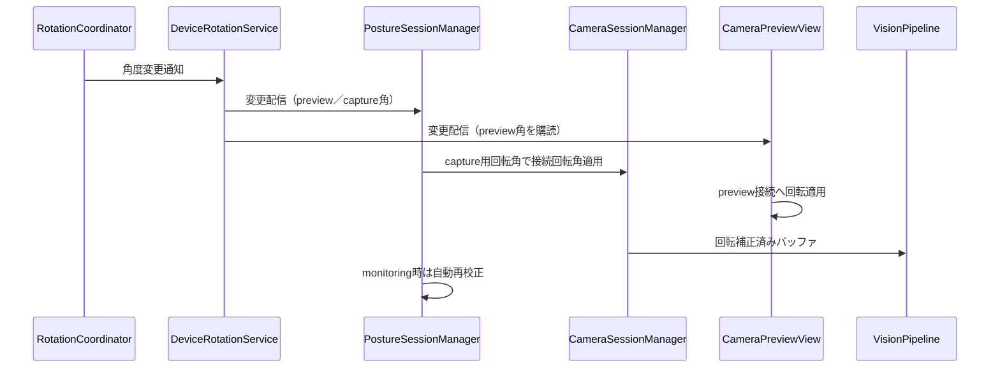

# Design: ios17-baseline

## Overview
**Purpose**: NekozeFix の回転角取得・適用経路を iOS 17 推奨方式へ移行し、非推奨警告を除去する。
**Users**: NekozeFix の開発者はクリーンなビルド基盤を得る。エンドユーザーの操作と見た目は変わらない。
**Impact**: UIDevice通知換算・デバイス姿勢→回転角の換算表・重複 monitor を `DeviceRotationService` 単一経路に置換する。判定・校正・通知・暗転・ライフサイクルの振る舞いは不変である。

### Goals
- 非推奨 `AVCaptureVideoOrientation` 依存の除去と警告ゼロ
- 回転角取得の単一信頼源化（preview／capture 回転角と変更通知）
- 既存振る舞いの完全維持（全テスト＋iPad 9th 実機で検証）
- 文書・設定の iOS 17 前提への統一

### Non-Goals
- `@Observable` 移行、Swift 6 厳密並行対応
- 判定ロジック・閾値・UI 見た目の変更
- 電池・性能の数値改善

## Boundary Commitments

### This Spec Owns
- 回転角の取得・配信の単一経路（回転角の取得、変更通知、カメラ切替時の再生成）
- preview／data-output 接続への回転適用方式
- デバイス姿勢不明時の維持則（直前有効値の保持）
- 16+ 残滓の除去（コード・設計書・タスクの表記統一）
- 移行前後の振る舞い同等性の検証条件

### Out of Boundary
- 姿勢判定・校正・通知・暗転・ライフサイクルの中身（nekoze-fix spec の所有。振る舞い維持のみ保証）
- 重力取得・変換則（14.2 修正で確定済み。デバイス姿勢を入力に取らない）
- `@Observable` 移行などの近代化全般

### Allowed Dependencies
- Upstream: nekoze-fix spec（2.3, 2.4, 4.1, 4.2, 4.3, 4.4, 4.5, 4.6, 4.7, 4.8, 7.1, 7.2, 8.1, 8.2, 8.3, 8.4 の振る舞いを変えないことが制約）
- Shared: 既存レイヤード構成（Types → Domain → Services → Session → UI）。依存方向の遵守を強制する
- External: AVFoundation `AVCaptureDeviceRotationCoordinator`（iOS 17+、Apple 純正）

### Revalidation Triggers
- 回転角の契約形状変更（角度単位・通知タイミング・再生成条件）
- 回転角変更購読経路の変更（Session トリガ・自動再校正への影響）
- data-output バッファ向き前提の変更（Vision `.up` 固定への影響）
- 対応 OS 下限の変更

## Architecture

### Existing Architecture Analysis
- 現行は UIDevice通知→自前換算（device→video マッピング表＋windowScene フォールバック）→`currentVideoOrientation` 発行→Session／preview が各々適用する二重経路である
- `isRotating`＋5秒タイマ・`.rotating` phase値は設定・購読がなく、回転過渡の停止は実質 13.3 自動再校正が担っている
- `videoAspectRatio` はフレーム実測で更新され、回転角換算と独立している

### Architecture Pattern & Boundary Map


- Selected pattern: 既存レイヤードの維持＋回転角の信頼源集約。回転角の取得は新規サービスに集約する。適用は接続所有者ごとに行う：data-output 接続は `CameraSessionManager`、preview 接続は `CameraPreviewView` が同一 Service の購読により適用する（Q1決定 A案）
- Domain/feature boundaries: 回転角の取得・配信は `DeviceRotationService`、data-output 接続への適用は `CameraSessionManager`、preview 接続への適用は `CameraPreviewView`、購読とトリガ・再生成指示は `PostureSessionManager`。二重解決・隠れた共有所有を作らない。View は角度の取得・判断を持たず、配信値の適用のみ行う（「表示専用」の読み替え）
- Existing patterns preserved: レイヤード依存方向、合成フレーム注入テストシーム、`videoAspectRatio` 実測、自動再校正経路
- New components rationale: `DeviceRotationService`（coordinator 所有・再生成・変更配信を単一責務化）
- Steering compliance: steering なし。本設計は既存パターンと要件のみに準拠する

### Technology Stack

| Layer | Choice / Version | Role in Feature | Notes |
|-------|------------------|-----------------|-------|
| Services | AVFoundation RotationCoordinator / iOS 17.0 | 回転角取得 | UIDevice換算の置換え。詳細は research.md |
| Services | AVFoundation videoRotationAngle / iOS 17.0 | 接続回転適用 | videoOrientation の置換え |
| Runtime | iOS 17.0 deployment target | 前提統一 | 既定 17.0、`@available` 分岐なし |

## File Structure Plan

### Modified Files
- `NekozeFix/Services/CameraSessionManager.swift` — data-output 接続への回転角適用。`fromDeviceOrientation` 換算・`videoOrientation` 設定の削除（preview 接続への適用は持たない）
- `NekozeFix/Session/PostureSessionManager.swift` — 回転角変更購読の一本化。新トリガ署名への移管、自動再校正トリガ・`isLandscape` 導出の維持、coordinator 再生成トリガの発行
- `NekozeFix/UI/CameraPreviewView.swift` — UIDevice直接参照の削除。`DeviceRotationService` の購読により preview 接続へ回転角を適用する
- `NekozeFix/Types/PostureTypes.swift` — 到達不能 `.rotating` case の削除
- `NekozeFix/UI/MonitorView.swift`・`NekozeFix/UI/RootView.swift` — 到達不能 `.rotating` 分岐の削除（見た目・文言の変更なし）
- `NekozeFix/Services/MotionService.swift` — `videoOrientation` 言及コメントの更新
- `NekozeFixTests/OrientationRecalibrationTests.swift` — 新トリガ署名への追従
- `NekozeFixTests/PostureSessionManagerTests.swift` — rotating系テスト（`testSetPhase_rotating_...` 等）の更新・削除
- `.kiro/specs/nekoze-fix/design.md` — tech stack の 16+ 表記更新（回転角関連記述）
- `.kiro/specs/nekoze-fix/tasks.md` — tasks 1.1 の 16+ 表記更新

### Created Files
- `NekozeFix/Services/DeviceRotationService.swift` — coordinator 所有・回転角配信・カメラ切替時再生成

### Deleted Files
- `NekozeFix/Services/DeviceOrientationMonitor.swift` — 移管完了後に削除（5秒タイマ・フォールバック推定ごと）

> 各ファイルは単一責務とする。

## System Flows



- 回転過渡時は自動再校正経路を通る（詳細は PostureSessionManager を参照）
- カメラ切替時は Session が coordinator再生成を指示してから接続を再構成する。プレビュー層は Session が生成して View へ注入し、層出現時も同様にcoordinator再生成する。coordinator再生成と接続再構成の順序・キュー保証は実装タスクで定義する（初回・切替・層再出現の3ケース）

## Requirements Traceability

| Requirement | Summary | Components | Interfaces | Flows |
|-------------|---------|------------|------------|-------|
| 1.1, 1.2 | 警告ゼロ・下限17.0 | DeviceRotationService, CameraSessionManager, CameraPreviewView, Docs | Service, State | — |
| 2.1, 2.2, 2.3, 2.4 | デバイス姿勢追従の一貫性 | DeviceRotationService, PostureSessionManager, CameraSessionManager | Service, State | 回転角変更 |
| 3.1, 3.2 | カメラ切替時の継続 | DeviceRotationService, PostureSessionManager | Service | — |
| 4.1 | デバイス姿勢不明時の維持 | DeviceRotationService, PostureSessionManager | Service, State | — |
| 5.1, 5.2, 5.3 | 振る舞い同等性 | 全体、テスト戦略 | — | 回転角変更 |

## Components and Interfaces

| Component | Domain/Layer | Intent | Req Coverage | Key Dependencies (P0/P1) | Contracts |
|-----------|--------------|--------|--------------|--------------------------|-----------|
| DeviceRotationService | Services | 回転角取得・配信・再生成 | 1.1, 2.1, 2.2, 3.1, 3.2, 4.1 | RotationCoordinator (P0 External), PostureSessionManager 購読・再生成トリガ (P0) | Service, State |
| CameraSessionManager | Services | data-output 接続への回転角適用 | 1.1, 2.1, 2.2, 3.1, 3.2 | Session 転送の capture用回転角 (P0), PostureSessionManager (P0) | Service |
| PostureSessionManager | Session | 回転角変更購読・再校正・表示維持・再生成指示 | 2.1, 2.2, 2.3, 2.4, 3.1, 3.2, 4.1, 5.1, 5.2, 5.3 | DeviceRotationService (P0), Overlay (P0) | State |
| CameraPreviewView | UI | preview 接続への回転適用（Service 購読） | 2.1, 2.2 | DeviceRotationService の角度配信 (P0) | — |

### Services

#### DeviceRotationService（新設）

| Field | Detail |
|-------|--------|
| Intent | 回転角の取得・配信・カメラ切替時再生成を単一所有する |
| Requirements | 1.1, 2.1, 2.2, 3.1, 3.2, 4.1 |

**Responsibilities & Constraints**
- coordinator インスタンスの保持・破棄は本サービスが所有する
- 生成・再生成の契機は Session が通知する：device 確定時（カメラ構成時）とプレビュー層出現時。coordinator 初期化用のプレビュー層インスタンスは Session が生成して View へ注入する（所有権は Session。View 側で生成しない。View→Session通知ペイロードは作らない）
- preview 用・capture 用の回転角（度）を `@Published` で配信する。KVO 通知はメイン配送である
- デバイス姿勢不明時はイベントを発火せず直前の有効角を保持し、nil や推測角を流さない（coordinator は horizon-level 角を常時返すため、実機では不明事象は到達しない想定。不明時維持はsmoke確認のみとし、TestDouble再現テストは行わない）
- UIDevice通知の購読・自前換算表・フォールバック推定を持たない

**Dependencies**
- Downstream consumers（データフロー送出先）: PostureSessionManager — 変更購読（Criticality P0）、CameraPreviewView — preview角の購読（Criticality P0）
- Lifecycle drivers（生成・再生成の指示元）: PostureSessionManager — 再生成トリガ通知（Criticality P0）
- Outbound: RotationCoordinator — 回転角取得（Criticality P0 External）

**Contracts**: Service [x] / API [ ] / Event [ ] / Batch [ ] / State [x]

##### Service Interface
```swift
final class DeviceRotationService {
  init(device: AVCaptureDevice, previewLayer: AVCaptureVideoPreviewLayer?)
  @Published private(set) var previewRotationAngle: CGFloat // 度
  @Published private(set) var captureRotationAngle: CGFloat // 度
  func recreate(for device: AVCaptureDevice, previewLayer: AVCaptureVideoPreviewLayer?)
  func start()
  func stop()
}
```
- 注：`previewLayer` の型は coordinator が求めるプレビュー層型とする（`CALayer?` では不可。実装時に API 署名を確認すること）
- Preconditions: start は監視・校正開始時に呼ばれ、stop は停止・背景移行時に呼ばれる（Motion起停と同一則）
- Postconditions: 返値は度単位の有効角、または直前有効角。不明時に推測値を返さず、イベントも発火しない
- Invariants: 同一物理姿勢では同一角度を返す。カメラ切替後は新デバイスの角度を返す

##### State Management
- State model: 直近有効角（preview／capture）＋動作有無のみ保持し、永続化しない
- Persistence & consistency: プロセス内メモリのみ
- Concurrency strategy: KVO はメイン配送。読取りはメイン。最新値の上書きのみ

**Implementation Notes**
- Integration: Session は変更購読のみ結線する。data-output 接続への適用は CameraSessionManager、preview 接続への適用は CameraPreviewView が行う
- Validation: 角度配信テスト・切替再生成テスト・不明時維持（smokeのみ）。全スイート回帰
- Risks: KVO 通知遅延（報告例で約1秒）は 0.5 秒ホールド・校正不安定リセット・自動再校正で吸収することを実機で検証する（吸収可否は実測し、追加対策が必要な場合は別タスク化のうえ nekoze-fix 側へ境界通知すること）

#### CameraSessionManager（改修）

| Field | Detail |
|-------|--------|
| Intent | 接続への回転適用を担う |
| Requirements | 1.1, 2.1, 2.2, 3.1, 3.2 |

**Responsibilities & Constraints**
- data-output 接続にcapture用回転角を適用する。preview 接続への適用は持たない（`CameraPreviewView` が同一 Service の購読により行う）。Vision へ渡すバッファ向き（`.up` 固定）を保つ
- Session から capture用回転角を受けて適用する。適用インターフェース：`updateCaptureRotationAngle(_ degrees: CGFloat)`
- `fromDeviceOrientation` 換算・`videoOrientation` 設定・前面ミラー以外のデバイス姿勢の推測を持たない（前面ミラー設定は維持）
- 対応可否を実行時判定し、非対応時は回転角適用を見送る（退行則）

**Dependencies**
- Inbound: PostureSessionManager — capture用回転角の受渡し（Criticality P0）
- Outbound: AVCaptureSession 接続 — 回転適用（Criticality P0）

**Contracts**: Service [x] / API [ ] / Event [ ] / Batch [ ] / State [ ]

**Implementation Notes**
- Integration: Session から転送される capture用回転角を唯一の駆動源とする。UIDevice直接参照を持たない。preview 接続には触らない
- Validation: デバイス姿勢別バッファ・preview 一致テスト。前面／背面の両方で確認
- Risks: data-output 接続の回転角変更に伴うフレーム配送途切れの有無を実機で確認する

### Session

#### PostureSessionManager（改修）

| Field | Detail |
|-------|--------|
| Intent | 回転角変更購読・自動再校正・表示維持を担う |
| Requirements | 2.1, 2.2, 2.3, 2.4, 3.1, 3.2, 4.1, 5.1, 5.2, 5.3 |

**Responsibilities & Constraints**
- 回転角変更購読を新サービスへ一本化する。自動再校正トリガ・`isLandscape` 導出・ゲート破棄則は変えない
- 新トリガ署名：`handleRotationAngleChange(preview: CGFloat, capture: CGFloat)`（いずれも度単位）。旧 `handleVideoOrientationChange(_: AVCaptureVideoOrientation)` は削除する
- Session は capture用回転角を `CameraSessionManager` へ転送する。preview用回転角の転送は行わない（View が Service を直接購読するため）
- coordinator 再生成の指示元である：device 確定時（カメラ構成時）とプレビュー層出現時に `recreate` を呼ぶ
- `isLandscape` 導出則：capture用回転角を用い、下表で判定する（coordinator実機規約はセンサ基準であり、ポートレートで90°・ランドスケープで0°/180°を取る。センサがランドスケープネイティブのため。WWDC23 10106。capture用回転角は Vision バッファと一致し、`isLandscape` の判定は軸方向のみを見るため前面鏡の影響を受けない。実機で検証条件化する）。
  - 境界ヒステリシスは実測後に追加検討する（初期実装なし）

  | capture角（度） | 判定 |
  |----------------|------|
  | 90°±45°、270°±45° | ポートレート（`isLandscape = false`） |
  | 0°±45°、180°±45° | ランドスケープ（`isLandscape = true`） |
- 描画基準線（referenceVector）は重力解決の返値に直近capture角θの(θ−90°)回転を適用して受渡す（重力はデバイス座標系・キーポイントは回転済みバッファ座標系のため。未確定時は無回転）。preview用回転角は転送しない
- `.rotating`／`isRotating` の死経路は除去する。過渡停止は自動再校正経路に一本化する（振る舞い不変）
- 状態機械・ゲート・通知・暗転・スリープ則は変えない

**Dependencies**
- Inbound: UI intents — 既存（Criticality P0）
- Outbound: DeviceRotationService — 回転角変更購読（Criticality P0）
- Outbound: CameraSessionManager — 回転角適用指示（Criticality P0）

**Contracts**: Service [ ] / API [ ] / Event [ ] / Batch [ ] / State [x]

**Implementation Notes**
- Integration: 既存 `handleVideoOrientationChange` 相当の処理は `handleRotationAngleChange(preview:capture:)` へ移管する。`OrientationRecalibrationTests` を角度値の直接注入に書き換え、`PostureSessionManagerTests` の rotating系を更新する
- Validation: 自動再校正・デバイス姿勢不明維持・カメラ切替の結合テスト。全スイート回帰
- Risks: トリガ署名変更に伴うテスト更新漏れ。grep で旧シンボル残存を確認する

### UI

#### CameraPreviewView（改修）
- UIDevice直接参照・通知購読を削除する。Session が所有する `DeviceRotationService` の同一インスタンスを参照し、`previewRotationAngle` を購読して preview 接続へ適用する。角度の取得・判断は持たず、配信値の適用のみ行う
- preview layer インスタンスは Session が生成して注入するものを使用する（View 側で生成しない）。層出現時（`didMoveToWindow` 相当）はペイロードなしで Session へ通知し、Session が所有層で `recreate` する
- Requirements: 2.1, 2.2

## Data Models
- 変更なし。`SessionSnapshot`（`isLandscape`、`videoAspectRatio`、`referenceVector`）の形状・意味は維持する

## Error Handling

### Error Strategy
- 回転角の取得失敗・非対応時は直前有効角を維持し、監視を継続する（代替鎖へは既存則で退行）

### Error Categories and Responses
- デバイス姿勢不明・平置き → 直前有効角を維持し、重力側の代替鎖は既存則で継続
- 回転角の適用非対応 → 回転角適用を見送り、現行回転角で継続（クラッシュさせない）
- coordinator 生成失敗（カメラなし等）→ 既存のカメラ不在時処理に委譲する

### Monitoring
- 既存の print 診断則に従う。新規の永続ログは作らない

## Testing Strategy
- Unit Tests: 角度配信（preview／capture の両角）、切替再生成（前面→背面で新デバイス角）、不明時維持（smokeのみ。TestDouble再現なし）、`isLandscape` 対応表（前面／背面の例値でsmoke確認。ヒステリシスなし）、対応可否の退行則
- Integration Tests: 回転角変更→接続適用→自動再校正の結合（TestDouble 角度で校正→基準保存→再校正遷移→完了復帰）、カメラ切替後の回転角継続、前面／背面の両経路、通知・暗転・スリープ則の同等性（既存テストの green 維持で確認）
- E2E/UI Tests: 監視中の回転→再校正→復帰の実機フロー（iPad 9th）。縦・横・回転遷移・代替表示の目視確認。KVO通知遅延の実測（UIDevice通知との差）と吸収確認（2.3, 2.4。合否基準：回転から自動再校正発火まで2秒以内＝暫定値、9th 実機で校正）
- Performance/Load: 回転角変更時のフレーム配送途切れの有無を実機で確認する

## Performance & Scalability
- 回転角適用はデバイス姿勢変化時のみであり、定常監視の負荷は変えない。KVO 配送はメイン限定・最新値上書きのみとする

## Migration Strategy
- 永続データ・外部契約の変更なし。移行フェーズなし。旧シンボル（`fromDeviceOrientation`、`currentVideoOrientation`、`isRotating`、`.rotating`）の残存を grep で確認し、クリーンビルドで非推奨警告ゼロを確認してから完了とする

## Supporting References
- Apple 開発者文書：RotationCoordinator（preview／capture の horizon-level 回転角、KVO はメイン配送）、WWDC23 セッション 10106（外部カメラ対応と回転の扱い、data-output 接続の回転角変更はフレーム配送に影響し得る）
- 詳細な調査記録は `research.md` を参照

## Open Questions / Risks
- KVO 通知遅延の実測値（9th 実機で UIDevice通知との差を測定する）
- data-output 接続の回転角変更に伴うフレーム配送途切れの有無と影響
- `.rotating`／`isRotating` 除去に伴う UI 切替分岐（`MonitorView`・`RootView` の case）は削除する（File Structure Plan に計上済み）。見た目・文言の変更は行わない
