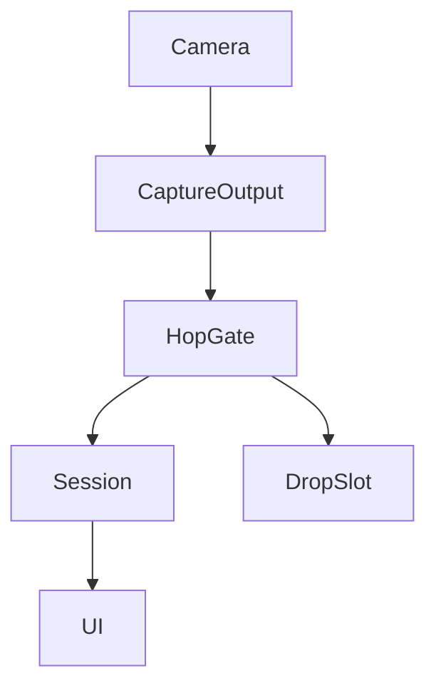
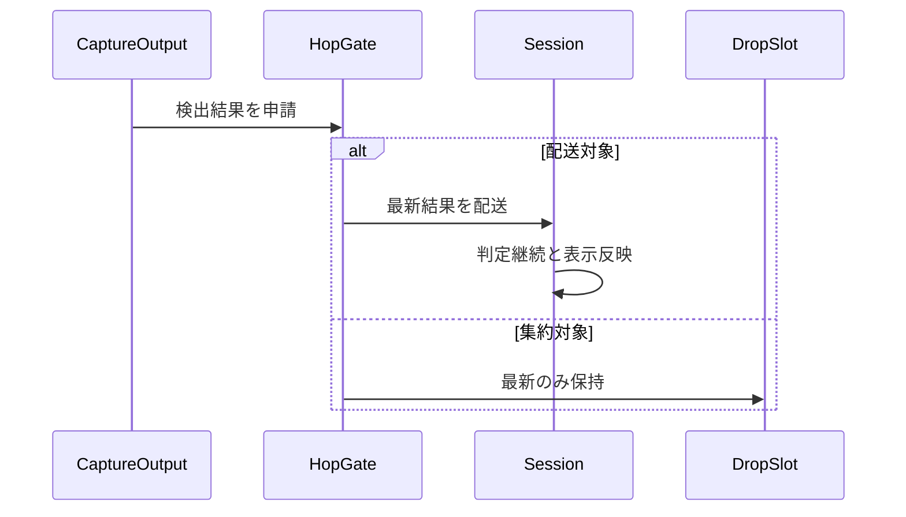
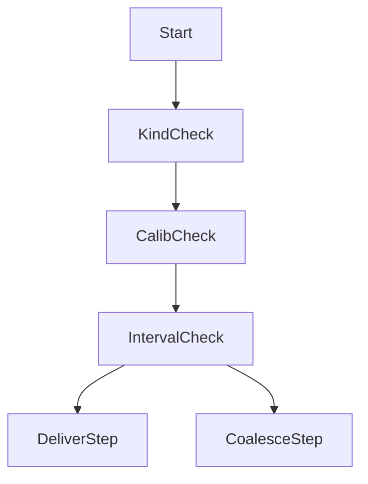

# Design: mainactor-throttle

## Overview

本機能は共有呼出点 `captureOutput` の Task 生成直前に三条件ゲートを置き、定常連続フレームの Main 受け渡しを最新優先で間引きつつ、判定転換に直結する遷移フレームと校正中の蓄積フレームを全量配送する。判定処理自体は Main に残し表示更新の配送頻度だけを抑えることで、3秒確定判定の意味と判定算出を変えずに Main タスク投入頻度とスナップショット書込み churn を削減する。

**Purpose**: 本機能は姿勢判定の継続性を維持したまま表示更新のみを独立最適化し、不要な Main 反映処理によるバッテリー消費を抑える価値を長時間監視の利用者に届ける。

**Users**: 長時間の姿勢監視を行うデスクワーカーが、操作変更なしに省電力の恩恵を受ける。効果を検証する開発者が、受け渡し頻度・待ち時間・通知遅延を実測で把握する。

**Impact**: 毎フレーム Task 生成する現行の呼出点を、ゲート通過分のみ Task 生成し不通過分は単一スロットに最新保持する呼出点に変える。検出結果の3値の意味と呼び出し互換は不変である。

### Goals

- 検出結果の Main 反映待ちの待ち時間・蓄積状況を計測する
- 不要な中間結果の破棄と最新結果優先により Main 受け渡し頻度を削減する
- 表示項目のまとめ反映と不変値の書込み回避により書込み churn を抑える
- 判定継続性・状態表示・通知タイミング・復帰挙動を現行のまま維持する
- 通常・暗転・不在・復帰・猫背・長時間シナリオで受け渡し頻度・待ち時間・通知遅延を実測記録する

### Non-Goals

- 推論FPS自体の制限・顔条件化ロジックの変更（上流 spec の範囲）
- 3秒確定・角度／距離閾値・判定算出・信頼度閾値・近側選択則の変更
- UIデザイン変更、Motion受信受け渡し・暗転表示切替の変更
- 判定処理の検出キュー移管や新規スレッド機構の導入

## Boundary Commitments

### This Spec Owns

- 呼出点の Task 生成直前の三条件ゲート判定と不通過フレームの単一スロット最新保持
- 定常間引き・遷移強制・校正中全量配送の配送則と表示更新間隔の設定方法
- 表示専用値の不変値書込み回避（画面比率の変化時のみ書込み）
- 受け渡し前段の待ち時間・蓄積・配送頻度の計測値の所有と読み出し形式
- 停止・再開時のゲート状態の初期化

### Out of Boundary

- Vision推論の実行要否・頻度の判断と顔条件化の検出内容（上流2 spec が所有し、本 spec は通過・配送後の結果を消費するのみ）
- 3秒確定ゲート・0.5秒系猶予・ホールド・平滑化・信頼度閾値・近側選択則の変更
- 判定算出（`PostureAnalyzer` 純関数）と校正蓄積則の変更
- カメラ解像度・プリセット・遅延破棄の運用、通知音・暗転・動作検知の変更
- 事象駆動の受け渡し（回転角配信・カメラ確定通知・設定変更時の再起動）の変更

### Allowed Dependencies

- 上流制約として nekoze-fix 仕様§3.3・§4・§5・§8・NFR 8.2（変更は許さない）
- vision-face-conditional の検出契約（3値の意味と呼出互換、処理順序は間引き→条件化→受け渡し削減）
- vision-fps-throttle の推論FPS確定値（受け渡し削減の入力レート前提、変更は許さない）
- AVFoundation の検出キューと既存の検出・セッション層（新規依存の追加は許さない）

### Revalidation Triggers

- 検出の公開署名や3値の意味の変更は、本 spec の配送則の再検証を要する
- 処理順序「間引き→条件化→受け渡し削減」の変更は、本 spec の前提崩壊として再検証を要する
- 表示更新間隔の考え方が時刻基準以外に変わる場合は、下流 dim-mode-saving の再検証を要する
- 計測値の形式変更は、下流 spec への引き渡しの再確認を要する
- 判定系の猶予・平滑への波及は、本 spec の範囲外として別 spec での扱いを要する

## Architecture

### Existing Architecture Analysis

現行は `captureOutput`（`detectionQueue` 上の同期実行）が全フレームで `PoseDetector.detect` を呼び、結果を毎フレーム `Task { @MainActor in ... }` で `processDetection` へ渡す。`processDetection` は判定継続に必要な処理（信頼度記録・3値分岐・フィルタ・ホールド・解析・ゲート・通知）と表示専用処理（可視化点・ガイド・画面比率書込み）を一括で実行する。判定系は時刻差分駆動（ゲートの `deltaTime`、校正投入の `now`、0.5秒系グレース）のため到着回数に依存しない。依存方向は Types → Domain → Services → Session → UI であり、本変更は Session 層の呼出点と新規の値型ゲートに閉じる。

### Architecture Pattern & Boundary Map



**Architecture Integration**:

- Selected pattern: 検出キュー側の三条件ゲートによる最新優先の合流（待機は単一スロット、蓄積なし）
- Domain/feature boundaries: 配送可否の所有は新規ゲート、判定継続の所有は既存の Session 則、表示の所有は既存の UI 則
- Existing patterns preserved: 検出キュー同期実行、3値優先の合成順序、時刻差分駆動の確定・猶予則、スナップショット唯一書込み点
- New components rationale: 配送則を純粋な値型に隔離し、カメラなしで単体検証できるようにする。計数は判定点に内包し取りこぼしをなくす
- Steering compliance: 新規依存なし、実測なき効果記載なし、3秒確定の意味不変、依存方向の維持

### Technology Stack

| Layer | Choice / Version | Role in Feature | Notes |
|-------|------------------|-----------------|-------|
| Session / Swift | 既存の呼出点と新規の値型ゲート | 配送則と計測と結線 | 新規依存なし |
| Services / AVFoundation | 既存の検出キューと遅延破棄 | 提示と遅延破棄の運用維持 | 変更なし |

## File Structure Plan

### Directory Structure

変更は Session 層に局在し、新規ファイルはゲートの1件のみである。

### Modified Files

- `NekozeFix/Session/MainHopGate.swift` — 新規。三条件ゲート判定・単一スロット・計数の値型
- `NekozeFix/Session/PostureSessionManager.swift` — `captureOutput` へのゲート結線、表示専用値の不変値スキップ、停止・再開経路からの初期化呼び出し
- `NekozeFix/Services/PoseDetector.swift` — 変更なし（検出3値契約の確認対象）
- `NekozeFix/Services/CameraSessionManager.swift` — 変更なし（検出キューと遅延破棄運用の確認対象）
- `NekozeFixTests/MainHopGateTests.swift` — 新規。配送則・最新優先・初期化・計数の単体検証
- `NekozeFixTests/PostureSessionManagerTests.swift` — 結線と非回帰の検証追加

## System Flows





- 検出種別の遷移と非 pose 結果は表示更新間隔にかかわらず即時配送する
- 校正フェーズ中は全量配送し、校正蓄積の意味を変えない
- 定常 pose 連続のみ表示更新間隔で間引き、不通過分は単一スロットに最新のみ保持する
- 排出時は常に最新の結果で判定継続と表示反映を行い、古い中間結果の遅延反映を起こさない

## Requirements Traceability

| Requirement | Summary | Components | Interfaces | Flows |
|-------------|---------|------------|------------|-------|
| 1.1 | 待ち時間計測 | 受け渡し計測器 | 計測契約 | 計測読出 |
| 1.2 | 蓄積数計数 | 受け渡し計測器 | 計測契約 | 計測読出 |
| 1.3 | 計測値読出し | 受け渡し計測器 | 計測契約 | 計測読出 |
| 2.1 | 中間破棄と最新優先 | 受け渡し集約器、呼出統合 | 配送契約 | 集約フロー |
| 2.2 | 受け渡し頻度抑制 | 受け渡し集約器 | 配送契約 | 集約フロー |
| 2.3 | 古び防止 | 受け渡し集約器、呼出統合 | 配送契約 | 集約フロー |
| 3.1 | まとめ反映 | 呼出統合 | 配送契約 | 集約フロー |
| 3.2 | 不変値書込み省略 | 表示書込み最適化 | 配送契約 | 集約フロー |
| 3.3 | 変化時の更新 | 表示書込み最適化 | 配送契約 | 集約フロー |
| 4.1 | 判定継続 | 受け渡し集約器、呼出統合 | 配送契約 | 集約フロー |
| 4.2 | 3秒確定維持 | 判定非回帰 | 既存契約 | 変更なし |
| 4.3 | 算出非回帰 | 判定非回帰 | 既存契約 | 変更なし |
| 4.4 | 猶予平滑維持 | 判定非回帰 | 既存契約 | 変更なし |
| 4.5 | 上流判断不変 | 呼出統合 | 配送契約 | 変更なし |
| 5.1 | 状態表示維持 | 体験非回帰 | 既存契約 | 変更なし |
| 5.2 | 通知0.5秒維持 | 体験非回帰 | 既存契約 | 検証記録 |
| 5.3 | 改善時停止維持 | 体験非回帰 | 既存契約 | 変更なし |
| 5.4 | 暗転復帰維持 | 体験非回帰、呼出統合 | 既存契約 | 変更なし |
| 6.1 | 書込み単一性 | 呼出統合 | 配送契約 | 変更なし |
| 6.2 | 競合回避 | 受け渡し集約器、呼出統合 | 配送契約 | 集約フロー |
| 6.3 | 周辺振舞維持 | 呼出統合 | 既存契約 | 変更なし |
| 7.1 | 計測記録 | 受け渡し計測器 | 計測契約 | 検証記録 |
| 7.2 | 推定記載禁止 | 受け渡し計測器 | 計測契約 | 検証記録 |
| 7.3 | 未計測明記 | 受け渡し計測器 | 計測契約 | 検証記録 |

## Components and Interfaces

| Component | Domain/Layer | Intent | Req Coverage | Key Dependencies (P0/P1) | Contracts |
|-----------|--------------|--------|--------------|--------------------------|-----------|
| 受け渡し集約器 | Session / MainHopGate | 三条件による配送選定と最新優先保持 | 2.1, 2.2, 2.3, 4.1, 6.2 | 呼出統合 (P0) | Service, State |
| 受け渡し計測器 | Session / MainHopGate | 待ち時間と蓄積と頻度の記録 | 1.1, 1.2, 1.3, 7.1, 7.2, 7.3 | 受け渡し集約器 (P0) | State |
| 呼出統合 | Session / PostureSessionManager | ゲート結線と排出と初期化配送 | 2.1, 2.3, 3.1, 4.1, 4.5, 5.4, 6.1, 6.2, 6.3 | 受け渡し集約器 (P0) | State |
| 表示書込み最適化 | Session / PostureSessionManager | 不変値の書込み回避 | 3.2, 3.3 | 呼出統合 (P0) | State |
| 判定非回帰 | Session・Domain / 既存則 | 確定・猶予・算出の現行維持 | 4.2, 4.3, 4.4 | 呼出統合 (P0) | State |
| 体験非回帰 | Session・UI / 既存則 | 表示・通知・復帰の現行維持 | 5.1, 5.2, 5.3, 5.4 | 呼出統合 (P0) | State |

### Session / MainHopGate

#### 受け渡し集約器

| Field | Detail |
|-------|--------|
| Intent | 定常間引き・遷移強制・校正中全量の三条件で配送を選定し最新のみ保持する |
| Requirements | 2.1, 2.2, 2.3, 4.1, 6.2 |

**Responsibilities & Constraints**

- 検出種別の遷移と非 pose 結果は表示更新間隔にかかわらず配送対象とする
- 校正フェーズ中は全量配送し、校正蓄積の到達を欠落させない
- 定常 pose 連続のみ表示更新間隔で間引き、不通過分は単一スロットに最新のみ保持する
- 画面比率の変化時は表示更新間隔にかかわらず配送対象とする。比率の前回値保持と変化判定の所有は受け渡し集約器 (`MainHopGate`) に寄せ、呼出点での保持・比較は行わない
- 待機蓄積を作らず、排出時は常に最新の結果を用いる

**Dependencies**

- Inbound: 呼出統合 — 検出種別の軽量 view とフェーズの軽量 view と現行画面比率と時刻の受取り（P0）
- Outbound: 呼出統合 — 配送可否と排出対象の返却（P0）

**Contracts**: Service [x] / API [ ] / Event [ ] / Batch [ ] / State [x]

##### Service Interface

```swift
/// PoseDetector.Detection の軽量種別 view。associated value (PoseFrame) を保持しない新規enum。
/// ゲート判定に必要な種別遷移の検出のみを担い、判定継続に必要な検出内容自体は保持しない。
enum DetectionKind: Equatable {
    case pose
    case personOnly
    case absent
}

/// SessionPhase / CalibrationProgress の軽量フェーズ view。ゲート判定に必要な2値のみを持つ新規enum。
/// 校正蓄積則自体は所有せず、呼出点が変換した結果を受け取るのみである。
enum GatePhase: Equatable {
    case calibrating
    case monitoring
}

enum HopDecision {
    case deliver
    case coalesce
}

struct MainHopGate {
    mutating func submit(kind: DetectionKind, phase: GatePhase, aspectRatio: CGFloat, at now: TimeInterval) -> HopDecision
    mutating func reset()
}
```

- Preconditions: 検出種別・フェーズ・現行画面比率・時刻を受け取る。呼出点は比較や前回値保持を行わず、生値を渡すのみである
- Postconditions: 配送時は前回配送時刻・前回検出種別・前回画面比率を更新し、集約時は状態のうち時刻以外を変えない。`aspectRatioChanged` は公開引数ではなく、ゲート内部で前回画面比率との比較により算出する
- Invariants: 表示更新間隔は注入時に定まり、判定中に変わらない。画面比率の比較は許容誤差付き等価で行い、判定中に基準を変えない

##### 型定義の位置づけと用語対応

`DetectionKind` と `GatePhase` は既存 `Detection` へのエイリアスではなく、`MainHopGate` 内で定義する新規の軽量enumである。理由は2点である。第一に、ゲート判定は種別遷移の有無のみを必要とし、`PoseFrame` の associated value を保持すると待機スロットが肥大化し最新優先の意図から外れるためである。第二に、ゲートを純粋な値型に保ち、Session の `@MainActor` 隔離状態や Vision の検出型への依存を持ち込まず、カメラなしで単体検証できるようにするためである。変換は呼出点 (`PostureSessionManager` の `captureOutput`) が担い、ゲートは変換結果のみを受け取る。判定継続に必要な検出内容・校正蓄積則の所有は既存則に残し、本 spec は配送可否の判定のみを所有する。

| 本 spec の用語 | 他 spec・実装の対応用語 | 対応内容 |
|---------------|------------------------|----------|
| `DetectionKind` (`pose` / `personOnly` / `absent`) | vision-face-conditional の「3値」、`PoseDetector.Detection` (`pose(PoseFrame)` / `personOnly` / `absent`) | 1対1に対応。`pose(PoseFrame)` の中身を捨て種別のみに写像する。意味と優先順序 (姿勢優先) は変えない |
| `GatePhase.calibrating` | vision-fps-throttle / vision-face-conditional の「校正フェーズ」「校正中」、`SessionPhase.calibrating` (および `CalibrationProgress` の蓄積中) | 校正蓄積の到達を欠落させないための全量配送条件に対応。呼出点が `snapshot.phase == .calibrating` を `calibrating` に写像し、それ以外を `monitoring` に写像する |
| `GatePhase.monitoring` | 上記の校正フェーズ以外 (監視中・待機等) | 定常間引きの対象。校正蓄積則自体の変更は含まない |
| ゲート内部の画面比率変化判定 | 要件3.3の「画面比率などの不変値が変化した」 | ゲート内部の前回画面比率との比較結果に対応。snapshot への書込み可否そのものではなく配送可否の判定材料である |
| `HopDecision.deliver` / `.coalesce` | 本 spec の「配送対象」「集約対象 (単一スロット最新保持)」 | 上流2 spec に同名概念はない。本 spec 内の配送選定結果のみを表す |

##### 結合フロー（統合擬似コード）

throttle→detect→hopGate→Task の全体順序は「間引き→条件化→受け渡し削減」を保つ。`MainHopGate` は比率の前回値保持と変化判定を所有し、呼出点は生の現行比率を渡すのみである。snapshot への書込みは既存の `@MainActor` 唯一書込み点を維持し、ゲートは snapshot に触れない。判定継続性分離の方針は変えない。

```swift
// PostureSessionManager.captureOutput (detectionQueue 上の同期実行)
func captureOutput(_ sampleBuffer: CMSampleBuffer) {
    // 1. vision-fps-throttle: 時刻基準の間引き判定（推論対象外は早期破棄）
    guard frameThrottle.shouldInfer(at: sampleBuffer.presentationTime) else { return }

    // 2. vision-face-conditional: 姿勢優先の二段階検出（3値の意味不変）
    let detection: PoseDetector.Detection = poseDetector.detect(
        sampleBuffer: sampleBuffer, orientation: orientation
    )

    // 3. 本 spec: ゲート用の軽量 view へ変換（呼出点が担い、ゲートは判定のみ所有）
    let kind: DetectionKind = mapToKind(detection)  // pose(PoseFrame)→.pose / personOnly→.personOnly / absent→.absent（中身なし）
    let phase: GatePhase = (snapshot.phase == .calibrating) ? .calibrating : .monitoring
    // 注意: snapshot.phase の読み出しは検出キューからの既存の読取り経路に従い、
    // snapshot への書込みは行わない。書込みは排出後の Main 側に限定する。
    let currentAspectRatio: CGFloat = currentVideoAspectRatio(from: sampleBuffer)

    // 4. 本 spec: 三条件ゲート判定（比率の前回値保持・変化判定は MainHopGate 側に寄せる）
    switch hopGate.submit(kind: kind, phase: phase, aspectRatio: currentAspectRatio, at: now()) {
    case .deliver:
        // 5a. 配送分のみ Main へ渡す（@MainActor 唯一書込み点は維持）
        Task { @MainActor in
            self.processDetection(detection, aspectRatio: currentAspectRatio)
            // processDetection 内で判定継続と表示反映を一括実行し、
            // snapshot.videoAspectRatio との比較で不変値の書込みを省略する
        }
    case .coalesce:
        // 5b. 集約分は新規 Task を生成せず、単一スロットに最新のみ保持する
        dropSlot.storeLatest(detection, aspectRatio: currentAspectRatio)
        // 排出時 (次回 deliver 時または能動排出時) はスロットの最新結果で上記 5a と同一経路を通る
    }
}
```

- 手順3の写像は判定内容を変えず、判定継続に必要な検出内容は `detection` 本体で 5a / 排出時にそのまま渡す
- 手順4の画面比率の変化判定はゲート内部の前回値との比較であり、呼出点での保持・比較は行わない
- 手順5a の表示書込み省略は Main 側で `snapshot.videoAspectRatio` との比較により行い、書込み単一性を保つ

##### State Management

- State model: 前回配送時刻、表示更新間隔、前回検出種別、前回画面比率、待機スロット（最新のみ）
- Persistence & consistency: プロセス内メモリのみ。待機スロットは錠で保護し最新優先を保つ。ゲートは snapshot に触れず、snapshot への書込みは排出後の Main 側に限定して単一性を保つ
- Concurrency strategy: 申請経路は検出キュー直列、排出読取りは Main、共有スロットのみ錠で直列化する

**Implementation Notes**

- Integration: Task 生成の直前で判定し、集約分は新規 Task を生成せず最新のみ保持する
- Validation: 種別遷移の即時配送、校正中の全量配送、画面比率変化時の即時配送、定常連続の間引き、最新優先の単体検証をする
- Risks: 判定転換の遅延は表示更新間隔内に収まり、通知予算の実測で検証する

#### 受け渡し計測器

| Field | Detail |
|-------|--------|
| Intent | 申請と配送と破棄と待ち時間を区別して数え、検証時に読み出せるようにする |
| Requirements | 1.1, 1.2, 1.3, 7.1, 7.2, 7.3 |

**Responsibilities & Constraints**

- 申請数、配送数、集約破棄数、排出待ち時間を保持する
- 読み出しは複写で行い、永続化と外部送出は行わない
- 実測前の削減率記載には用いない

**Dependencies**

- Inbound: 受け渡し集約器 — 判定点での計数（P0）
- Outbound: なし（検証時の読み出しのみ）（P2）

**Contracts**: Service [ ] / API [ ] / Event [ ] / Batch [ ] / State [x]

##### State Management

- State model: 申請数、配送数、集約破棄数、排出待ち時間
- Persistence & consistency: プロセス内メモリのみ。錠による一貫性確保
- Concurrency strategy: 検出スレッドからの更新と検証時の読み出しを錠で直列化する

**Implementation Notes**

- Integration: 計測の有無で検出結果と配送順序を変えない
- Validation: 両計数の進行と読出しの複写性を単体検証し、実機で計測シナリオを記録する
- Risks: CPU使用率は計測器の対象外とし、外部計測で記録する

### Session / PostureSessionManager

#### 呼出統合

| Field | Detail |
|-------|--------|
| Intent | ゲート結線と最新排出と初期化配送を行い、書込み単一性を保つ |
| Requirements | 2.1, 2.3, 3.1, 4.1, 4.5, 5.4, 6.1, 6.2, 6.3 |

**Responsibilities & Constraints**

- 呼出点で検出結果を軽量 view (`DetectionKind` / `GatePhase`) に変換し、現行画面比率の生値とともに集約器に申請する。比率の前回値保持・比較はゲート側に寄せ、呼出点では行わない
- 配送分のみ Main へ渡し、集約分は新規 Task を生成しない
- 排出時は単一スロットの最新結果で判定継続と表示反映を一括で行う
- 停止・再開経路から集約器の初期化を検出キューへ配送する。初期化は検出キュー上でfps側正本順（FrameThrottle.reset() → MainHopGate.reset()）に従う（順序の正本はvision-fps-throttle側とし、本specは参照するのみである）
- 事象駆動の受け渡し（回転角・カメラ確定・設定変更）は現行のまま保つ

**Dependencies**

- Inbound: カメラ入力 — フレーム配信（P0）
- Outbound: 上流検出 — 通過結果の受取り（P0）

**Contracts**: Service [ ] / API [ ] / Event [ ] / Batch [ ] / State [x]

##### State Management

- State model: 集約器の所有と初期化の配送（既存の snapshot・ゲート・猶予則は不変）
- Persistence & consistency: 変更なし
- Concurrency strategy: 申請は検出キュー、排出と snapshot 書込みは既存の Main 受け渡しを維持する

**Implementation Notes**

- Integration: 上流の推論要否・条件化の判断には触れず、配送頻度のみを制御する
- Validation: 排出の最新性・初期化後の振る舞い・周辺振舞の不変を結合検証する
- Risks: 初期化の配送遅延は次フレーム基準で吸収される

#### 表示書込み最適化

| Field | Detail |
|-------|--------|
| Intent | 表示専用値の不変書込みを省略し、書込み churn を抑える |
| Requirements | 3.2, 3.3 |

**Responsibilities & Constraints**

- 画面比率は前回値から変化した場合のみ書き込む。書込み可否の判定は Main 側で既存 `snapshot.videoAspectRatio` との比較により行い、`@MainActor` 唯一書込み点を保つ
- 配送可否のための比率変化判定は受け渡し集約器側の前回値保持に寄せ、本コンポーネントでは snapshot 比較による書込み省略のみを担う
- 判定が参照する値（基準角・距離・近側・ゲート）には触れない

**Dependencies**

- Inbound: 呼出統合 — 排出時の表示反映（P0）

**Contracts**: Service [ ] / API [ ] / Event [ ] / Batch [ ] / State [x]

##### State Management

- State model: Main 側の書込み省略のための `snapshot.videoAspectRatio` との比較（新規の前回値変数は持たず、既存 snapshot 項目の比較に限定する）
- Persistence & consistency: 変更なし。`@MainActor` 唯一書込み点を維持する
- Concurrency strategy: 変更なし（Main 上の比較と書込み）

**Implementation Notes**

- Integration: 可視化点・信頼度・ガイドベクトルの churn は配送削減自体で抑える
- Validation: 不変時の書込み省略と変化時の更新を単体検証する
- Risks: 削減効果の主因は配送頻度削減であり、本対応は補助効果と位置づける

### Session・Domain / 既存則

#### 判定非回帰

| Field | Detail |
|-------|--------|
| Intent | 確定・猶予・算出の既存則を現行のまま維持する |
| Requirements | 4.2, 4.3, 4.4 |

**Responsibilities & Constraints**

- 本 spec での変更対象外であり、排出後の判定同一性の確認対象である

**Dependencies**

- Inbound: 呼出統合 — 排出後の検出結果の受け取り（P0）

**Contracts**: Service [ ] / API [ ] / Event [ ] / Batch [ ] / State [x]

##### State Management

- State model: 既存の確定ゲート・猶予・ホールド・平滑則を維持する
- Persistence & consistency: 変更なし
- Concurrency strategy: 変更なし

**Implementation Notes**

- Integration: 時刻差分駆動のため配送削減で意味が変わらないことを回帰で確認する
- Validation: 既存テストの回帰に加え、削減下での3秒確定と猶予則を検証する
- Risks: 変更の波及が見つかれば本 spec の範囲外として扱う

### Session・UI / 既存則

#### 体験非回帰

| Field | Detail |
|-------|--------|
| Intent | 状態表示・通知・復帰の既存体験を現行のまま維持する |
| Requirements | 5.1, 5.2, 5.3, 5.4 |

**Responsibilities & Constraints**

- 本 spec での変更対象外であり、表示と通知と復帰の確認対象である

**Dependencies**

- Inbound: 呼出統合 — 排出後の状態反映の受け取り（P0）

**Contracts**: Service [ ] / API [ ] / Event [ ] / Batch [ ] / State [x]

##### State Management

- State model: 既存の表示・通知・暗転・ライフサイクル則を維持する
- Persistence & consistency: 変更なし
- Concurrency strategy: 変更なし

**Implementation Notes**

- Integration: 通知遅延と復帰時間の実測で回帰を確認する
- Validation: 既存テストの回帰に加え、確定→再生0.5秒以内の実測を検証記録する
- Risks: 変更の波及が見つかれば本 spec の範囲外として扱う

## Data Models

本機能は新規の領域情報を作らない。集約器の状態（前回配送時刻・表示更新間隔・前回検出種別・前回画面比率・待機スロット）と計測値（申請数・配送数・集約破棄数・排出待ち時間）は `MainHopGate` に閉じ、検出結果の型と3値の意味は現行のままである。

## Error Handling

### Error Strategy

配送機会の欠落を起こさず、既存の失敗到達性を維持する。

### Error Categories and Responses

- 無効な時刻の申請: 配送側に倒し、判定機会を保つ
- 初期化配送の遅延: 次フレームの判定基準で吸収し、例外扱いしない
- 検出実行全体の例外: 人物不在を返す現行則を維持する

### Monitoring

受け渡し計測器の申請数・配送数・集約破棄数・排出待ち時間により、集約の動作を検証時に確認する。

## Testing Strategy

- Unit Tests: 種別遷移の即時配送、校正中の全量配送、画面比率変化時の即時配送、定常連続の間引き境界、単一スロットの最新優先、初期化直後の振る舞い、不変時の書込み省略と変化時の更新、両計数の進行と読出しの複写性
- Integration Tests: 排出の最新性、停止・再開時の初期化、削減下での3秒確定・猶予・ホールド則の回帰、事象駆動受け渡しの不変、遅延破棄運用の維持
- E2E/UI Tests: 該当なし（表示デザイン変更なし）
- Performance/Load: 実機での計測シナリオ（通常・暗転・不在・復帰・猫背・長時間）における受け渡し頻度・待ち時間・CPU使用率・通知遅延・復帰時間の記録、確定→再生0.5秒以内の確認（推定記載なし、未計測明記）
