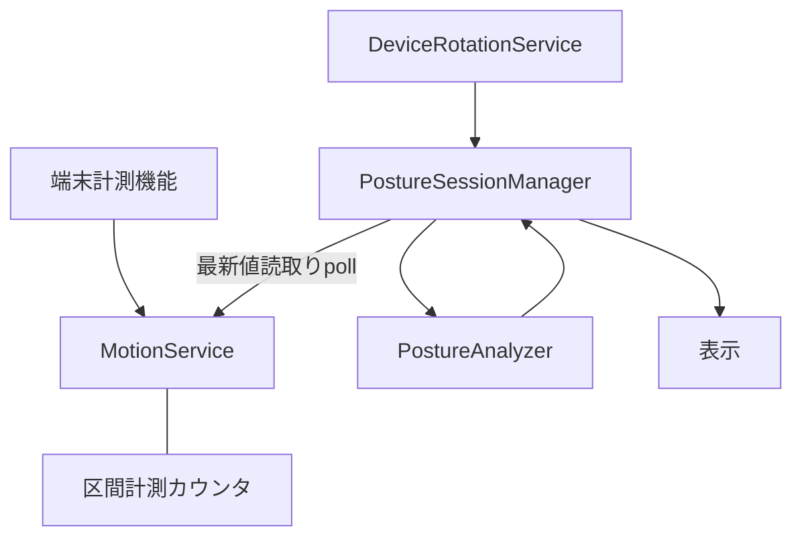
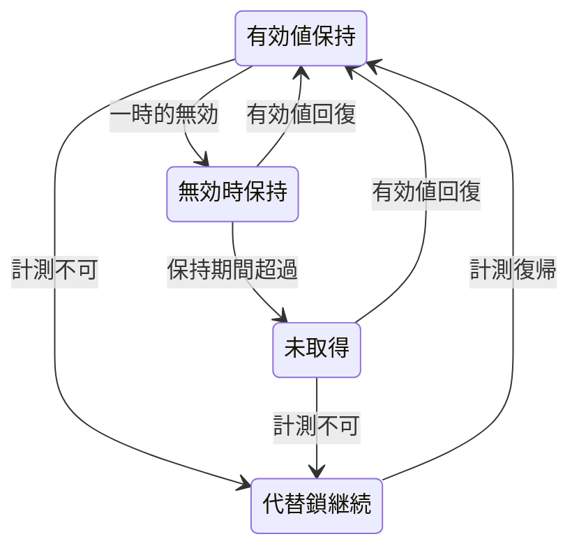

# Design: motion-frequency

## Overview
本機能は、姿勢監視中の重力更新の取得頻度を計測先行で最適化する。重力の取得（MotionService）・保持（0.5 秒単一ホールド）・消費（フレーム処理ごとの最新値読取り）は既に分離されているため、変更を MotionService 内に閉じ、判定仕様・回転系・起停則には手を加えない。毎秒30回・15回・10回の候補を電力と精度の実測で比較し、効果が確認できない場合は現状維持とする。

**Purpose**: 本機能は長時間利用者に、判定精度を保ったまま不要な重力取得を削減する省電力を提供する。
**Users**: 姿勢監視を利用するユーザーが、向き変更や暗転操作を含む既存の利用手順のまま利用する。
**Impact**: 現状の 30Hz 固定取得を、計測・設定可能・比較選定の対象に変える。判定・表示・代替鎖の振る舞いは変えない。

### Goals
- 重力更新の取得回数と判定での利用回数を独立に計測できる
- 取得間隔を比較候補（毎秒30回・15回・10回）の範囲で設定でき、既定は毎秒30回とする
- 実質同一の受信値は読取り側可視値の更新を抑制し、変化時と状態変化時は必ず可視値を更新する（受動公開・pull）
- 垂直補正・回転・鏡像・代替鎖・起停の既存振る舞いを維持し、回帰で確認する
- 選定と比較の根拠を実測値のみで記録し、未計測項目を明記する

### Non-Goals
- 映像の取得・推論処理の変更
- 猫背判定の閾値・代替基準の選択則の変更
- 暗転中の起動・停止方針の変更（受口の提供に留める）
- 状態に応じた自動頻度切替（全体適応化は見送り）

## Boundary Commitments

### This Spec Owns
- 重力取得間隔の設定（許可値範囲の検証と既定値の保持を含む）
- 同一値受信時の可視値更新抑制則（許容差付き比較・状態変化時の無条件更新。受動公開・pull前提で通知は行わない）
- 取得・可視値更新・消費参照の計測カウンタと区間計測の取出し（メモリ内のみ）
- 30・15・10Hz 候補の実測比較手順と選定・見送りの判断記録形式
- 既存振る舞い（保持・変換・代替鎖・回転整合・起停）の回帰確認

### Out of Boundary
- 推論・映像パイプラインの頻度制御（別 spec の所有）
- 判定閾値・代替基準の選択則・3秒確定則の意味（変更しない）
- 暗転時の省電力モード切替方針（dim-mode-saving の所有。本 spec は頻度変更の受口のみ提供する）
- 回転角配信の方式（DeviceRotationService の所有。整合確認のみ行う）

### Allowed Dependencies
- 上流: nekoze-fix spec §4.1・§4.9・§7（天方向基準・代替鎖・デバイス向きの制約）、既存の MotionService・Session 消費点・MotionServiceTests
- 共有: 起停一本化の則（`setMotionRotationRunning` の契約は変更しない）
- 新規依存の追加は禁止（既存の端末計測機能のみ使用する）

### Revalidation Triggers
- 取得間隔の設定契約（許可値・既定値・許可外値の扱い）の変更
- 可視値更新抑制則（許容差・状態変化の定義）の変更
- 計測カウンタの所有者・取出し形式の変更
- 保持期間・変換式・代替鎖への合図（nil の意味）の変更は本 spec の範囲外であり、nekoze-fix spec 側の再確認を要する

## Architecture

### Existing Architecture Analysis
- 依存方向は Types → Domain → Services → Session → UI に固定され、Session が状態の唯一の書込み点である
- MotionService（Services）は取得・保持を所有し、`latestGravityInKeypointSpace` の最新値を公開する。nil は代替解決への合図である
- Session はフレーム処理ごとに最新値を読取り、純関数である PostureAnalyzer（Domain）に値渡しする。取得頻度と消費頻度は既に非連動である
- 回転角配信は独立系統であり、重力→天方向の変換は向き引数を持たない。頻度変更は回転・鏡像に影響しない
- 技術的負債の新設はしない。既存の `ingest` 入口契約とホールド則を維持し、既存テストを回帰として再利用する

### Architecture Pattern & Boundary Map


**Architecture Integration**:
- Selected pattern: 既存層構造の維持＋単一所有者への局所拡張（新規層・新規サービスを作らない）
- Domain/feature boundaries: 計測値の所有は MotionService、消費参照の記録呼出しは Session、判定は Analyzer（純粋維持）。データ所有の重複を作らない
- Existing patterns preserved: 依存方向、Session 唯一書込み点、nil 合図による代替鎖、起停一本化
- New components rationale: 計測値オブジェクトのみ Types に追加する（層方向を守るための値受渡し）。判定・回転・起停の新規部品はなし
- Steering compliance: 新規依存なし、メモリ内のみ、実測なき記載の禁止を維持する

### Technology Stack

| Layer | Choice / Version | Role in Feature | Notes |
|-------|------------------|-----------------|-------|
| Services | 既存の端末計測機能 | 重力取得の間隔設定・保持・計測 | 新規依存なし、取得方式の変更なし |
| Types | 既存の共有値オブジェクト | 計測結果の値受渡し | 追加は計測値オブジェクトのみ |
| Test | 既存の単体検査基盤 | 回帰・新規検証 | 実機計測は手動検証として計画する |

## File Structure Plan

### Modified Files
- `NekozeFix/Types/PostureTypes.swift` — 計測結果の値オブジェクトの追加（層方向を守る受渡し用）
- `NekozeFix/Services/MotionService.swift` — 取得間隔の内部設定化、比較付き可視値更新、計測カウンタの所有（保持・変換・起停の契約は不変）
- `NekozeFix/Session/PostureSessionManager.swift` — 消費時参照記録の付随呼出しの追加（最新値読取り則は不変）
- `NekozeFixTests/MotionServiceTests.swift` — 既存回帰の維持（全頻度条件で再実行）

### New Files
- `NekozeFixTests/MotionFrequencyTests.swift` — 頻度設定・可視値更新抑制則・計測カウンタの新規検証（単一責任：本機能の新規振る舞いの検証）

### Unchanged Files（参照・回帰のみ、変更なし）
- `NekozeFix/Domain/PostureAnalyzer.swift` — 判定・代替解決は不変。nil 合図の契約も変えない
- `NekozeFix/Services/DeviceRotationService.swift` — 回転角配信は不変。整合確認のみ行う

> 各ファイルは単一責任に収める。Analyzer・回転サービス・映像系ファイルへの変更はなし。検証記録（実測比較と選定根拠）は Testing Strategy の形式に従い spec 配下に残す。

## System Flows

```mermaid
sequenceDiagram
    Sensor ->> Motion: 重力サンプル到着
    Motion ->> Motion: 変換と前回値比較（同一時は可視値の更新を抑制）
    Session --poll--> Motion: 最新値読取りと参照記録
    Motion -- 最新可視値 --> Session: 公開値の返却
    Session ->> Analyzer: 値渡しで判定
    Analyzer -->> Session: 判定と基準線
```

本specは受動公開（pull）に一本化する。MotionからSessionへの変化通知は行わない（Outboundなし）。省略とは通知抑制ではなく、読取り側可視値の更新抑制を指す。Sessionはフレーム処理ごとに最新可視値を読取り（poll）、同一可視値の場合は追加処理を起こさないことで鮮度維持と削減を両立する。無効値の扱いと代替鎖への退行は既存則のままとする。dim-mode-saving側の連動前提：頻度切替えは `setUpdateFrequency` による間隔設定のみで行い、可視値の更新タイミングや通知有無に依存しない。設定は次回開始時から反映される。



状態遷移自体は既存のままである。頻度変更は遷移の起動機会（サンプル到着）の密度のみを変え、遷移則と保持期間の意味は変えない。

## Requirements Traceability

| Requirement | Summary | Components | Interfaces | Flows |
|-------------|---------|------------|------------|-------|
| 1.1 | 取得回数と利用回数の計測 | MotionService, Session 消費記録 | 計測契約 | 計測フロー |
| 1.2 | 映像処理回数との独立記録 | MotionService | 計測契約 | 計測フロー |
| 1.3 | 計測条件の付記 | MotionService | 計測契約 | 計測フロー |
| 2.1 | 電力差の実測比較 | 頻度設定, 計測契約 | 頻度設定契約 | 比較手順 |
| 2.2 | 精度差の実測比較 | 頻度設定, Session 消費記録 | 頻度設定契約 | 比較手順 |
| 2.3 | 改善未確認時の現状維持 | 頻度設定 | 頻度設定契約 | 比較手順 |
| 2.4 | 選定根拠の実測記録 | 計測契約 | 計測契約 | 比較手順 |
| 3.1 | 映像頻度との非連動 | MotionService | 頻度設定契約 | 受信消費フロー |
| 3.2 | 最新値の使用 | Session 消費記録 | 読取り則（不変） | 受信消費フロー |
| 3.3 | 不変時の追加発生の抑制 | MotionService | 可視値更新抑制則契約 | 受信消費フロー |
| 3.4 | 受信超過の判定増加の禁止 | MotionService | 可視値更新抑制則契約・計測契約 | 受信消費フロー |
| 4.1 | 基準線表示と判定の一致 | 既存経路（不変） | 変更なし | 回帰 |
| 4.2 | 向き追従 | 既存経路（不変） | 変更なし | 回帰 |
| 4.3 | 回転中の判定停止 | 既存経路（不変） | 変更なし | 回帰 |
| 4.4 | 回転完了後の再開 | 既存経路（不変） | 変更なし | 回帰 |
| 4.5 | 鏡像補正後の表示判定 | 既存経路（不変） | 変更なし | 回帰 |
| 4.6 | 3秒確定則の意味維持 | 既存経路（不変） | 変更なし | 回帰 |
| 5.1 | 両肩直交への退行 | 既存経路（不変） | 変更なし | 状態遷移（不変） |
| 5.2 | 画像垂直への最終退行 | 既存経路（不変） | 変更なし | 状態遷移（不変） |
| 5.3 | 復帰時の天方向復帰 | 既存経路（不変） | 変更なし | 状態遷移（不変） |
| 5.4 | 代替線の通常表示 | 既存経路（不変） | 変更なし | 回帰 |
| 5.5 | 直前有効値の期間限定使用 | 既存経路（不変） | 変更なし | 状態遷移（不変） |
| 5.6 | 保持期間の意味維持 | MotionService | 変更なし（粒度上限を検証） | 回帰 |
| 6.1 | 開始時の更新開始 | 既存起停（不変） | 変更なし | 回帰 |
| 6.2 | 停止時の更新停止と破棄 | 既存起停（不変） | 変更なし | 回帰 |
| 6.3 | 暗転中の継続 | 既存起停（不変） | 変更なし | 回帰 |
| 6.4 | 背景移行時の停止 | 既存起停（不変） | 変更なし | 回帰 |
| 6.5 | 頻度変更の受口提供 | MotionService | 頻度設定契約 | 受信消費フロー |
| 7.1 | 映像取得推論の不変 | 範囲外（非接触） | 変更なし | 回帰 |
| 7.2 | 閾値選択則の不変 | 範囲外（非接触） | 変更なし | 回帰 |
| 7.3 | 実測のみ記録・未計測明記 | 計測契約 | 計測契約 | 比較手順 |
| 7.4 | 実測不足時の現状維持 | 頻度設定 | 頻度設定契約 | 比較手順 |

## Components and Interfaces

| Component | Domain/Layer | Intent | Req Coverage | Key Dependencies (P0/P1) | Contracts |
|-----------|--------------|--------|--------------|--------------------------|-----------|
| MotionService 拡張 | Services | 取得間隔・可視値更新抑制・計測の所有 | 1.1, 1.2, 1.3, 2.1, 2.3, 2.4, 3.1, 3.3, 3.4, 5.6, 6.5, 7.3, 7.4 | 端末計測機能（P0） | Service, State |
| Session 消費記録 | Session | 最新値参照と参照記録の付随 | 1.1, 2.2, 3.2 | MotionService（P0）, PostureAnalyzer（P0） | State |
| PostureAnalyzer | Domain | 判定（変更なし・参照のみ） | 4.1, 4.6, 5.1, 5.2, 5.3, 7.2 | なし（純関数） | 変更なし |
| DeviceRotationService | Services | 回転角配信（変更なし・整合確認のみ） | 4.2, 4.3, 4.4, 4.5 | なし（独立系統） | 変更なし |
| 既存起停・代替表示（不変） | Session（既存） | 起停則と代替表示の維持確認（変更なし・回帰のみ） | 5.4, 5.5, 6.1, 6.2, 6.3, 6.4, 7.1 | 既存の起停・表示（P0） | 変更なし |

### Services

#### MotionService 拡張

| Field | Detail |
|-------|--------|
| Intent | 重力の取得間隔・可視値更新抑制・計測を単一に所有する（受動公開・pull） |
| Requirements | 1.1, 1.2, 1.3, 2.1, 2.3, 2.4, 3.1, 3.3, 3.4, 5.6, 6.5, 7.3, 7.4 |

**Responsibilities & Constraints**
- 取得間隔の内部保持と許可値検証（毎秒30回・15回・10回のみ、既定は毎秒30回）
- 受信値の許容差付き比較による可視値の更新抑制（変化時と有効無効の状態変化時は無条件で可視値を更新する。Sessionへの変化通知は行わない）
- 受信・可視値更新・消費参照・無効参照の区間計測（メモリ内のみ、永続化なし）
- 保持・変換・起停の既存契約の維持（本拡張は契約を追加するのみで既存則を変更しない）

**Dependencies**
- Inbound: Session 消費記録 — 最新値読取りと参照記録（P0）
- Outbound: なし（Session が読取る受動公開であり、本サービスからの呼出しは作らない）
- External: 端末計測機能 — 重力取得（P0）

**Contracts**: Service [x] / API [ ] / Event [ ] / Batch [ ] / State [x]

##### Service Interface
```swift
enum MotionUpdateFrequency {
    case thirtyHz
    case fifteenHz
    case tenHz
    var interval: TimeInterval { get }
}

struct MotionFrequencyMeasurement {
    let frequency: MotionUpdateFrequency
    let duration: TimeInterval
    let sampleCount: Int
    let dispatchCount: Int
    let consumptionCount: Int
    let invalidCount: Int
    let conditionNote: String
}

final class MotionService {
    func setUpdateFrequency(_ frequency: MotionUpdateFrequency)
    func startMeasuring(note: String)
    func stopMeasuring() -> MotionFrequencyMeasurement
    func noteConsumption(hasValue: Bool)
}
```
- Preconditions: 許可外の間隔値は受け付けず既定を維持する。計測は監視動作中に区切る
- Postconditions: 設定後は次回開始時から新間隔で取得する。同一値の可視値更新抑制は判定結果を変えない
- Invariants: 保持期間・変換式・nil 合図の意味は不変。計測値は実測のみを含み推定値を含まない

**Implementation Notes**
- Integration: 起停メソッド（`setMotionRotationRunning`）の契約は変えず、間隔設定は開始時に反映する。Session の読取り則は変えず参照記録の呼出しのみ追加する。dim-mode-saving側はpull前提で連動し、頻度切替えは `setUpdateFrequency` のみ経由で行い可視値更新のタイミングや通知有無に依存しない
- Validation: 許可外値の既定維持、状態変化時の可視値更新漏れなし、抑制時の判定不変を単体検査で確認する
- Risks: 許容差の過大設定による微小変化の欠落 → 微小固定値＋状態変化時の無条件更新で緩和する

### Session

#### Session 消費記録

| Field | Detail |
|-------|--------|
| Intent | フレーム処理ごとの最新値参照に参照記録を付随させる |
| Requirements | 1.1, 2.2, 3.2 |

**Responsibilities & Constraints**
- 最新値の読取り則は変更しない（読取り時にその時点の最新値を使用する）
- 読取りのつど参照の有無を計測側へ通知する（判定ロジックへの介入なし）

**Dependencies**
- Inbound: フレーム処理 — 判定ごとの読取り契機（P0）
- Outbound: MotionService — 参照記録の通知（P0）
- External: なし

**Contracts**: Service [ ] / API [ ] / Event [ ] / Batch [ ] / State [x]

##### State Management
- State model: 計測状態を持たず、通知のみ行う（状態の所有は MotionService）
- Persistence & consistency: 永続化なし。通知漏れは計測精度にのみ影響し判定には影響しない
- Concurrency strategy: 既存のメイン系列に従い、新規キューを作らない

**Implementation Notes**
- Integration: `analyze` 呼出し直前の読取り点に付随させ、読取りと通知の順序を保つ
- Validation: 参照回数と判定実行回数の一致を検査で確認する
- Risks: 通知漏れ時の計測誤差 → 記録形式に区間条件を付し再計測可能にする

## Data Models

### Domain Model
- 本機能が導入する領域概念は「取得頻度の設定」と「区間計測の結果」のみであり、集約や永続化を伴わない
- 計測結果は値オブジェクトとして扱い、生成後の変更を許さない

### Logical Data Model
**Structure Definition**:
- 取得頻度：毎秒30回・15回・10回の列挙と取得間隔の対応（既定は毎秒30回）
- 計測結果：頻度・計測期間・受信回数・可視値更新回数（dispatchCount）・消費参照回数・無効参照回数・計測条件の記録

**Consistency & Integrity**:
- 計測区間の開始・終了は対応させ、未終了区間の取出しを許さない
- 記録に推定値を含めない。未計測項目は明記する

物理データモデルはなし（永続化しない）。

### Data Contracts & Integration
**API Data Transfer**
- 計測結果の受渡しは Types の値オブジェクトにより行い、層方向（Services → Session の読取り、所有は Services）を守る

## Error Handling

### Error Strategy
取得・保持・消費の各段階で、劣化時は代替鎖と既存則により監視を継続し、監視自体を停止しない。

### Error Categories and Responses
- 取得不可（未対応端末・権限拒否・平置き・変換失敗）→ nil 継続と代替鎖への退行（既存則のまま）
- 許可外の頻度指定 → 既定（毎秒30回）を維持し、頻度変更を追加しない
- 計測区間の不整合（未開始の終了・二重開始）→ 計測のみ無効とし、取得・判定には影響させない
- 停止・背景移行 → 保持値破棄と nil 扱い（既存則のまま）

### Monitoring
計測カウンタ自体が本機能の観測手段である。記録には計測条件を付し、比較の再現性を保つ。

## Testing Strategy
- Unit Tests: 許可値検証と既定維持、同一値の可視値更新抑制と状態変化時の無条件更新、計測カウンタの加算と区間取出し、ホールド境界の既存回帰（全頻度条件で再実行）
- Integration Tests: 読取りと参照記録の一致、nil 時の代替鎖への退行と復帰、起停・背景移行・暗転継続の既存回帰、回転・鏡像の整合回帰
- E2E/UI Tests（実機）: 30・15・10Hz での電力・精度の比較計測、同一姿勢での判定一致、回転・復帰時間の回帰
- Performance/Load（実機）: 可視値更新回数（dispatchCount）と判定実行回数の削減確認、未計測項目の明記を含む選定記録の作成（効果未確認時は現状維持とし変更を追加しない）
