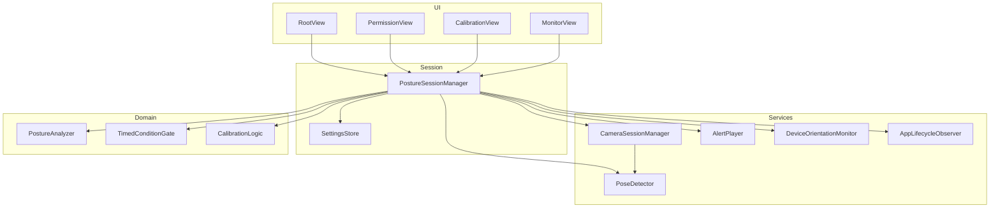
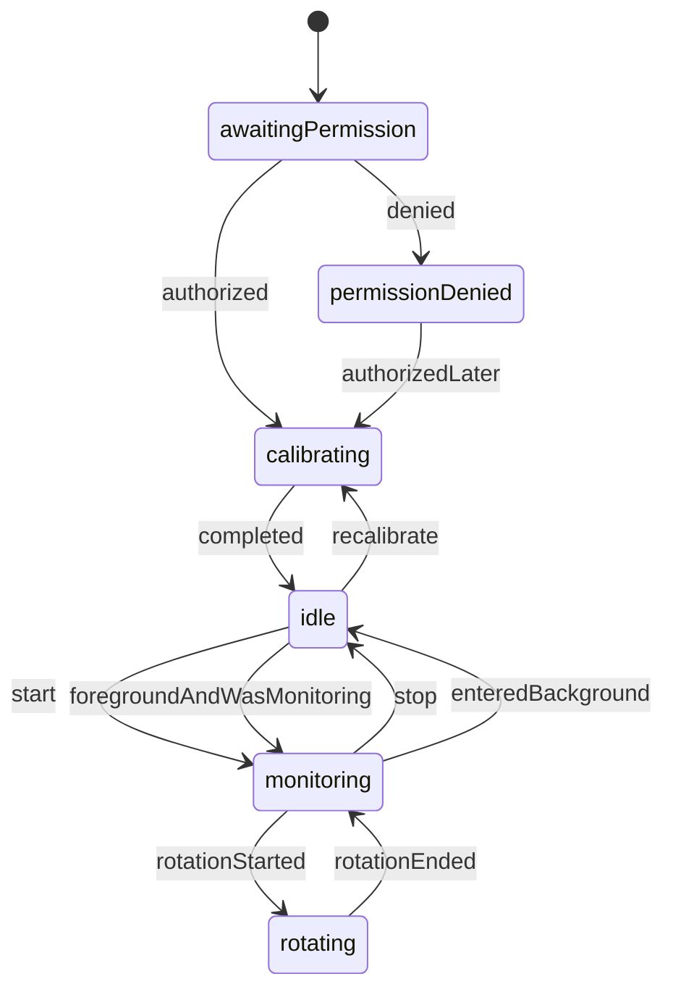
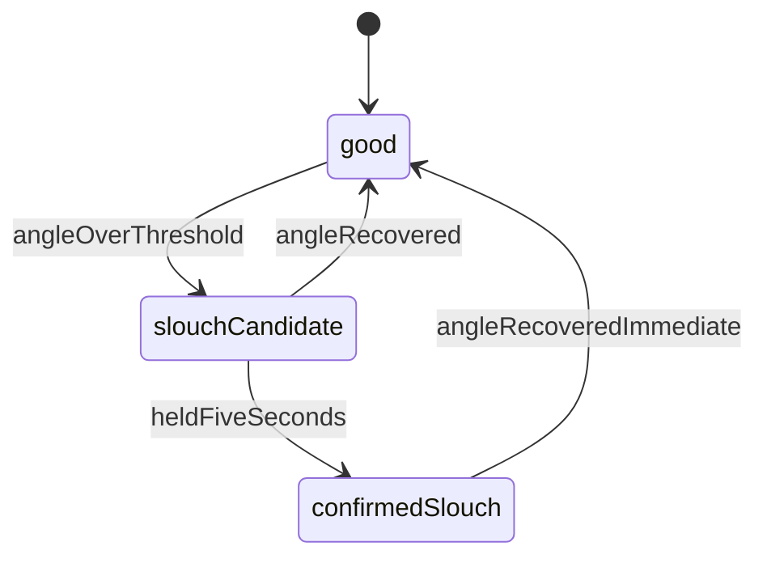
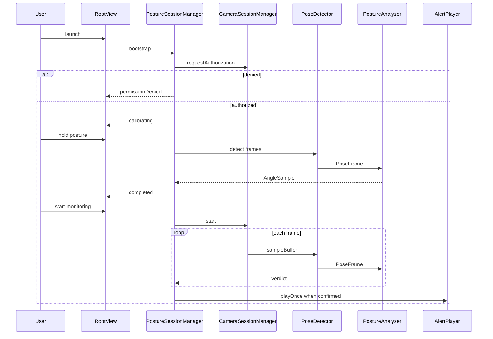

# Design: nekoze-fix

## Overview

NekozeFix は、iPhone/iPad のフロントカメラと Apple Vision の人体姿勢推定を用いてデスクワーカーの猫背をリアルタイム検知し、内蔵通知音で即時フィードバックする単一画面の iOS/iPadOS ネイティブアプリである。キャリブレーションで基準姿勢を登録し、近側の耳と肩の関係に基づく角度変化から猫背を判定する。サードパーティ依存は持たない。

本設計は MVVM を採用する。ドメインロジックは UI から独立した純関数と状態機械として定義し、カメラ・Vision・オーディオはそれぞれ単一のサービス境界に閉じる。

## Goals / Non-Goals

### Goals

- フロントカメラと Vision API によるリアルタイム姿勢検知パイプラインを確立する
- キャリブレーションでカメラ設置角度を吸収した基準姿勢を登録する
- 近側キーポイント中心の角度ベース猫背判定と、5秒連続検知による確定判定を実装する
- マナーモードでも再生される通知音と、画面暗転モードでの省電力監視を提供する
- 縦置き・横置き、バックグラウンド移行・復帰を含むデバイスライフサイクルに対応する

### Non-Goals

- バックグラウンド監視、統計・履歴、姿勢データの永続化
- カスタム通知音選択、バイブレーション通知
- クラウド同期、アカウント、HealthKit、ウェアラブル連携
- Android 対応、全身骨格推定の製品機能化

## Boundary Commitments

本スペックが所有する責任境界は次の通りである。

- フロントカメラセッションの構成・開始・停止と権限要求
- Vision による肩・耳キーポイント抽出と信頼度フィルタ
- 近側中心の耳ー肩角度計算、キャリブレーション、猫背確定/改善判定
- 通知音の再生・再通知間隔・停止
- 監視 UI、画面暗転モード、感度調整、向き追従、フォアグラウンドライフサイクル

### Out of Boundary

- バックグラウンドでのカメラ継続、通知センターへのリモート通知
- 姿勢履歴の保存、分析ダッシュボード
- OS の権限ダイアログ本体とオーディオ優先度調停の実装
- 極端なカメラ角度（真横・真後ろ）での検出保証

### Allowed Dependencies

- iOS/iPadOS 16+ SDK: AVFoundation, Vision, AVFAudio, SwiftUI, UIKit
- バンドル内の通知音アセット（自前生成の短いメロディ）
- UserDefaults（感度と前回監視状態のローカル保持のみ）

### Revalidation Triggers

- 最低対応 OS を iOS 16 以外に変更する場合
- 判定指標を角度以外（垂直距離、3D 姿勢推定など）に切り替える場合
- バックグラウンド監視や永続化をスコープに入れる場合
- 通知手段を音以外（バイブレーション、システム通知）に拡張する場合

## Architecture

依存方向は次の一方向に固定する。左の層は右の層を知らない。

```
Types → Domain → Services → Session → UI
```

| Layer | 責務 | 上位への公開 |
|-------|------|--------------|
| Types | 値オブジェクトと列挙 | 全層が参照可能 |
| Domain | 角度計算、近側選択、連続条件ゲート | 純関数。I/O なし |
| Services | カメラ、Vision、オーディオ、向き、ライフサイクル | プロトコル経由の入出力 |
| Session | 監視セッション状態機械、設定保持 | ViewModel 相当 |
| UI | SwiftUI 画面とプレビュー | Session の公開状態のみ購読 |



### Key Decisions

- 単一の `PostureSessionManager` がセッション状態の唯一の書き込み点である。UI は状態を表示し、ユーザー操作をコマンドとして渡すだけである
- Vision 推論はカメラのサンプルバッファキュー上で実行し、UI 更新だけをメインキューへ送る
- 画面暗転は独立サービスではなく、セッション状態 `dimmed` に対する UI 表現である
- サードパーティライブラリは導入しない

## File Structure Plan

すべて新規作成。Xcode プロジェクト `NekozeFix.xcodeproj` をルートに置く。

| Path | Responsibility | Component |
|------|----------------|-----------|
| `NekozeFix/NekozeFixApp.swift` | アプリエントリ、ルート注入 | App |
| `NekozeFix/Info.plist` | カメラ利用説明、向き、最低 OS | Config |
| `NekozeFix/Resources/usagi-to-kame.caf` | 短い通知音アセット | AlertPlayer |
| `NekozeFix/Types/PostureTypes.swift` | 状態・キーポイント・判定結果の型 | Types |
| `NekozeFix/Domain/PostureAnalyzer.swift` | 近側選択と耳ー肩角度、猫背判定 | PostureAnalyzer |
| `NekozeFix/Domain/TimedConditionGate.swift` | N秒連続条件の蓄積とリセット | TimedConditionGate |
| `NekozeFix/Domain/CalibrationLogic.swift` | 安定判定と基準角度の確定 | CalibrationLogic |
| `NekozeFix/Services/CameraSessionManager.swift` | フロントカメラセッションと権限 | CameraSessionManager |
| `NekozeFix/UI/CameraPreviewView.swift` | AVCaptureVideoPreviewLayer の SwiftUI ラッパ | CameraPreviewView |
| `NekozeFix/Services/PoseDetector.swift` | Vision リクエストと信頼度フィルタ | PoseDetector |
| `NekozeFix/Services/AlertPlayer.swift` | playback カテゴリでの通知音再生 | AlertPlayer |
| `NekozeFix/Services/DeviceOrientationMonitor.swift` | 向き変化と回転中フラグ | DeviceOrientationMonitor |
| `NekozeFix/Services/AppLifecycleObserver.swift` | フォアグラウンド/バックグラウンド通知 | AppLifecycleObserver |
| `NekozeFix/Session/PostureSessionManager.swift` | 監視セッションの状態機械 | PostureSessionManager |
| `NekozeFix/Session/SettingsStore.swift` | 感度と前回監視状態 | SettingsStore |
| `NekozeFix/UI/RootView.swift` | 権限・校正・監視の画面切替 | RootView |
| `NekozeFix/UI/PermissionView.swift` | 権限要求と拒否時の案内 | PermissionView |
| `NekozeFix/UI/CalibrationView.swift` | 校正指示、蓄積時間、再実行 | CalibrationView |
| `NekozeFix/UI/MonitorView.swift` | プレビュー、状態表示、開始停止、暗転、感度 | MonitorView |
| `NekozeFixTests/PostureAnalyzerTests.swift` | 角度・近側・信頼度の単体試験 | tests |
| `NekozeFixTests/TimedConditionGateTests.swift` | 3秒/5秒ゲートの単体試験 | tests |
| `NekozeFixTests/CalibrationLogicTests.swift` | 安定・崩しリセットの単体試験 | tests |
| `NekozeFixTests/PostureSessionManagerTests.swift` | 状態遷移の単体試験 | tests |

## Components & Interfaces

### Component Summary

| Component | Domain | Intent | Requirements | Dependencies | Contracts |
|-----------|--------|--------|--------------|--------------|-----------|
| Types | Types | 共有値と状態の定義 | 3.3, 4.1 | なし | State |
| PostureAnalyzer | Domain | 近側角度から猫背候補を出す | 3.5, 4.1, 4.5, 4.6 | Types | Service |
| TimedConditionGate | Domain | 連続条件の確定 | 2.3, 2.4, 4.2 | Types | Service |
| CalibrationLogic | Domain | 基準角度の確定規則 | 2.1-2.7 | Types, TimedConditionGate | Service |
| CameraSessionManager | Services | カメラ権限とキャプチャ | 1.1, 1.2, 3.1, 3.2, 7.1, 8.1, 8.2, 8.1性能 | AVFoundation | Service |
| PoseDetector | Services | キーポイント抽出 | 2.5, 3.4, 4.5, 8.1性能 | Vision | Service |
| AlertPlayer | Services | 通知音と再通知 | 5.1-5.4, 8.2性能 | AVFAudio | Service |
| DeviceOrientationMonitor | Services | 回転中の判定停止 | 7.1, 7.2 | UIKit | Event |
| AppLifecycleObserver | Services | 背面停止と復帰再開 | 8.1, 8.2 | UIKit | Event |
| SettingsStore | Session | 感度と監視フラグ | 4.4, 8.2 | UserDefaults | State |
| PostureSessionManager | Session | セッション状態の唯一の所有者 | 2.*, 3.*, 4.*, 5.*, 6.*, 7.*, 8.* | 上記すべて | State, Service |
| PermissionView | UI | 権限 UI | 1.1, 1.2 | Session | State |
| CalibrationView | UI | 校正 UI | 2.1-2.6, 10.1 | Session | State |
| MonitorView | UI | 監視・暗転・感度 UI | 3.1-3.4, 4.4, 6.1-6.3, 9.2, 10.1 | Session | State |
| CameraPreviewView | UI | プレビュー描画 | 3.2, 6.2 | CameraSessionManager | State |

### Types

共有型。実装詳細ではなく契約として固定する。

```swift
enum CameraAuthorization {
    case notDetermined
    case authorized
    case denied
}

enum DetectionPresence {
    case personDetected
    case personMissing
}

struct Keypoint: Equatable {
    var x: Double
    var y: Double
    var confidence: Double
}

struct PoseFrame: Equatable {
    var timestamp: TimeInterval
    var leftEar: Keypoint?
    var rightEar: Keypoint?
    var leftShoulder: Keypoint?
    var rightShoulder: Keypoint?
}

enum Side: Equatable {
    case left
    case right
}

struct AngleSample: Equatable {
    var nearSide: Side
    var nearAngleDegrees: Double
    var farAngleDegrees: Double?
}

enum PostureVerdict: Equatable {
    case good
    case slouchCandidate
    case insufficientKeypoints
}

enum SessionPhase: Equatable {
    case awaitingPermission
    case permissionDenied
    case calibrating
    case idle
    case monitoring
    case rotating
}

enum DisplayedPosture: Equatable {
    case good
    case slouch
    case personMissing
}

struct SessionSnapshot: Equatable {
    var phase: SessionPhase
    var displayedPosture: DisplayedPosture
    var isDimmed: Bool
    var calibrationElapsed: TimeInterval
    var isPersonDetected: Bool
    var sensitivity: Double
    var isMonitoringEnabled: Bool
}
```

信頼度閾値は定数 `minimumKeypointConfidence = 0.5` とする。感度はユーザー向けの 0.0...1.0 値とし、内部では角度増加の閾値（度）へ単調変換する。デフォルト感度は中間値とする。

### PostureAnalyzer

近側キーポイントを選び、耳ー肩ベクトルと垂直線のなす角度を計算する。I/O なし。

**Preconditions**: 入力 `PoseFrame` の各キーポイントは未フィルタでもよい。本コンポーネントが confidence 未満を除外する。

**Postconditions**:
- 近側の耳と肩が両方有効なら `AngleSample` と `PostureVerdict` を返す
- 片側のみ有効ならその側だけで判定する（3.5, 4.6）
- 両側が有効なら近側を主指標、遠側を補助として安定化に使う（4.6）
- 有効な耳ー肩ペアが無い場合は `insufficientKeypoints`

```swift
protocol PostureAnalyzing {
    func analyze(
        frame: PoseFrame,
        referenceNearAngleDegrees: Double?,
        slouchDeltaThresholdDegrees: Double
    ) -> (sample: AngleSample?, verdict: PostureVerdict)
}
```

角度定義: 肩から耳へ向かうベクトルと、画像上向きの垂直ベクトルがなす角（度）。キャリブレーション値からの増加が閾値以上なら `slouchCandidate`。カメラ設置角は基準値に含まれるため、絶対垂直との比較は行わない。

### TimedConditionGate

連続充足時間を蓄積する純ロジック。

```swift
struct TimedConditionGate {
    var requiredDuration: TimeInterval
    mutating func tick(isConditionMet: Bool, now: TimeInterval) -> Bool
    mutating func reset()
}
```

- `isConditionMet == true` の間だけ経過を加算し、`requiredDuration` 到達で `true` を一度返す
- `false` になった瞬間に蓄積をゼロにする（2.4, 4.2 の途中解除）
- キャリブレーションは 3.0 秒、猫背確定は 5.0 秒でインスタンスを分ける

### CalibrationLogic

人物検出があり、かつ `PostureAnalyzer` が角度を出せるフレームだけを安定とみなす。

```swift
protocol Calibrating {
    mutating func start()
    mutating func ingest(sample: AngleSample?, presence: DetectionPresence, now: TimeInterval) -> CalibrationProgress
}

enum CalibrationProgress: Equatable {
    case waitingForPerson
    case accumulating(elapsed: TimeInterval)
    case completed(referenceNearAngleDegrees: Double)
}
```

完了時は蓄積期間中の近側角度の平均を基準姿勢として返す（2.3, 2.7）。再実行は `start()` により基準を上書きする（2.6）。人物なしは完了しない（2.5）。

### CameraSessionManager

**Inbound**: Session からの start/stop、向き更新。  
**Outbound**: サンプルバッファを PoseDetector へ。  
**External P0**: AVFoundation フロントカメラ。

```swift
protocol CameraSessionManaging: AnyObject {
    var authorization: CameraAuthorization { get }
    var captureSession: AVCaptureSession { get }
    func requestAuthorization() async -> CameraAuthorization
    func start() async throws
    func stop()
    func applyVideoOrientation(_ orientation: AVCaptureVideoOrientation)
}
```

- プリセットは `.medium`（NFR 9.1）。Vision に 4K は不要
- `AVCaptureVideoDataOutput` は専用シリアルキュー。メインキューでは動かさない
- `startRunning` / `stopRunning` はバックグラウンドキューで実行する
- 権限が `.denied` のとき start は失敗し、UI は設定アプリ導線を出す（1.2）
- エラー: カメラ欠如、セッション構成失敗。いずれもユーザー向けに「カメラを使用できません」へ写像する

### PoseDetector

```swift
protocol PoseDetecting {
    func detect(sampleBuffer: CMSampleBuffer, orientation: CGImagePropertyOrientation) -> PoseFrame?
}
```

- `VNDetectHumanBodyPoseRequest` を使用する
- 返すキーポイントは confidence >= 0.5 のみ。未満は `nil`（4.5）
- 観測が空なら `nil` を返し、Session が `personMissing` とする（2.5, 3.4）
- 処理はキャプチャキュー上。目標は 15 fps 以上（NFR 8.1）。遅延時は最新フレーム以外を捨てる

### AlertPlayer

```swift
protocol AlertPlaying {
    func configureSession() throws
    func playOnce()
    func startRepeating(interval: TimeInterval)
    func stop()
}
```

- カテゴリ `.playback`、オプション `.duckOthers`（5.4）
- 確定猫背の初回で 1 回再生し、継続中は 30 秒間隔（5.1, 5.2）
- 改善時は即停止し、繰り返しタイマーを破棄する（5.3）
- 再生開始は確定判定から 0.5 秒以内（NFR 8.2）。プレイヤーは事前ロードする
- デフォルト音源はバンドルの `usagi-to-kame.caf`（1〜2 秒）

### DeviceOrientationMonitor

```swift
protocol DeviceOrientationMonitoring {
    var currentVideoOrientation: AVCaptureVideoOrientation { get }
    var isRotating: Bool { get }
}
```

回転開始で `isRotating = true`、完了で `false`。Session は回転中 `rotating` に遷移し猫背判定を停止する（7.2）。完了後にカメラ向きを更新して監視を再開する（7.1）。

### AppLifecycleObserver

```swift
protocol AppLifecycleObserving {
    var isActive: Bool { get }
}
```

非アクティブでカメラ停止・通知音停止（8.1）。アクティブ復帰時、`SettingsStore.isMonitoringEnabled` が true かつ校正済みなら監視を再開する（8.2）。

### SettingsStore

```swift
protocol SettingsStoring: AnyObject {
    var sensitivity: Double { get set }
    var isMonitoringEnabled: Bool { get set }
    func slouchDeltaThresholdDegrees() -> Double
}
```

UserDefaults に感度と監視フラグのみ保存する。基準姿勢はプロセス内メモリに保持し、永続化しない（Out of Scope）。

### PostureSessionManager

セッションの単一ソース。`ObservableObject` として `SessionSnapshot` を公開する（iOS 16 互換のため `@Observable` は使わない）。

```swift
@MainActor
protocol PostureSessionCommanding: AnyObject {
    var snapshot: SessionSnapshot { get }
    func bootstrap() async
    func startCalibration()
    func recalibrate()
    func startMonitoring()
    func stopMonitoring()
    func enterDimMode()
    func exitDimMode()
    func updateSensitivity(_ value: Double)
}
```

#### 状態機械



`displayedPosture` と通知は `monitoring` のサブ状態として扱う。



- `confirmedSlouch` 入場で `playOnce` と 30 秒リピート開始
- `good` 入場で `stop`
- `personMissing` は判定を進めず表示のみ更新。蓄積中の猫背ゲートはリセットする
- `dimmed` はフェーズではなくフラグ。監視は継続しプレビューを隠す（6.2）
- 暗転中のタップは `exitDimMode`（6.3）

### UI Components

いずれも新規境界を持たないため要約のみ。

- **RootView**: snapshot.phase で Permission / Calibration / Monitor を切替える。起動から監視開始までを権限 → 校正 → 開始の 3 ステップに収める（10.1）
- **PermissionView**: 初回はシステムダイアログをトリガし、拒否時は設定アプリへの案内を出す（1.1, 1.2）
- **CalibrationView**: 3秒キープ指示、検出状態、蓄積時間、人物なしメッセージ、再実行（2.1-2.6）
- **MonitorView**: プレビュー、良好/猫背、開始停止、感度、暗転ボタン。暗転時は黒画面＋低輝度、タップで復帰（3.*, 4.4, 6.*）
- **CameraPreviewView**: `UIViewRepresentable`。暗転中は非表示（3.2, 6.2）

暗転時は `UIScreen.main.brightness` を下げ、解除時に元の値へ戻す。アプリが背面に出るときは元の輝度に復元する。

## System Flows

### 起動から監視



### 確定猫背と改善

判定は Session 内のゲートが所有する。AlertPlayer は再生命令だけを受け、判定理由を知らない。

## Data Models

永続化対象は感度と監視フラグのみ。基準姿勢・セッション状態はメモリ上の集約 `PostureSession` が所有する。

**不変条件**
- 基準角度が無い状態では monitoring に入れない
- confidence < 0.5 のキーポイントは AngleSample に入らない
- 確定猫背中のみ通知タイマーが存在する
- 暗転は monitoring または rotating でのみ true になり得る

## Error Handling

| 失敗 | 検出点 | ユーザー影響 | 復旧 |
|------|--------|--------------|------|
| カメラ権限拒否 | CameraSessionManager | 設定案内画面 | 設定から許可後に復帰 |
| カメラ構成失敗 | CameraSessionManager | 使用不可メッセージ | 再起動を促す |
| 人物なし | PoseDetector | フレーム内へ誘導 | 検出再開で自動復帰 |
| キーポイント不足 | PostureAnalyzer | 人物なし相当の警告 | 近側再検出 |
| オーディオセッション失敗 | AlertPlayer | 判定は継続、音なし | 次回再生時に再構成 |
| 回転中の不安定フレーム | DeviceOrientationMonitor | 判定一時停止 | 回転完了で再開 |

失敗時もカメラパイプライン全体を落とさない。部分機能（検知なし表示、音なし監視）を優先する。

## Testing Strategy

要件の受け入れ条件から導出する。

### Domain 単体

- PostureAnalyzer: 近側のみ、遠側低信頼、両側高信頼、confidence 0.49 除外、閾値前後の判定（3.5, 4.1, 4.5, 4.6）
- TimedConditionGate: 5秒未満で解除したら未確定、5秒連続で確定、改善は即リセット（4.2, 4.3）
- CalibrationLogic: 3秒安定で平均角度保存、途中崩れで蓄積ゼロ、人物なしで未完了、再実行で上書き（2.3-2.6）

### Session 単体

- 開始/停止でカメラ start/stop が対になる（3.1）
- 確定入場で playOnce、継続で 30 秒リピート、改善で stop（5.1-5.3）
- 回転中は判定停止、完了で再開（7.2）
- 背面で停止、復帰時は isMonitoringEnabled に従う（8.1, 8.2）
- 暗転フラグ中も判定は進む（6.2）

### UI / 統合

- 権限拒否 UI が設定導線を出す（1.2）
- 監視中プレビュー表示、暗転中は非表示（3.2, 6.2）
- 起動から監視開始が 3 ステップ（10.1）

### 性能確認（手動または計測テスト）

- キーポイント処理 15 fps 以上（NFR 8.1）
- 確定から再生まで 0.5 秒以内（NFR 8.2）
- 暗転時の消費が通常より低いこと（NFR 9.2）。1時間 15% は実機確認（NFR 9.1）

E2E クリティカルパス: 権限許可 → 3秒校正 → 監視開始 → 5秒猫背で通知 → 改善で停止 → 暗転 → タップ復帰 → 背面停止 → 前面再開。

## Security

カメラ映像とキーポイントはデバイス内のみで処理し、ネットワークへ出さない。権限文字列は利用目的を正確に記述する。通知音はユーザーの明示的な監視開始後にのみ鳴らす。

## Performance

- キャプチャプリセット `.medium`、Vision は最新フレームのみ
- 画面暗転時はプレビューレイヤを外し、輝度を下げる
- AlertPlayer は起動時または監視開始時にプリロード
- UI 更新は判定結果の変化時と表示用間引き（最大 15 Hz）に限定する

## Requirements Traceability

| Requirement | Summary | Components | Interfaces | Flows |
|-------------|---------|------------|------------|-------|
| 1.1 | 起動時カメラ権限 | CameraSessionManager, PermissionView | requestAuthorization | 起動 |
| 1.2 | 拒否時の設定案内 | PermissionView | snapshot.phase | 起動 |
| 2.1 | 3秒キープ指示 | CalibrationView, CalibrationLogic | startCalibration | 校正 |
| 2.2 | 検出状態と蓄積表示 | CalibrationView | calibrationElapsed | 校正 |
| 2.3 | 3秒安定で自動完了 | CalibrationLogic, TimedConditionGate | CalibrationProgress | 校正 |
| 2.4 | 崩れでリセット | CalibrationLogic, TimedConditionGate | tick | 校正 |
| 2.5 | 人物なしは未完了 | PoseDetector, CalibrationLogic | DetectionPresence | 校正 |
| 2.6 | 再実行で上書き | CalibrationLogic, CalibrationView | recalibrate | 校正 |
| 2.7 | 設置角の吸収 | PostureAnalyzer, CalibrationLogic | reference angle | 校正 |
| 3.1 | 開始と停止 | PostureSessionManager, MonitorView | startMonitoring, stopMonitoring | 監視 |
| 3.2 | プレビュー表示 | CameraPreviewView, MonitorView | captureSession | 監視 |
| 3.3 | 良好/猫背表示 | PostureSessionManager, MonitorView | displayedPosture | 監視 |
| 3.4 | 人物なし警告 | PoseDetector, MonitorView | personMissing | 監視 |
| 3.5 | 片側のみで継続 | PostureAnalyzer | analyze | 判定 |
| 4.1 | 基準からの角度増加 | PostureAnalyzer | slouchCandidate | 判定 |
| 4.2 | 5秒連続で確定 | TimedConditionGate | requiredDuration 5 | 判定 |
| 4.3 | 改善は即時 | PostureSessionManager | confirmedSlouch to good | 判定 |
| 4.4 | 感度調整 | SettingsStore, MonitorView | updateSensitivity | 監視 |
| 4.5 | confidence 0.5 未満除外 | PoseDetector, PostureAnalyzer | minimumKeypointConfidence | 判定 |
| 4.6 | 近側主、遠側補助 | PostureAnalyzer | AngleSample | 判定 |
| 5.1 | 確定時に1回再生 | AlertPlayer | playOnce | 通知 |
| 5.2 | 30秒おき再通知 | AlertPlayer | startRepeating | 通知 |
| 5.3 | 改善で停止 | AlertPlayer | stop | 通知 |
| 5.4 | マナーモードでも再生 | AlertPlayer | playback category | 通知 |
| 6.1 | 暗転へ切替 | MonitorView, PostureSessionManager | enterDimMode | 暗転 |
| 6.2 | 暗転中も監視継続 | PostureSessionManager, CameraPreviewView | isDimmed | 暗転 |
| 6.3 | タップで復帰 | MonitorView | exitDimMode | 暗転 |
| 7.1 | 向き追従 | DeviceOrientationMonitor, CameraSessionManager | applyVideoOrientation | 回転 |
| 7.2 | 回転中は判定停止 | PostureSessionManager | phase rotating | 回転 |
| 8.1 ライフサイクル | 背面で停止 | AppLifecycleObserver, PostureSessionManager | isActive | ライフサイクル |
| 8.2 ライフサイクル | 復帰時に状態へ従う | AppLifecycleObserver, SettingsStore | isMonitoringEnabled | ライフサイクル |
| 8.1 性能 | 15 fps 以上 | PoseDetector, CameraSessionManager | detect | 性能 |
| 8.2 性能 | 0.5 秒以内に再生 | AlertPlayer | playOnce | 性能 |
| 9.1 | 1時間 15% 以下 | CameraSessionManager | preset medium | 性能 |
| 9.2 | 暗転時はより低消費 | MonitorView | isDimmed | 暗転 |
| 10.1 | 3ステップ以内 | RootView | bootstrap | 起動 |

要件 8.1 / 8.2 は機能（ライフサイクル）と非機能（性能）で番号が重複している。トレース上は意味で区別し、ID 自体は requirements.md の表記を維持する。
