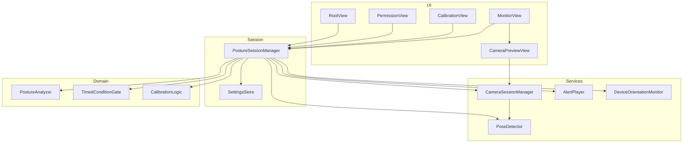
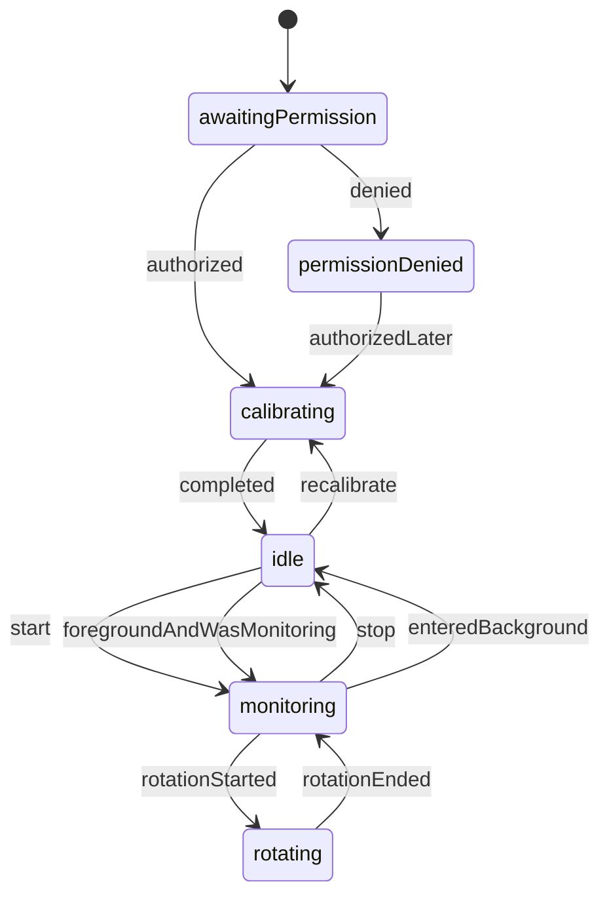
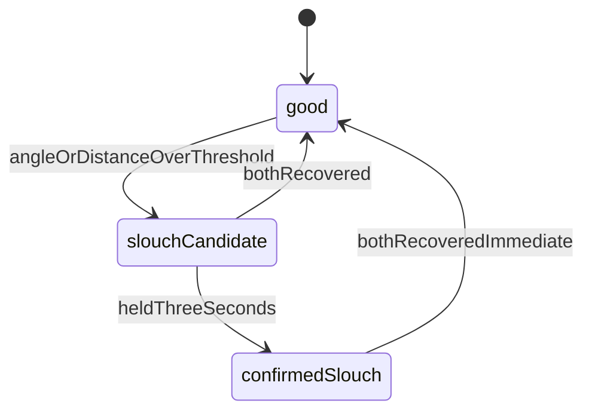
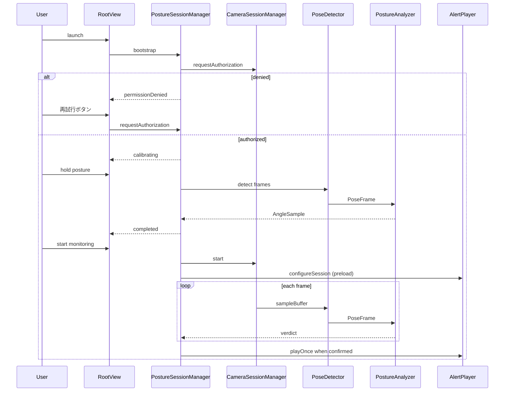
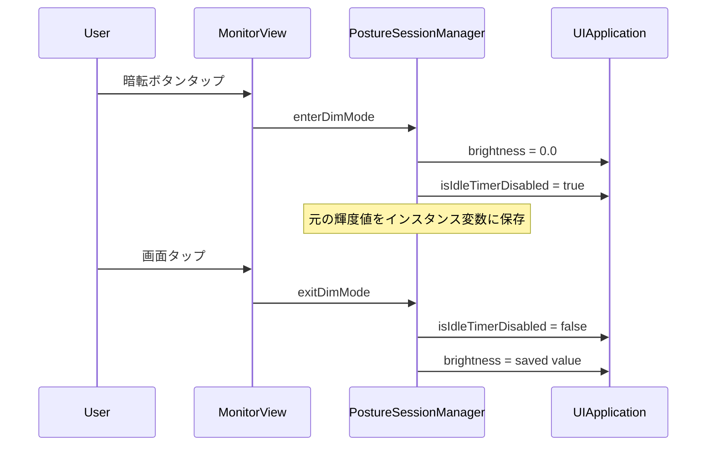

# Design: nekoze-fix

## Overview

NekozeFix は、iPhone/iPad のフロントカメラと Apple Vision の人体姿勢推定を用いてデスクワーカーの猫背をリアルタイム検知し、内蔵通知音で即時フィードバックする単一画面の iOS/iPadOS ネイティブアプリである。キャリブレーションで基準姿勢を登録し、近側の耳と肩の関係に基づく角度変化から猫背を判定する。サードパーティ依存は持たない。

本設計は MVVM を採用する。ドメインロジックは UI から独立した純関数と状態機械として定義し、カメラ・Vision・オーディオはそれぞれ単一のサービス境界に閉じる。

## Goals / Non-Goals

### Goals

- フロントカメラと Vision API によるリアルタイム姿勢検知パイプラインを確立する
- キャリブレーションでカメラ設置角度を吸収した基準姿勢を登録する
- 近側キーポイント中心の角度ベース猫背判定と、3秒連続検知による確定判定を実装する
- マナーモードでも再生される通知音と、画面暗転モードでの省電力監視を提供する
- 縦置き・横置き、バックグラウンド移行・復帰を含むデバイスライフサイクルに対応する

### Non-Goals

- バックグラウンド監視、統計・履歴、姿勢データの永続化（基準姿勢はプロセス内メモリに保持。UserDefaults に保存しない）
- カスタム通知音選択、バイブレーション通知
- クラウド同期、アカウント、HealthKit、ウェアラブル連携
- Android 対応、全身骨格推定の製品機能化

## Boundary Commitments

本スペックが所有する責任境界は次の通りである。

- フロントカメラセッションの構成・開始・停止と権限要求
- Vision による肩・耳キーポイント抽出と信頼度フィルタ（confidence < 0.3 を除外）
- 近側中心の耳ー肩角度計算（肩の x 座標で近側を判定、鋭角 0-90度）、校正ロック側の耳ー肩距離基準比計算、キャリブレーション、猫背確定/改善判定（角度 OR 距離）
- 通知音の再生・再通知間隔・停止（前回の音は停止して次を再生）
- 監視 UI、画面暗転モード（輝度 0.0 + wake lock）、閾値調整（角度 3〜20度・距離 5〜15%）、向き追従、フォアグラウンドライフサイクル

### Out of Boundary

- バックグラウンドでのカメラ継続、通知センターへのリモート通知
- 姿勢履歴の保存、分析ダッシュボード
- OS の権限ダイアログ本体とオーディオ優先度調停の実装
- 極端なカメラ角度（真横・真後ろ）での検出保証
- UserDefaults 以外の永続化（Keychain、ファイル DB など）

### Allowed Dependencies

- iOS/iPadOS 16+ SDK: AVFoundation（`.high` プリセット = 720p）、Vision、AVFAudio、SwiftUI、UIKit
- バンドル内の通知音アセット（`usagi-to-kame.caf`、うさぎとかめのチップチューンループ音源）
- UserDefaults（閾値と前回監視状態のローカル保持のみ）

### Revalidation Triggers

- 最低対応 OS を iOS 16 以外に変更する場合
- 角度 + 校正ロック側耳ー肩距離の 2 指標（OR）構成を変更・解除する場合
- 判定指標をこれら以外（3D 姿勢推定など）に切り替える場合
- バックグラウンド監視や永続化をスコープに入れる場合
- 通知手段を音以外（バイブレーション、システム通知）に拡張する場合
- カメラプリセットを `.high` から変更する場合

## Architecture

依存方向は次の一方向に固定する。左の層は右の層を知らない。

```
Types → Domain → Services → Session → UI
```

| Layer | 責務 | 上位への公開 |
|-------|------|--------------|
| Types | 値オブジェクトと列挙 | 全層が参照可能 |
| Domain | 角度計算、近側選択、連続条件ゲート | 純関数。I/O なし |
| Services | カメラ、Vision、オーディオ、向き、ライフサイクル | プロトコル経由の入出力 |
| Session | 監視セッション状態機械、設定保持 | ViewModel 相当 |
| UI | SwiftUI 画面とプレビュー | Session の公開状態のみ購読 |



### Key Decisions

- 単一の `PostureSessionManager` がセッション状態の唯一の書き込み点である。UI は状態を表示し、ユーザー操作をコマンドとして渡すだけである
- Vision 推論はカメラのサンプルバッファキュー上で実行し、UI 更新だけをメインキューへ送る
- 画面暗転は独立サービスではなく、`SessionSnapshot.isDimmed` フラグに対する UI 表現である。暗転中も監視・判定は継続する
- サードパーティライブラリは導入しない
- カメラプリセットは `.high`（720p）とし、Vision のキーポイント検出精度と NFR 8.1（15fps以上）の双方を満たす
- デバイス回転の完了判定は 5秒タイムアウト（orientationDidChangeNotification 発火後の静止を待つ）
- 通知音は監視開始時にプリロードし、停止時に解放する

### Grilling Decisions（24問の設計鋭鋭結果）

以下は `/grilling` セッションで決定した項目である。番号は質問番号に対応する。

| # | 決定項目 | 決定 |
|---|---------|------|
| Q1 | デフォルト判定閾値 | 5度（2026-09-12 改訂: 感度マッピングを廃止し度数直接指定へ。2026-09-13 改訂: 実測感度によりデフォルト 8度→5度、下限 3度へ変更） |
| Q2 | 暗転輝度 | 0.0（全黒）+ wake lock |
| Q3 | 遠側キーポイントの役割 | 「両側検出済みか」の合否判定のみ |
| Q4 | 基準姿勢の永続化 | 不要（プロセス内メモリのみ） |
| Q5 | 回転中のゲート保持 | 保持する（リセットしない） |
| Q6 | personMissing 時のゲート | 即座にリセットする |
| Q7 | 権限拒否からの復帰 | ユーザーが手動で「再試行」ボタンを押す |
| Q8 | 暗転中の personMissing | 抑制（完全黒画面維持） |
| Q9 | 近側の決定基準 | 肩の x 座標が小さい側を近側とする |
| Q10 | 角度計算の定義 | 鋭角 0〜90度（ベクトルなす角） |
| Q11 | 片側のみ検出時 | 検出側を自動的に近側として扱う |
| Q12 | 両側高信頼度時の安定化 | 移動平均なし（生の角度をゲートに投入） |
| Q13 | カメラプリセット | `.high`（720p） |
| Q14 | 回転完了判定 | 5秒タイムアウト |
| Q15 | wake lock の実装 | `UIApplication.shared.isIdleTimerDisabled = true` |
| Q16 | 回転中の personMissing | 抑制 |
| Q17 | 通知音プリロード | 監視開始時（`startMonitoring()` 内） |
| Q18 | 通知音同時再生 | 前の音を停止して次を再生 |
| Q19 | 暗転中の音量 | ユーザー設定のまま |
| Q20 | 監視停止時の通知音 | 即座に `stop()` を呼ぶ |
| Q21 | 人物検出の判定 | 即座（2026-09-13 改訂: null 観測から 0.5 秒猶予 `personMissingGracePeriod` 経過後に確定。瞬間的な検出抜けを吸収） |
| Q22 | 姿勢崩れ判定 | 角度変化 > 5度 OR 人物検出途絶 |
| Q23 | 再通知間隔 | 前回通知から音声1ループ分（音源長に追従、現音源は約14秒） |
| Q24 | 暗転復帰時の輝度 | プロセス内メモリ保持。**フォアグラウンド復帰時は暗転を解除し保存した輝度を復元**（2026-09-13 改訂: 旧決定「復元せず暗転継続」は全黒画面で復帰する実害があるため変更） |

詳細は各ADR（docs/adr/0008〜0013）に記載されている。

### Grilling Decisions（第2ラウンド: 前出し距離指標）

「首が前に出る（forward head）」を検出するため、角度指標に加えて耳ー肩距離の基準比を第2指標として導入する。FQ 番号は 2026-09-13 の grilling セッションの質問番号に対応する。

| # | 決定項目 | 決定 |
|---|---------|------|
| FQ1 | 距離計算の側 | **校正時にロックした側**を使用する。角度の近側選択（Q9）とは独立。ロック側のペアが無効化したら距離をスキップし角度のみ継続（左右の耳ー肩距離には約8%の固有差があり、側混在はノイズではなく系统的誤差になる。第1段 DEBUG 実測で確認） |
| FQ2 | 距離しきい値の初期値 | **+8%（2026-09-13 検収で確定値）**。第2段実機検収（iPad 9th）: 意図的前出し110%で発音確認、自然前出しの 1s-median 最大も110%で両者は分離しない。作業中の前出し110%は矯正対象とみなし 8% 据え置きで PASS（第1段実測: 静止ノイズ ±1%、意図的前出し +11〜15%） |
| FQ3 | 距離閾値の UI | **スライダー化**（角度スライダーの横に並列表示） |
| FQ4 | 距離スライダーの範囲 | **5〜15%・ステップ 0.5・デフォルト 8%**（観測レンジに絞った狭い範囲） |
| FQ5 | DEBUG 表示の運命 | 検収実測が終わるまで黄色 monospace 距離表示を残し、その後 chore コミットで削除（角度指標導入時と同じ慣例） |
| FQ6 | 判定関係 | 角度偏差 **OR** 距離基準比増加で猫背候補。改善遷移は**有効な全指標**が閾値未満に戻った時（4.3。スキップ中の指標は条件集合から除外）。3秒確定ゲート（4.2）は OR 後の結果に掛かる |
| FQ7 | 正規化 | 校正時耳ー肩距離の平均を `referenceDistance` として保存し、監視中は基準比%（素値+直近1秒中央値を DEBUG 表示）で比較。角度と同一タイミング・同一機構で保存 |
| FQ8 | 検収と実測の順序 | 検収1セッションで両取り: 意図的前出しで発音確認 → 通常作業で自然前出しの最大%記録 → 閾値の妥当性判定 → DEBUG 削除 |

物理前提: カメラは斜め正面45度設置が想定（要件 3.*）。前出しでは耳が前方+下方に動き、45度では前方変位が像面に横ずれとして現れるため耳ー肩投影距離は伸びる。角度指標は傾きと頭部下垂が打ち消し合い微弱信号になりやすい一方、距離は両成分が加算され補完的。すくめは距離が縮む方向なので誤発火しない。

## File Structure Plan

すべて新規作成。Xcode プロジェクト `NekozeFix.xcodeproj` をルートに置く。

| Path | Responsibility | Component |
|------|----------------|-----------|
| `NekozeFix/NekozeFixApp.swift` | アプリエントリ、ルート注入 | App |
| `NekozeFix/Info.plist` | カメラ利用説明、向き、最低 OS | Config |
| `NekozeFix/Resources/usagi-to-kame.caf` | 短い通知音アセット | AlertPlayer |
| `NekozeFix/Types/PostureTypes.swift` | 状態・キーポイント・判定結果の型 | Types |
| `NekozeFix/Domain/PostureAnalyzer.swift` | 近側選択と耳ー肩角度、猫背判定 | PostureAnalyzer |
| `NekozeFix/Domain/TimedConditionGate.swift` | N秒連続条件の蓄積とリセット | TimedConditionGate |
| `NekozeFix/Domain/CalibrationLogic.swift` | 安定判定と基準角度の確定 | CalibrationLogic |
| `NekozeFix/Services/CameraSessionManager.swift` | フロントカメラセッションと権限 | CameraSessionManager |
| `NekozeFix/UI/CameraPreviewView.swift` | AVCaptureVideoPreviewLayer の SwiftUI ラッパ | CameraPreviewView |
| `NekozeFix/Services/PoseDetector.swift` | Vision リクエストと信頼度フィルタ | PoseDetector |
| `NekozeFix/Services/AlertPlayer.swift` | playback カテゴリでの通知音再生 | AlertPlayer |
| `NekozeFix/Services/DeviceOrientationMonitor.swift` | 向き変化と回転中フラグ | DeviceOrientationMonitor |
| `NekozeFix/Session/PostureSessionManager.swift` | 監視セッションの状態機械 | PostureSessionManager |
| `NekozeFix/Session/SettingsStore.swift` | 閾値と前回監視状態 | SettingsStore |
| `NekozeFix/UI/RootView.swift` | 権限・校正・監視の画面切替 | RootView |
| `NekozeFix/UI/PermissionView.swift` | 権限要求と拒否時の案内 | PermissionView |
| `NekozeFix/UI/CalibrationView.swift` | 校正指示、蓄積時間、再実行 | CalibrationView |
| `NekozeFix/UI/MonitorView.swift` | プレビュー、状態表示、開始停止、暗転、閾値 | MonitorView |
| `NekozeFixTests/PostureAnalyzerTests.swift` | 角度・近側・信頼度の単体試験 | tests |
| `NekozeFixTests/TimedConditionGateTests.swift` | 3秒/5秒ゲートの単体試験 | tests |
| `NekozeFixTests/CalibrationLogicTests.swift` | 安定・崩しリセットの単体試験 | tests |
| `NekozeFixTests/PostureSessionManagerTests.swift` | 状態遷移の単体試験 | tests |

## Components & Interfaces

### Component Summary

| Component | Domain | Intent | Requirements | Dependencies | Contracts |
|-----------|--------|--------|--------------|--------------|-----------|
| Types | Types | 共有値と状態の定義 | 3.3, 4.1, 4.4 | なし | State |
| PostureAnalyzer | Domain | 角度 OR 距離基準比から猫背候補を出す | 3.5, 4.1, 4.5, 4.6 | Types | Service |
| TimedConditionGate | Domain | 連続条件の確定 | 2.3, 2.4, 4.2, 4.3 | Types | Service |
| CalibrationLogic | Domain | 基準角度・基準距離・ロック側の確定規則 | 2.1-2.7, 4.1 | Types | Service |
| CameraSessionManager | Services | カメラ権限とキャプチャ（.high 720p） | 1.1, 1.2, 3.1, 3.2, 7.1, 8.1, 8.2, 9.1 | AVFoundation | Service |
| PoseDetector | Services | キーポイント抽出（confidence ≥ 0.3） | 2.5, 3.4, 4.5, 8.1 | Vision | Service |
| AlertPlayer | Services | 通知音と再通知（前音停止・上書き） | 5.1-5.4, 8.2 | AVFAudio | Service |
| DeviceOrientationMonitor | Services | 回転検知（5秒タイムアウト完了） | 7.1, 7.2 | UIKit | Event |
| SettingsStore | Session | 閾値と監視フラグ（角度 3〜20度・距離 5〜15%） | 4.4, 8.2 | UserDefaults | State |
| PostureSessionManager | Session | セッション状態の唯一の所有者 | 2.*, 3.*, 4.*, 5.*, 6.*, 7.*, 8.* | 上記すべて | State, Service |
| PermissionView | UI | 権限 UI | 1.1, 1.2 | Session | State |
| CalibrationView | UI | 校正 UI | 2.1-2.6, 10.1 | Session | State |
| MonitorView | UI | 監視・暗転・閾値 UI | 3.1-3.4, 4.4, 6.1-6.3, 9.2, 10.1 | Session | State |
| CameraPreviewView | UI | プレビュー描画 | 3.2, 6.2 | CameraSessionManager | State |

### Types

共有型。実装詳細ではなく契約として固定する。

```swift
enum CameraAuthorization {
    case notDetermined
    case authorized
    case denied
}

enum DetectionPresence {
    case personDetected
    case personMissing
}

struct Keypoint: Equatable {
    var x: Double
    var y: Double
    var confidence: Double
}

struct PoseFrame: Equatable {
    var timestamp: TimeInterval
    var leftEar: Keypoint?
    var rightEar: Keypoint?
    var leftShoulder: Keypoint?
    var rightShoulder: Keypoint?
}

enum Side: Equatable {
    case left
    case right
}

struct AngleSample: Equatable {
    var nearSide: Side
    var nearAngleDegrees: Double
    var farSideDetected: Bool
    var nearDistance: Double  // 近傍側の耳ー肩距離（正規化座標系、単位なし）。FQ1 により監視中はロック側の値が入る
}

enum PostureVerdict: Equatable {
    case good
    case slouchCandidate
    case insufficientKeypoints
}

enum SessionPhase: Equatable {
    case awaitingPermission
    case permissionDenied
    case calibrating
    case idle
    case monitoring
    case rotating
}

enum DisplayedPosture: Equatable {
    case good
    case slouch
    case personMissing
}

struct SessionSnapshot: Equatable {
    var phase: SessionPhase
    var displayedPosture: DisplayedPosture
    var isDimmed: Bool
    var isPersonDetected: Bool
    var isMonitoringEnabled: Bool
}
```

**信頼度閾値**: 定数 `keypointThreshold = 0.3` とする（検出率向上のため 0.5 から緩和、2026-09-13 実装同期）。

**閾値**: 判定閾値は `SettingsStore.slouchThresholdDegrees`（3〜20度、デフォルト 5.0）と `SettingsStore.slouchDistanceThresholdPercent`（5〜15%、デフォルト 8.0）を単一ソースとして View/Session とも直接参照する。感度（0.0-1.0）を経由する変換層は廃止（2026-09-12 改訂）。

### PostureAnalyzer

近側キーポイントを選び、耳ー肩ベクトルと垂直線のなす角度を計算する。I/O なし。

**Preconditions**: 入力 `PoseFrame` の各キーポイントは未フィルタでもよい。本コンポーネントが confidence 未満を除外する。

**Postconditions**:
- 近側の耳と肩が両方有効なら `AngleSample` と `PostureVerdict` を返す
- 片側のみ有効ならその側を自動的に「近側」として扱い、その側で判定する（3.5, 4.6）
- 両側が有効なら **肩の x 座標** が小さい側を近側とする（Q9 決定）。遠側キーポイントの `farAngleDegrees` は返すが、近側判定には使用しない（Q3 決定：遠側は「両側検出済みか」の合否のみ）
- 有効な耳ー肩ペアが無い場合は `insufficientKeypoints`

**近側決定規則**:
- `leftShoulder.x < rightShoulder.x` → `nearSide = .left`
- `rightShoulder.x < leftShoulder.x` → `nearSide = .right`
- `leftShoulder.x == rightShoulder.x` → デフォルトで `.left`
- 片側のみ検出 → 検出側を `nearSide` とする

**角度計算**:
- ベクトル `v = ear - shoulder`
- 画像上向きの垂直ベクトル `(0, 1)`（Vision の座標系：左下原点、x右向き、y上向き）
- `cos(θ) = v.y / |v|`
- `θ = acos(clamp(v.y / |v|, -1, 1))`
- 結果は **鋭角 0〜90度**（Q10 決定）
- **移動平均フィルタは適用しない**（Q12 決定：生の角度を 3秒ゲートに投入）

**判定（OR 判定・FQ6）**: 角度条件 `nearAngleDegrees - referenceNearAngleDegrees >= slouchDeltaThresholdDegrees`、または距離条件 `referenceDistance > 0 かつ sample.nearDistance >= referenceDistance * (1 + slouchDistanceThresholdPercent / 100)` のいずれかが成立なら `slouchCandidate`。カメラ設置角は基準値に含まれるため、絶対垂直との比較は行わない。

**距離の側ロック（FQ1）**: 監視中の距離計算は角度判定で選択された近側とは独立に、校正時に保存した `referenceSide` の耳ー肩ペアで行う。ロック側のペアが confidence < 0.3 等で使用できないフレームでは距離条件を評価せず（スキップ）、角度のみで判定を継続する。校正中は角度と同じ近側を距離にも記録する。

```swift
struct PostureAnalyzer {
    func analyze(
        frame: PoseFrame,
        referenceNearAngleDegrees: Double?,
        slouchDeltaThresholdDegrees: Double,
        distanceMetric: DistanceMetric?,   // ロック側ペアと基準距離。nil またはペア欠測時は距離スキップ
        slouchDistanceThresholdPercent: Double, // 距離閾値%（SettingsStore.slouchDistanceThresholdPercent を単一ソースとして渡す。角度の slouchDeltaThresholdDegrees と対称）
        previousNearSide: Side?
    ) -> (sample: AngleSample?, verdict: PostureVerdict)
}

/// 距離指標の評価に必要データ（Session 層が校正完了時に構成し監視中保持）
struct DistanceMetric {
    var side: Side              // 校正時にロックした側
    var referenceDistance: Double // 校正時耳ー肩距離の平均（正規化座標系）
}
```

### TimedConditionGate

連続充足時間を蓄積する純ロジック。

```swift
struct TimedConditionGate {
    var requiredDuration: TimeInterval
    mutating func tick(isConditionMet: Bool, now: TimeInterval) -> Bool
    mutating func reset()
}
```

- `isConditionMet == true` の間だけ経過を加算し、`requiredDuration` 到達で `true` を一度返す
- `false` になった瞬間に蓄積をゼロにする（2.4, 4.2 の途中解除）
- キャリブレーションは 5.0 秒、猫背確定は 3.0 秒でインスタンスを分ける
- 回転中は PostureSessionManager が `tick` 呼び出しを停止し、ゲートは保持される（Q5 決定：回転中ゲートはリセットしない）。回転完了後に再開する
- 人物なし（`isConditionMet == false`）が検出された時点でゲートは即座にリセットされる（Q6 決定。人物なし自体の確定は 0.5 秒猶予を経てから）

### CalibrationLogic

人物検出があり、かつ `PostureAnalyzer` が角度を出せるフレームだけを安定とみなす。**姿勢崩れは角度変化 > 5度 OR 人物検出途絶** で判定する（Q22 決定）。

```swift
struct CalibrationLogic {
    mutating func start()
    mutating func ingest(
        sample: AngleSample?,
        presence: DetectionPresence,
        now: TimeInterval,
        points: [CGPoint] = []  // 可視化ポイント（6点: 0左肩 1右肩 2左耳 3右耳 4近傍耳 5近傍肩）
    ) -> CalibrationProgress
}

enum CalibrationProgress: Equatable {
    case waitingForPerson
    case accumulating(elapsed: TimeInterval)
    case completed(referenceNearAngleDegrees: Double, referenceDistance: Double, referenceSide: Side, referencePoints: [CGPoint])
}
```

完了時は蓄積期間中の近側角度の平均を基準姿勢として返し、最終フレームの可視化ポイント列を `referencePoints` として返す（2.3, 2.7）。角度と同一タイミング・同一窓で、蓄積距離の平均を `referenceDistance`、**完了フレームの近側**（`sample.nearSide`）を `referenceSide`（距離のロック側・FQ1）として返す。近側は姿勢崩れ規則（下記）で5秒間切り替わりなしが保証されているため、窓内は単一侧のみ。再実行は `start()` により基準を上書きする（2.6）。人物なしは完了しない（2.5）。

**姿勢崩れ判定規則**:
- 直前の近側角度と今回の近側角度の差分が 5度以上 → 蓄積をリセット
- **近側の切り替わり（`sample.nearSide` 変化）→ 蓄積をリセット**（2026-09-13 追加: validate-design Issue 1。角度と距離で単位が違う安定条件だが、左右の耳ー肩距離に約8%の固有差があるため側またぎの距離窓は系统的に汚染される。側が安定していること自体が校正の安定条件の一部）
- `presence == .personMissing` → キーポイント脱落と同一扱い。直近の有効サンプルからの経過が `dropoutTolerance`（1.0 秒）以内なら蓄積を保持し時間を凍結、超過でリセット（2026-09-13 変更: 即座リセットから猶予付きに。Q21 の 0.5 秒デバウンスと合わせ、Session 確定済みの personMissing も脱落許容の範囲で吸収する）
- それ以外 → 蓄積を継続

**キーポイント脱落の許容（時間凍結）**:
脱力・なで肩姿勢では Body Pose 観測がフレーム単位でチラつき、角度サンプルが欠測することがある。
欠測直後の 1.0 秒以内の脱落は「リセットでも計上でもなく」、蓄積時間を凍結する（f1 決定）。
許容を超えた時点で姿勢崩れと同じくリセット。これによりカウントダウンの逆行・毎回リセットを防止する。
`accumulatedDuration` は有効サンプル間の経過のみ計上し、凍結区間の経過は計上しない。

### CameraSessionManager

**Inbound**: Session からの start/stop、向き更新。
**Outbound**: サンプルバッファを PoseDetector へ。
**External P0**: AVFoundation フロントカメラ。

```swift
protocol CameraSessionManaging: AnyObject {
    var authorization: CameraAuthorization { get }
    var captureSession: AVCaptureSession { get }
    func requestAuthorization() async -> CameraAuthorization
    func start() async throws
    func stop()
    func applyVideoOrientation(_ orientation: AVCaptureVideoOrientation)
}
```

- プリセットは **`.high`（1280x720 相当）**（Q13 決定）。Vision のキーポイント検出精度と NFR 8.1（15fps以上）の双方を満たす
- `AVCaptureVideoDataOutput` は専用シリアルキュー。メインキューでは動かさない
- `startRunning` / `stopRunning` はバックグラウンドキューで実行する
- 権限が `.denied` のとき start は失敗し、UI は設定アプリ導線を出す（1.2）
- エラー: カメラ欠如、セッション構成失敗。いずれもユーザー向けに「カメラを使用できません」へ写像する

### PoseDetector

```swift
protocol PoseDetecting {
    func detect(sampleBuffer: CMSampleBuffer, orientation: CGImagePropertyOrientation) -> PoseFrame?
}
```

- `VNDetectHumanBodyPoseRequest` を使用する
- 返すキーポイントは confidence >= 0.3 のみ。未満は `nil`（4.5。検出率向上のため 0.5 から緩和）
- 観測が空（人物なし）なら `nil` を返す。Session は null 観測が **0.5 秒（`personMissingGracePeriod`）継続した時点で** `personMissing` を確定する（Q21 改訂：瞬間的な検出抜けを吸収）
- 処理はキャプチャキュー上。目標は 15 fps 以上（NFR 8.1）。遅延時は最新フレーム以外を捨てる
- **複数人物時の選択基準（FR 4.7）**: 画面中央 (0.5, 0.5) に最も近いバウンディングボックスの人物のみ認識する。顔観測は `boundingBox`、Body Pose 観測はキーポイントの囲み矩形を代理 box とし、同一の `closestToCenter`（距離二乗比較）を使う。選択はフレーム単位（人物追跡・ID ロックは持たない）
- **人体矩形 ROI 再試行（c 案）**: パス1で `VNDetectHumanRectanglesRequest` を顔検出と同時実行し、Body Pose がフルフレームで空振りした場合のみ、人体矩形（単位矩形へクリップ）を `regionOfInterest` として再試行する。頭部クロズアップで Body Pose 観測が 0 になる実測（face/humanRect は生存）への対処で、iPad 9th 実機で蘇生を確認済み。クリップを忘れると Vision Code=14、`.zero` を代入すると Code=3 で全失敗するため、未指定時はプロパティを設定しない
- **ランドスケープ×なで肩の肩欠測（ADR 0014）**: iPad 9th 横置き・なで肩姿勢では Body Pose 観測がフルフレーム・ROI 再試行ともゼロ件になる（実測: 左右肩/耳 `--`、人体矩形 0.43x0.99 の生存のみ）。ランドスケープの縦画角がセンサー短辺に刈り込まれ肩が画角から落ちるのが物理原因で、検出側の救済（ROI 再試行拡張・閾値引き下げ）は不能と判定。`isShoulderMissing` のガイダンスを `SessionSnapshot.isLandscape`（向きの購読経路で更新、判定ロジックには関与しない）に応じて分岐し、ランドスケープでは「少し離してカメラが耳から肩のあたりに向くよう角度を調整する」を案内する（ガイダンス表示はキャリブレーション画面のみ。モニター画面では出さない）

### AlertPlayer

```swift
protocol AlertPlaying {
    func configureSession() throws
    func playOnce()
    func startRepeating()
    func stop()
}
```

- カテゴリ `.playback`、オプション `.duckOthers`（5.4）
- **プリロードは `startMonitoring()` 呼び出し時に実行**（Q17 決定）。`configureSession()` と音声ファイルのロードを `startMonitoring()` 内で行う
- 確定猫背の初回で 1 回再生し、継続中は **前回通知から音声1ループ分**（Q23 決定：「0s, 30s, 60s...」ではなく「通知時点から再再生」。間隔は `AVAudioPlayer.duration` に追従し、音切れ・重複のないシームレスループとする。現音源 `usagi-to-kame.caf` は約14.2秒）
- **同時再生ポリシー**: 次の再生時刻で前の音がまだ鳴っている場合、前の音を停止して次を再生する（Q18 決定：重複を避ける）
- 改善時は即停止し、繰り返しタイマーを破棄する（5.3, Q20 決定：監視停止でも `stop()` を即座に呼ぶ）
- 再生開始は確定判定から 0.5 秒以内（NFR 8.2）。プレイヤーは事前ロードする
- デフォルト音源はバンドルの `usagi-to-kame.caf`（約14.2秒ループ。繰り返し間隔は音源長に連動するため、短いファンファーレである必要はない）
- 暗転中の音量は **ユーザー設定のまま**（Q19 決定）。暗転モードは画面のみで音量は変えない

### DeviceOrientationMonitor

```swift
protocol DeviceOrientationMonitoring {
    var currentVideoOrientation: AVCaptureVideoOrientation { get }
    var isRotating: Bool { get }
}
```

- `UIDevice.beginGeneratingDeviceOrientationNotifications()` で方向変更を監視
- 向き変化が検出されたら `isRotating = true`
- **5秒間 orientation が変化しなければ完了** とみなす（Q14 決定：`isRotating = false`）
- 完了後に Session が `applyVideoOrientation` を呼んでカメラ向きを更新し、`monitoring` に復帰

### ライフサイクル（歴史: 旧 AppLifecycleObserver は未接続のまま削除）

背面停止・復帰再開（FR 8.1/8.2）を担当する `AppLifecycleObserver` は一度も接続されないまま 2026-09-13 に削除した。削除後は iOS による AVCaptureSession の自動停止に依存する状態が続いていたが、同日タスク 3.5 として下記を実装した。

### ライフサイクル（実装: タスク 3.5）

単独 Component は置かず `PostureSessionManager` 内で完結させる（上記決定通り）。
- **トリガー**: RootView が `@Environment(\.scenePhase)` を購読し、`.background` で `handleDidEnterBackground()`、`.active` で `handleWillEnterForeground()` を呼ぶ（`.inactive` — 通知シェード/コントロールセンター開等 — では呼ばない。フォアグラウンド滞留中の暗転を維持するため）。iOS の AVCaptureSession 自動停止に重ねて明示停止する（音声停止・wake lock 解除を保証するため）
- **背面移行**: 通知音停止、カメラ停止、`isIdleTimerDisabled = false`。暗転フラグ・輝度はこの時点では変更しない。監視中/校正中/回転中は `idle` へ退避。監視フラグ（SettingsStore）は維持 — ユーザーストップではないため
- **フォアグラウンド復帰**: まず暗転を解除（`exitDimMode()` で保存輝度を復元、Q24 改訂）。その後 `isMonitoringEnabled == true` **かつ**校正済み（`referenceAngle != nil`）なら `startMonitoring()` で再開。明示停止（false）・未校正・権限なしは停止維持。idle 以外のフェーズは触らない
- **監視フラグの単一ソース**: `SettingsStore.isMonitoringEnabled` を `startMonitoring`/`stopMonitoring`/校正完了で更新（snapshot のフラグと同期）。復帰判定はこの永続フラグのみを参照

### SettingsStore

```swift
protocol SettingsStoring: AnyObject {
    var slouchThresholdDegrees: Double { get set }  // 3.0...20.0、デフォルト 5.0
    var slouchDistanceThresholdPercent: Double { get set }  // 5.0...15.0、デフォルト 8.0（FQ2/FQ4）
    var isMonitoringEnabled: Bool { get set }
}
```

UserDefaults に閾値（度数）と監視フラグのみ保存する。基準姿勢は **プロセス内メモリに保持し、永続化しない**（Q4 決定：Out of Scope）。

**閾値ストレージ（2026-09-12 改訂）**: 感度（0.0-1.0）は廃止し、判定閾値を度数そのもの (`slouchThresholdDegrees: 3.0...20.0`、デフォルト 5.0、ステップ 0.5) で永続化する。旧感度キー (`com.nekozefix.sensitivity`) は初回起動時に旧マッピング `20 - sensitivity * 15` で一度だけ変換して引き継ぎ、以降削除する。 registered default を閾値キーに登録すると移行判定がマスクされるため、デフォルト値は `init` 側で担保する。

**距離閾値ストレージ（FQ3/FQ4 追加）**: `slouchDistanceThresholdPercent`（5.0...15.0、ステップ 0.5、デフォルト 8.0）を角度と同じ UserDefaults 機構で永続化する。新規キーのため旧キー移行は不要。範囲外値は角度と同様にクランプする。

### PostureSessionManager

セッションの単一ソース。`ObservableObject` として `SessionSnapshot` を公開する（iOS 16 互換のため `@Observable` は使わない）。

```swift
@MainActor
class PostureSessionManager: ObservableObject {
    var snapshot: SessionSnapshot
    func bootstrap() async
    func startCalibration()
    func recalibrate()
    func startMonitoring()
    func stopMonitoring()
    func enterDimMode()
    func exitDimMode()
    func updateSensitivity(_ value: Double)
}
```

**権限拒否からの復帰**（Q7 決定）: ユーザーが PermissionView の「再試行」ボタンを押すことで `requestAuthorization()` を再呼び出しする。アプリ自身は OS 標準ダイアログの再トリガを能動的に行わない。

#### 状態機械



`displayedPosture` と通知は `monitoring` のサブ状態として扱う。



`angleOrDistanceOverThreshold` は OR 判定（FQ6）。`bothRecovered` は**有効な全指標**が閾値未満に戻ったこと（4.3）。ロック側ペアが読めないフレームでは距離は条件評価に参加しない（FQ1）— スキップ中の指標は条件集合から除外されるため、距離不使用時は角度のみの旧挙動に自然に退化する。

- `confirmedSlouch` 入場で `playOnce` とリピート開始（間隔は音声ループ長）
- `good` 入場で `stop`
- `personMissing` は Vision が `nil` を返してから **0.5 秒猶予（`personMissingGracePeriod`）経過後に確定**。確定した時点で蓄積中の猫背ゲートは即座にリセットする（Q6 決定）
- `dimmed` はフェーズではなくフラグ。監視は継続しプレビューを隠す（6.2）。暗転中の人物なし表示は **抑制**（Q8 決定：完全黒画面維持）
- 暗転中のタップは `exitDimMode`（6.3）
- 回転中は personMissing 表示も **抑制**（Q16 決定：回転中黒画面維持）

### UI Components

いずれも新規境界を持たないため要約のみ。

- **RootView**: snapshot.phase で Permission / Calibration / Monitor を切替える。起動から監視開始までを権限 → 校正 → 開始の 3 ステップに収める（10.1）
- **PermissionView**: 初回はシステムダイアログをトリガし、拒否時は設定アプリへの案内と「再試行」ボタンを出す（1.1, 1.2, Q7 決定）
- **CalibrationView**: 5秒キープ指示、検出状態、蓄積時間、人物なしメッセージ、再実行（2.1-2.6）。可視化は `PostureOverlayView(mode: .current)` を使用し、肩・耳・判定ラインをリアルタイム表示
- **MonitorView**: カメラプレビューは表示しない。校正で確定した姿勢を薄いグレー（`.reference` モード）で固定表示し、現在の姿勢をカラー（`.current` モード）で重ねて表示。開始停止、閾値（角度スライダーと距離スライダーを横並び。FQ3）、暗転ボタン。暗転時は **完全黒画面＋輝度 0.0 + wake lock**（Q2, Q15 決定）。タップで復帰（3.*, 4.4, 6.*）
- **PostureOverlayView**: 校正・監視共通のオーバーレイ。`mode: .reference` はグレーで固定表示、`mode: .current` はカラーでリアルタイム表示。肩・耳・判定ライン・基準線を描画
- **CameraPreviewView**: `UIViewRepresentable`。校正画面のみで使用。暗転中は非表示（3.2, 6.2）

**DEBUG 距離表示（FQ5・削除済み）**: 検収 PASS（2026-09-13）に伴い、黄色 monospace の基準比%表示足場（SessionSnapshot の `debugDistanceText` と窓バッファ）は chore で削除した。判定ロジック（`DistanceMetric`・OR 判定）は独立して残る。

**暗転モードの実装詳細**:
- `enterDimMode()` で:
  1. 元の輝度値（`UIScreen.main.brightness`）を **PostureSessionManager のインスタンス変数** に保存（Q24 決定：プロセス内メモリ、UserDefaults 永続化なし）
  2. `UIScreen.main.brightness = 0.0`
  3. `UIApplication.shared.isIdleTimerDisabled = true`（Q15 決定：wake lock）
- `exitDimMode()` で:
  1. `UIApplication.shared.isIdleTimerDisabled = false`
  2. 保存した輝度値へ復元
- バックグラウンド移行時の扱い（タスク 3.5 実装済み）:
  1. `isIdleTimerDisabled = false`
  2. 背面移行時点では輝度を復元しない（画面が消えているため実害なし）
  3. カメラ停止・通知音停止
  4. フォアグラウンド復帰時に `exitDimMode()` を呼び暗転を解除、保存した輝度を復元する（Q24 改訂。旧決定の「復帰後も暗転継続」は輝度 0.0 の全黒画面で復帰する実害があるため変更）

## System Flows

### 起動から監視



### 確定猫背と改善

判定は Session 内のゲートが所有する。AlertPlayer は再生命令だけを受け、判定理由を知らない。

### 暗転モード遷移



## Data Models

永続化対象は閾値と監視フラグのみ。基準姿勢・セッション状態はメモリ上の集約 `PostureSession` が所有する。

**不変条件**
- 基準角度が無い状態では monitoring に入れない
- 基準距離（`referenceDistance`）・ロック側（`referenceSide`）は基準角度と同一タイミング（校正完了時）に保存され、プロセス内メモリのみ（Q4 と同じ扱い）
- confidence < 0.3 のキーポイントは AngleSample に入らない
- 確定猫背中のみ通知タイマーが存在する
- 暗転は monitoring または rotating でのみ true になり得る
- 人物なし（Vision が `nil`）が 0.5 秒継続した時点で `personMissing` が確定する
- 暗転中・回転中は personMissing の表示が抑制される

## Error Handling

| 失敗 | 検出点 | ユーザー影響 | 復旧 |
|------|--------|--------------|------|
| カメラ権限拒否 | CameraSessionManager | 設定案内画面＋「再試行」ボタン | 設定から許可後、または再試行ボタン |
| カメラ構成失敗 | CameraSessionManager | 使用不可メッセージ | 再起動を促す |
| 人物なし | PoseDetector | フレーム内へ誘導（暗転・回転中は表示抑制） | 検出再開で自動復帰 |
| キーポイント不足 | PostureAnalyzer | 人物なし相当の警告 | 近側再検出 |
| 距離ロック側ペア欠測 | PostureAnalyzer | 距離スキップ（角度のみで判定継続・FQ1）。復帰で自動復活 | 側ロックは維持したまま距離条件が再評価される |
| オーディオセッション失敗 | AlertPlayer | 判定は継続、音なし | 次回再生時に再構成 |
| 回転中の不安定フレーム | DeviceOrientationMonitor | 判定一時停止（5秒タイムアウトで再開） | 5秒静止で完了 |

失敗時もカメラパイプライン全体を落とさない。部分機能（検知なし表示、音なし監視）を優先する。

## Testing Strategy

要件の受け入れ条件から導出する。

### Domain 単体

- **PostureAnalyzer**:
  - 近側のみ検出（左耳・左肩のみ confidence ≥ 0.3）で `nearSide = .left` を返す
  - 遠側のみ検出（右耳・右肩のみ confidence ≥ 0.3）で `nearSide = .right` を返す（Q11 決定）
  - 両側高信頼度で、肩 x 座標が左寄りなら `nearSide = .left`（Q9 決定）
  - 両側高信頼度で、肩 x 座標が右寄りなら `nearSide = .right`
  - confidence 0.29 のキーポイントは除外される
  - 閾値前後の判定（基準 + 9度 = good、基準 + 11度 = slouchCandidate）
  - 鋭角 0-90度範囲の確認（Q10 決定）
  - **距離 OR 判定（FQ6）**: 角度は閾値未満だが距離基準比が閾値以上 → slouchCandidate。逆も同様。両方閾値未満 → good
  - **距離の側ロック（FQ1）**: ロック側と異なる側が近側になったフレームでも、距離はロック側ペアで計算される。ロック側ペアが confidence < 0.3 のフレームでは距離条件が評価されず角度のみで判定される
  - **距離しきい値境界**: 基準比がちょうど閾値%で slouchCandidate（以上）、閾値未満で good
- **TimedConditionGate**:
  - 3秒未満で解除したら未確定
  - 3秒連続で確定
  - 改善は即リセット
  - 人物なし（`isConditionMet == false`）即座リセット（Q6 決定）
- **CalibrationLogic**:
  - 5秒安定で平均角度保存
  - 完了時に平均距離と完了フレームの近側が角度と同一タイミングで返る（FQ1/FQ7）
  - 角度変化 > 5度で蓄積リセット（Q22 決定）
  - 校正中の近側切り替わり（left↔right）で蓄積リセット（FQ1 基準汚染防止）
  - 人物検出途絶で蓄積リセット（Q22 決定）
  - 人物なしで未完了
  - 再実行で上書き

### Session 単体

- 開始/停止でカメラ start/stop が対になる（3.1）
- 開始時に AlertPlayer をプリロード（Q17 決定）
- 停止時に AlertPlayer.stop() を即座に呼ぶ（Q20 決定）
- 距離閾値 `slouchDistanceThresholdPercent` の範囲クランプ（5〜15%）と UserDefaults 永続化（新規キーのため旧キー移行なし）（4.4/FQ4）
- 確定入場で playOnce、継続でリピート（Q23 決定：間隔は音声ループ長に追従）
- 改善で stop（5.3）
- 同時再生ポリシー：前の音停止→次を再生（Q18 決定）
- 回転中は判定停止、5秒タイムアウトで再開（Q5, Q14 決定）
- 背面で停止、復帰時は isMonitoringEnabled に従う（8.1, 8.2）
- 暗転フラグ中も判定は進む（6.2）
- 暗転中の personMissing は表示抑制（Q8 決定）
- 回転中の personMissing は表示抑制（Q16 決定）

### UI / 統合

- 権限拒否 UI が設定導線と「再試行」ボタンを出す（1.2, Q7 決定）
- 監視中プレビュー表示、暗転中は非表示（3.2, 6.2）
- 起動から監視開始が 3 ステップ（10.1）
- 暗転ボタンは enterDimMode を呼ぶ、輝度 0.0 + isIdleTimerDisabled = true（Q2, Q15 決定）
- 暗転中のタップは exitDimMode を呼ぶ、輝度復元 + isIdleTimerDisabled = false

### 性能確認（手動または計測テスト）

- キーポイント処理 15 fps 以上（NFR 8.1）— `.high` プリセットで達成
- 確定から再生まで 0.5 秒以内（NFR 8.2）— プリロードで達成
- 暗転時の消費が通常より低いこと（NFR 9.2）。1時間 15% は実機確認（NFR 9.1）

E2E クリティカルパス: 権限許可 → 5秒校正 → 監視開始 → 3秒猫背で通知 → 改善で停止 → 暗転 → タップ復帰 → 背面停止 → 前面再開。

## Security

カメラ映像とキーポイントはデバイス内のみで処理し、ネットワークへ出さない。権限文字列は利用目的を正確に記述する。通知音はユーザーの明示的な監視開始後にのみ鳴らす。

## Performance

- キャプチャプリセット **`.high`（720p）**、Vision は最新フレームのみ
- 画面暗転時はプレビューレイヤを外し、**輝度 0.0 + wake lock** で消費を抑える
- AlertPlayer は **監視開始時にプリロード**（Q17 決定）
- 角度計算は **移動平均なし**（Q12 決定）：生の角度を 3秒ゲートに投入
- UI 更新は判定結果の変化時と表示用間引き（最大 15 Hz）に限定する

## Requirements Traceability

| Requirement | Summary | Components | Interfaces | Flows |
|-------------|---------|------------|------------|-------|
| 1.1 | 起動時カメラ権限 | CameraSessionManager, PermissionView | requestAuthorization | 起動 |
| 1.2 | 拒否時の設定案内＋再試行 | PermissionView | snapshot.phase, 再試行ボタン | 起動 |
| 2.1 | 5秒キープ指示 | CalibrationView, CalibrationLogic | startCalibration | 校正 |
| 2.2 | 検出状態と蓄積表示 | CalibrationView | calibrationElapsed | 校正 |
| 2.3 | 5秒安定で自動完了 | CalibrationLogic | CalibrationProgress | 校正 |
| 2.4 | 崩れでリセット | CalibrationLogic | ingest | 校正 |
| 2.5 | 人物なしは未完了 | PoseDetector, CalibrationLogic | DetectionPresence | 校正 |
| 2.6 | 再実行で上書き | CalibrationLogic, CalibrationView | recalibrate | 校正 |
| 2.7 | 設置角の吸収 | PostureAnalyzer, CalibrationLogic | reference angle | 校正 |
| 3.1 | 開始と停止 | PostureSessionManager, MonitorView | startMonitoring, stopMonitoring | 監視 |
| 3.2 | プレビュー表示 | CameraPreviewView, MonitorView | captureSession | 監視 |
| 3.3 | 良好/猫背表示 | PostureSessionManager, MonitorView | displayedPosture | 監視 |
| 3.4 | 人物なし警告 | PoseDetector, MonitorView | personMissing（暗転・回転中は抑制） | 監視 |
| 3.5 | 片側のみで継続 | PostureAnalyzer | analyze（検出側を近側扱い） | 判定 |
| 4.1 | 基準からの角度増加 OR 距離基準比増加（側ロック、フォールバック） | PostureAnalyzer, CalibrationLogic | slouchCandidate、DistanceMetric | 判定 |
| 4.2 | 3秒連続で確定 | TimedConditionGate | requiredDuration 3 | 判定 |
| 4.3 | 改善は即時（有効な全指標が閾値未満） | PostureSessionManager | confirmedSlouch to good | 判定 |
| 4.4 | 閾値調整（角度 3〜20度・距離 5〜15%、ステップ0.5、横並び表示） | SettingsStore, MonitorView | slouchThresholdDegrees, slouchDistanceThresholdPercent | 監視 |
| 4.5 | confidence 0.3 未満除外 | PoseDetector, PostureAnalyzer | keypointThreshold | 判定 |
| 4.6 | 近側主、遠側は合否のみ | PostureAnalyzer | AngleSample | 判定 |
| 5.1 | 確定時に1回再生 | AlertPlayer | playOnce | 通知 |
| 5.2 | 音声ループ長おき再通知（前回通知から） | AlertPlayer | startRepeating | 通知 |
| 5.3 | 改善で停止 | AlertPlayer | stop（監視停止でも即座） | 通知 |
| 5.4 | マナーモードでも再生 | AlertPlayer | playback category | 通知 |
| 6.1 | 暗転へ切替（輝度 0.0 + wake lock） | MonitorView, PostureSessionManager | enterDimMode | 暗転 |
| 6.2 | 暗転中も監視継続 | PostureSessionManager, CameraPreviewView | isDimmed | 暗転 |
| 6.3 | タップで復帰 | MonitorView | exitDimMode | 暗転 |
| 7.1 | 向き追従 | DeviceOrientationMonitor, CameraSessionManager | applyVideoOrientation | 回転 |
| 7.2 | 回転中は判定停止（5秒タイムアウト） | PostureSessionManager | phase rotating | 回転 |
| 8.1 ライフサイクル | 背面で停止 | PostureSessionManager, RootView | handleDidEnterBackground | ライフサイクル |
| 8.2 ライフサイクル | 復帰時に状態へ従う（復帰時に暗転解除・輝度復元） | PostureSessionManager, SettingsStore | handleWillEnterForeground / isMonitoringEnabled | ライフサイクル |
| 8.1 性能 | 15 fps 以上（.high プリセット） | PoseDetector, CameraSessionManager | detect | 性能 |
| 8.2 性能 | 0.5 秒以内に再生（プリロード） | AlertPlayer | playOnce | 性能 |
| 9.1 | 1時間 15% 以下 | CameraSessionManager | preset .high | 性能 |
| 9.2 | 暗転時はより低消費（輝度 0.0） | MonitorView | isDimmed | 暗転 |
| 10.1 | 3ステップ以内 | RootView | bootstrap | 起動 |

要件 8.1 / 8.2 は機能（ライフサイクル）と非機能（性能）で番号が重複している。トレース上は意味で区別し、ID 自体は requirements.md の表記を維持する。
