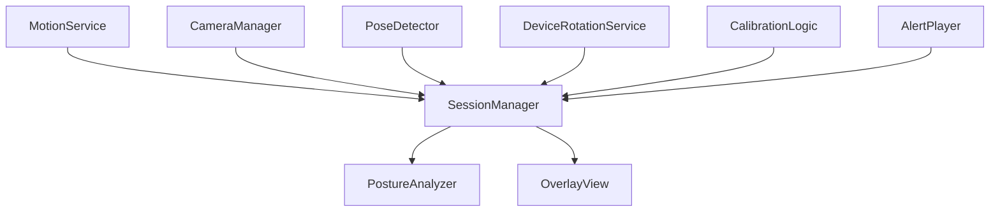
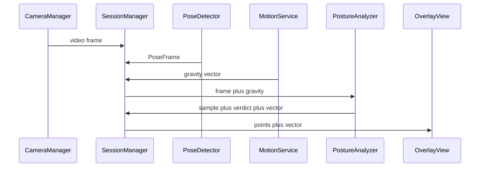

# Design: nekoze-fix

## Overview

**Purpose**: 猫背検知アプリ NekozeFix の耳ー肩角度の主基準を、両肩ライン直交から天方向（端末計測の重力反対方向）に一本化する。判定・校正・表示を同一基準に統一し、設置傾きに対する頑健性を向上させる。
**Users**: デスクワーカーが端末をデスクに置くだけで、正面・斜め設置のいずれでも安定した猫背通知を受ける。
**Impact**: `PostureAnalyzer` の基準ベクトル算出を変更し、`MotionService` を新設する（三段解決は Analyzer 内 `resolve` に同梱）。近側選択・距離OR・3秒ゲート・通知・暗転・ライフサイクルの振る舞いは変えない。

### Goals

- 4.1 の天方向基準・三段フォールバック鎖（重力→肩ライン直交→画像垂直）を実装する
- 4.9 の基準線表示と校正の一貫性を実現する（代替中は無区別表示）
- 既存アーキテクチャ（Types → Domain → Services → Session → UI）と純粋性制約を維持する
- 全受入基準に対するテスト可能性を確保する

### Non-Goals

- 回転中（transient）の判定停止配線の変更（7.2 は現状維持、既存ギャップとして残す。定常的な向き遷移後の自動再校正とは別物）
- 距離指標・近側選択・閾値体系の変更（ロック側欠測時のフォールバック枝削除を除く）
- 切替デバウンス秒数の要件化（設計値として 0.5 秒を採用し実装内に閉じる）
- バックグラウンド監視・履歴・クラウド等の Out 範囲

## Boundary Commitments

### This Spec Owns

- 天方向基準ベクトルの取得・変換・解決（重力→画像座標投影、三段フォールバック鎖、無効判定としきい値）
- `analyze` への重力注入と角度算出の一本化、判定・校正・表示での同一ベクトル使用
- 基準線描画の重力対応（通常時と代替時で同一の見た目）
- モーション権限文言と黙過フォールバック（監視を妨げない）
- 重力の取得と単一 0.5 秒ホールド（デバイス姿勢・鏡像の同時取得は不要。出力バッファはインターフェース向きに自動回転し Vision には `.up` 固定で渡るため。14.2 実機知見）
- 向き変化時（monitoring中のみ）の自動再校正遷移（旧基準・ゲート破棄、再校正完了まで監視停止。grill Q3/Q5/Q6決定）

### Out of Boundary

- カメラ・Vision・音声・暗転・スリープ抑止・ライフサイクルの既存振る舞い（変更しない）
- 回転検出ロジックは `ios17-baseline` スペックの `DeviceRotationService` に一本化済み（本スペックでは参照のみ）
- カスタム通知音・履歴・ヘルスケア連携等の Out 項目

### Allowed Dependencies

- Apple frameworks のみ: SwiftUI, Combine, AVFoundation, Vision, CoreMotion, UIKit, AudioToolbox（サードパーティ追加なし）
- 既存層の再利用: `TimedConditionGate`、`CalibrationLogic`（無改修で利用）。デバイス姿勢の購読と出力接続の向き同期は Session 側の別系統であり、`MotionService` は参照しない。`DeviceRotationService`（`ios17-baseline` スペック）から回転角を購読し、Session で角度変換・再生成指示を行う。`DeviceOrientationMonitor` は削除済み。`CameraSessionManager` の鏡像情報の読取りは行わない
- 依存方向は Types → Domain → Services → Session → UI を厳守し、Domain は Services を参照しない（重力は値として注入）

### Revalidation Triggers

- `ReferenceVector` の形状・フォールバック順序・無効判定しきい値の変更
- 重力→天方向の変換則の変更（正規化・平置き判定含む）
- `analyze` シグニチャの変更
- 単一ホールド秒数の変更
- 向き変化時の自動再校正遷移の条件・破棄方針の変更
- モーション権限文言の削除・ブロッキング化
- オーバーレイ基準線の見た目変更（無区別原則の破棄）

## Architecture

### Existing Architecture Analysis

- 単方向レイヤード構成。Domain は副作用なし純粋関数。Session（`@MainActor`）が唯一の状態所有者。
- `PostureAnalyzer.analyze` が基準ベクトル `perp` を内部算出しているため、重力対応の自然な拡張点は引数注入である。
- `snapshot.videoAspectRatio`・EMA 平滑・personMissing／shoulderMissing 猶予（各 0.5 秒）の前例があり、フォールバック保持時間の設計前例として流用できる。
- `captureOutput` は出力バッファがインターフェース向きに自動回転して配信されるため Vision に `.up` 固定で渡す（`PostureSessionManager.captureOutput`、`connection.videoOrientation` は参考値）。キーポイント空間上向きは画面上向きと一致する。一方、デバイス座標の天方向 `K=normalize(−gx,−gy)` はセンサ固定のため、バッファ座標系で表すには直近capture角θの(θ−90°)回転が必要である（coordinator角はセンサ基準でポートレート90°・ランドスケープ0°/180°。landscape実機不具合の修正。回転はSession受渡し時に適用し、取得式自体は向き非依存のまま）。

### Architecture Pattern & Boundary Map


```mermaid
graph TB
    MotionService --> SessionManager
    CameraManager --> SessionManager
    PoseDetector --> SessionManager
    DeviceRotationService --> SessionManager
    SessionManager --> PostureAnalyzer
    SessionManager --> OverlayView
    CalibrationLogic --> SessionManager
    AlertPlayer --> SessionManager
```

**Architecture Integration**:
- 既存レイヤードの維持＋値注入。重力は Services で取得し Domain へ値渡しする。回転角は `ios17-baseline` スペックの `DeviceRotationService` から取得し Session で購読する。
- Domain boundaries: 解決（`resolve`）・判定（Analyzer）・取得（MotionService）を分離し、三段解決は Analyzer 内に一本化する。
- Existing patterns preserved: 純粋 Domain、Session 集約、猶予パターン、無改修の校正・ゲート・通知。
- New components rationale: MotionService（取得と単一ホールド）、ReferenceVector 型（判定と表示の同一性保証）。
- Steering compliance: steering 欠如のためコード実測＋ADR-0017 に準拠。

### Technology Stack

| Layer | Choice / Version | Role in Feature | Notes |
|-------|------------------|-----------------|-------|
| Services | CoreMotion CMMotionManager / iOS 17.0 | 重力取得 | プラットフォーム標準を採用、自作傾き推定は不採用 |
| Services | AVFoundation RotationCoordinator / iOS 17.0 | 回転角取得 | `ios17-baseline` スペックの `DeviceRotationService` 経由で取得 |
| Domain | Swift 構造体 純粋関数 | 解決・角度算出 | 新規依存なし |
| UI | SwiftUI 既存 Overlay | 基準線描画 | 見た目変更なし |
| Config | Info plist NSMotionUsageDescription | 権限文言 | カメラ文言の既存方式に倣う |

## File Structure Plan

### Directory Structure

```
NekozeFix/
├── Types/PostureTypes.swift          # 追加: ReferenceVector
├── Domain/PostureAnalyzer.swift      # 改修: 重力注入＋resolve同梱
├── Services/MotionService.swift      # 新設: 取得＋変換＋単一ホールド
├── Session/PostureSessionManager.swift # 改修: 所有＋注入＋表示受渡し
├── UI/PostureOverlayView.swift       # 改修: ベクトル入力＋無区別描画
└── Info.plist                        # 改修: モーション文言
他は無改修（CalibrationLogic / TimedConditionGate / Camera / PoseDetector / AlertPlayer / OrientationMonitor / SettingsStore / MonitorView 他）。
```

### Modified Files

- `NekozeFix/Types/PostureTypes.swift` — `ReferenceVector`（`SIMD2<Double>` の typealias、単位ベクトル）を追加
- `NekozeFix/Domain/PostureAnalyzer.swift` — `gravityInKeypointSpace: SIMD2<Double>? = nil` 引数追加、内部 `perp` 算出を同ファイル内 `resolve` 静的関数に置換、旧 `0.5` コメントを `0.3` に修正
- `NekozeFix/Session/PostureSessionManager.swift` — MotionService 所有・起動停止、フレーム毎注入、解決ベクトルの表示受渡し
- `NekozeFix/UI/PostureOverlayView.swift` — `referenceVector: CGVector` 入力追加（非オプショナル、プレビューはダミー垂直）
- `NekozeFix/Info.plist`＋`project.pbxproj` — `NSMotionUsageDescription` 追加（日英二文、カメラ文言方式に倣う）
- `NekozeFixTests/PostureAnalyzerTests.swift` — 重力注入対応と傾斜肩テスト期待値の更新
- `NekozeFixTests/PostureAnalyzerResolveTests.swift` — 新設（`resolve` のベクトル値と角度を検証）
- `NekozeFixTests/MotionServiceTests.swift` — 新設（変換・単一ホールド検証）

## System Flows


```mermaid
sequenceDiagram
    CameraManager ->> SessionManager: video frame
    PoseDetector ->> SessionManager: PoseFrame
    MotionService ->> SessionManager: gravity vector
    SessionManager ->> PostureAnalyzer: frame plus gravity
    PostureAnalyzer ->> SessionManager: sample plus verdict plus vector
    SessionManager ->> OverlayView: points plus vector
```

変換・解決・フォールバックの分岐は以下に集約する。時間保持は MotionService 内に閉じ、新規ゲート型は作らない。

```mermaid
stateDiagram_v2
    gravity: gravity primary
    shoulder: shoulder fallback
    vertical: image vertical final
    gravity --> shoulder: invalid over hold time
    shoulder --> vertical: shoulders unavailable
    shoulder --> gravity: gravity valid
    vertical --> gravity: gravity valid
    vertical --> shoulder: gravity invalid
```

Key Decisions: 保持時間 0.5 秒は personMissing／shoulderMissing の既存前例に合わせた設計値であり要件ではない。復帰は即時。校正の定数（5 秒・5 度・7 窓）は不変。

## Requirements Traceability

変更分のみ記載する。既存動作の要件は `requirements.md` に委譲し、ここでは重複列挙しない。

| Requirement | Summary | Components | Interfaces | Flows |
|-------------|---------|------------|------------|-------|
| 2.7 | 天方向基準で登録 | Analyzer, Session | 重力注入・解決 | sequence |
| 3.1 | 監視開始停止 | Session | 既存＋Motion 起停 | sequence |
| 4.1 | 天方向鋭角・三段代替・OR | Analyzer, MotionService | 解決・注入 | state, sequence |
| 4.5 | 閾値ガイド表示 | OverlayView, Session | ガイドパラメータ受渡し | sequence |
| 4.9 | 基準線表示と校正一貫・無区別 | OverlayView, Session, Analyzer | ベクトル受渡し | sequence |
| 6.2 | 暗転中継続 | Session | 既存＋Motion 継続 | — |
| 8.1 | 背景移行で停止 | Session | 既存＋Motion 停止 | — |
| 8.2 | 復帰時再開 | Session | 既存＋Motion 再開 | — |
| 9.1 | 電池 1時間15pct以下 | MotionService | 起停・間隔 1/30 | — |
| 2.3, 2.4, 7.1 | 向き変化時の自動再校正遷移 | Session, CalibrationLogic | setPhase経由の遷移・旧基準破棄 | sequence |

## Components and Interfaces

| Component | Domain/Layer | Intent | Req Coverage | Key Dependencies (P0/P1) | Contracts |
|-----------|--------------|--------|--------------|--------------------------|-----------|
| PostureAnalyzer | Domain | 角度算出と OR 判定＋三段解決（`resolve` 同梱） | 2.7, 3.5, 4.1, 4.3, 4.5, 4.6 | Types (P0) | Service |
| MotionService | Services | 重力取得・変換・単一ホールド | 4.1, 3.1, 9.1 | CoreMotion (P0 外) | Service, State |
| DeviceRotationService | Services | 回転角取得・配信・再生成 | 2.1, 2.2, 2.3, 2.4 | RotationCoordinator (P0 外) | Service, State |
| PostureSessionManager | Session | 所有・注入・表示受渡し・回転購読 | 2.7, 3.1, 4.9, 8.1, 8.2, 2.3, 2.4, 7.1 | Motion (P0), Analyzer (P0), Overlay (P0), Rotation (P0) | State |
| PostureOverlayView | UI | 基準線描画（無区別）＋閾値ガイド表示 | 4.9, 4.5 | Session snapshot (P0) | State |

### Domain

#### 三段解決 `resolve`（`PostureAnalyzer.swift` 内 private 静的関数）

| Field | Detail |
|-------|--------|
| Intent | 重力・肩直交・画像垂直の三段解決を純粋に所有する |
| Requirements | 4.1 |

- 入力は重力値（キーポイント空間、任意）とフレームのみ。時刻・状態を持たない。
- 解決順序は gravity → shoulderLine → imageVertical に固定する。肩直交の算出式は現行式をそのまま移設する。常に単位ベクトル相当（長さ 1±1e-9）を返す。

##### Service Interface

```swift
// PostureAnalyzer.swift 内
private static func resolve(
  gravityInKeypointSpace: SIMD2<Double>?,
  frame: PoseFrame
) -> ReferenceVector
```

- Integration: Analyzer からのみ呼ぶ。Session は直接呼ばない（単一解決）。
- Validation: 下記 Resolver テストでベクトル値と角度を検証する。
- Risks: 変換則の誤りは角度オフセットになるが、校正が定数分を吸収するため致命化しない。直立端末＋直立人物で約 0 度の不変条件テストで検出する。

### Domain

#### PostureAnalyzer（改修）

| Field | Detail |
|-------|--------|
| Intent | 解決済み基準線との鋭角算出と OR 判定を担う |
| Requirements | 2.7, 3.5, 4.1, 4.3, 4.5, 4.6 |

**Responsibilities & Constraints**
- 近側選択・ヒステリシス・距離 OR・鋭角化の現行則を維持する。
- ロック側ペア欠測のフレームでは距離条件をスキップし角度のみで判定する（反対側代用なし、grill Q1決定）。`fallbackReferenceDistance` 枝と Session 側の遠側基準構築は削除する。
- 基準線は同ファイル内 `resolve` に集約する（Session からの二重解決なし）。

**Dependencies**
- Inbound: Session — フレーム毎呼出し（Criticality P0）
- Outbound: Types — AngleSample 等（Criticality P0）

**Contracts**: Service [x] / API [ ] / Event [ ] / Batch [ ] / State [ ]

##### Service Interface

```swift
func analyze(
  frame: PoseFrame,
  referenceNearAngleDegrees: Double?,
  slouchDeltaThresholdDegrees: Double,
  distanceMetric: DistanceMetric?,
  slouchDistanceThresholdPercent: Double,
  previousNearSide: Side?,
  gravityInKeypointSpace: SIMD2<Double>?
) -> (sample: AngleSample?, verdict: PostureVerdict, referenceVector: ReferenceVector)
```

- Preconditions: gravity は MotionService 変換済みか nil。nil は代替解決を意味する。
- Postconditions: 角度は 0〜90 度の鋭角。sample は近側・遠側情報を従来通り含む。
- Invariants: gravity 以外の入力が同一なら従来と同一の近側・距離・判定を返す。

**Implementation Notes**
- Integration: Session のみ新引数を渡す。
- Validation: 傾斜肩テストの期待値を重力基準に更新する。
- Risks: 既存テストの大量更新が必要。AngleSample の拡張は本設計では行わない（最小化）。

### Services

#### DeviceRotationService（ios17-baseline スペックで実装済み）

`ios17-baseline` スペック（task 2.1）で実装済み。本スペックでは参照のみ。

| Field | Detail |
|-------|--------|
| Intent | 回転角の取得・配信・再生成を単一所有する（`ios17-baseline` スペック所有） |
| Requirements | 2.1, 2.2, 2.3, 2.4, 3.1, 3.2, 4.1 |

**Responsibilities & Constraints**（`ios17-baseline` 設計書より抜粋）
- `AVCaptureDevice.RotationCoordinator` を所有し、preview 用・capture 用の回転角（度）を `@Published` で配信する
- カメラ確定時・プレビュー層出現時に Session が `recreate` を呼ぶ
- デバイス姿勢不明時はイベントを発火せず直前の有効角を保持する
- UIDevice 通知の購読・自前換算表・フォールバック推定を持たない

**Service Interface**
```swift
final class DeviceRotationService {
  init(device: AVCaptureDevice, previewLayer: AVCaptureVideoPreviewLayer?)
  @Published private(set) var previewRotationAngle: CGFloat // 度
  @Published private(set) var captureRotationAngle: CGFloat // 度
  func recreate(for device: AVCaptureDevice, previewLayer: AVCaptureVideoPreviewLayer?)
  func start()
  func stop()
}
```

#### MotionService（新設）

| Field | Detail |
|-------|--------|
| Intent | 重力の取得・画像座標変換・無効保持を所有する |
| Requirements | 4.1, 3.1, 9.1 |

**Responsibilities & Constraints**
- `CMMotionManager.deviceMotion` を 1/30 間隔（定数）で取得する。監視・校正中のみ動作させる。
- 天方向 `K = normalize(−gx, −gy)` をそのまま有効ベクトルとして保持する。出力バッファはインターフェース向きに自動回転して配信され Vision には `.up` 固定で渡すため（`PostureSessionManager.captureOutput`）、キーポイント空間上向きは画面上向きと一致し、デバイス姿勢別の回転・鏡像は不要である（14.2 実機知見。旧デバイス姿勢別変換表は撤去）。
- 無効（z 支配の平置き・未取得・権限拒否）は直前有効値を 0.5 秒ホールドし（単一タイマ、設計値・実装内に閉じる）、超過で nil を返す。回復時は即時復帰する。ユーザー通知はしない（黙過フォールバック）。
- **基準ベクトル切替時の校正・ゲート整合性**: 重力↔肩ライン直交↔画像垂直のいずれかへ切り替わった瞬間（nil→非nil復帰含む）に、以下を実行する
  1. 現在の校正値（referenceAngle/referenceDistance/referenceSide/referencePoints/calibrationReferenceSource）を破棄
  2. 猫背ゲートをリセット
  3. Session を calibrating フェーズへ遷移させ、再校正完了まで監視を停止
  これにより基準ベクトルの定義域変化に伴う角度比較の不整合を防ぐ。向き変更時の自動再校正（grill Q3/Q5）と同一ポリシーで扱う。

**Dependencies**
- Inbound: Session — 起停と値参照（Criticality P0）
- Outbound: CoreMotion — 取得（Criticality P0 External）

**Contracts**: Service [x] / API [ ] / Event [ ] / Batch [ ] / State [x]

##### Service Interface

```swift
final class MotionService {
  init() // CMMotionManager 実体・1/30・0.5s ホールドは内部定数。向きは持たない（Session 側の向き購読・出力接続の向き同期とは別系統）
  var latestGravityInKeypointSpace: SIMD2<Double>? // テストは@testableで直接代入（サブクラス不要、prod 分岐なし）
  func start()
  func stop()
}
```

- Preconditions: start は監視・校正開始時に呼ばれ、stop は停止・背景移行時に呼ばれる。
- Postconditions: 返値は単位化済みか nil。nil は代替解決への合図である。
- Invariants: シミュレータ・権限拒否・平置きでは持続的に nil を返す。

##### State Management

- State model: 直前有効ベクトル＋最終有効時刻・動作有無のみ保持し、永続化しない。
- Persistence & consistency: プロセス内メモリのみ。
- Concurrency strategy: 全状態更新・参照を @MainActor に集約する。motionQueue コールバックからは `Task { @MainActor in self?.ingest(...) }` でメインへ安全に値を渡す。start()/stop() も @MainActor 実行で同期。最新値の上書きのみで競合なし。

**Implementation Notes**
- Integration: Session は start/stop のみ結線する（provider 配線なし）。向き・鏡の読取りは持たない。
- Validation: 向き非依存の変換テスト（傾き鏡像回帰含む）＋単一ホールドテスト＋平置き無効テスト。
- Risks: バッテリは起停限定と 1/30 間隔で抑制する。実機検証タスクを残す。

##### 変換則（取得は向き非依存・受渡し時に(θ−90°)回転、14.2 実機知見＋landscape修正で確定）

- 合成規則: 天方向 `K = normalize(u)`、`u = (−gx, −gy)`。出力バッファはインターフェース向きに自動回転して配信され Vision には `.up` 固定で渡すため（`PostureSessionManager.captureOutput`）、キーポイント空間上向きは画面上向きと一致する。ただしKはデバイス座標系の値であり、バッファ座標系のキーポイントと混ぜる前に直近capture角θの(θ−90°)回転を適用する（Session受渡し時。未確定時は無回転。coordinator角はセンサ基準のためポートレート90°起点の補正となる）。デバイス姿勢別の回転表・鏡像は不要のままである。
- 旧表（grill Q2決定の向き別4行）はセンサ固定フレームの誤った想定＋前面鏡の適用誤りであり、縦持ち右傾きで緑線が鏡像反転する実機不具合として発覚したため撤去した（黄線＝キーポイントは正しく左傾き、緑のみ右傾きという観測が決定打）。
- 世界直立人物の耳ー肩ベクトルは全向きで K と一致し、向き毎の直立約0度の不変条件が成立する。
- 平置き（z支配）は nil で代替鎖へ退行させる。
- 向き遷移後の定常ズレは自動再校正遷移で吸収する（grill Q3決定）。
- 回転中（transient）の判定停止配線は本 spec の対象外のまま。単一ホールドは重力欠測時の切替振動対策に限定する。

### Session

#### PostureSessionManager（改修）

| Field | Detail |
|-------|--------|
| Intent | Motion 所有・重力注入・解決ベクトルの表示受渡し・回転角購読を追加する |
| Requirements | 2.7, 3.1, 4.9, 8.1, 8.2, 2.3, 2.4, 7.1 |

**Responsibilities & Constraints**
- 既存の状態機械・ゲート・通知・暗転・スリープ則は変えない。
- 向き変化時（monitoring中のみ）は自動再校正遷移を行う（grill Q3/Q5決定）: `referenceAngle/referenceDistance/referenceSide` と猫背ゲートを破棄し `calibrating` へ遷移、再校正完了まで監視を停止する（grill Q6決定）。トリガは `DeviceRotationService` の `captureRotationAngle` 変更通知（`handleRotationAngleChange(preview:capture:)`）で検知する。calibrating中・idle・同一角の再通知は対象外。
- `isLandscape` 導出は `captureRotationAngle` を用い、正規化角度区間 [45°, 135°) と [225°, 315°) を portrait、それ以外を landscape とする。ヒステリシスなし。
- 重力ベクトルのバッファ座標系変換には `captureRotationAngle` を用い `(θ-90°)` 回転を適用する（デバイス座標系→バッファ座標系）。背面カメラ・ランドスケープ時はさらに 180° 補正する。
- カメラ確定時・プレビュー層出現時に `DeviceRotationService.recreate` を指示する（`ios17-baseline` スペック task 4.1 の順序保証に従う）。
- Motion 起停と完全同一箇所で回転サービスの起停を駆動する（暗転中継続・背景移行停止を含む）。
- Overlay に渡すベクトルは `analyze` が返した `referenceVector` をそのまま受渡しする（単一解決、二重解決なし）。

**Dependencies**
- Inbound: UI intents — 既存（Criticality P0）
- Outbound: MotionService — 起停と参照（Criticality P0）
- Outbound: DeviceRotationService — 起停・再生成指示・角度購読（Criticality P0）
- Outbound: OverlayView — 点列＋ベクトル（Criticality P0）

**Contracts**: Service [ ] / API [ ] / Event [ ] / Batch [ ] / State [x]

##### State Management

- State model: snapshot に `referenceVector: CGVector`（表示専用、非オプショナル）を追加。
- Persistence & consistency: 既存通り非永続。
- Concurrency strategy: `@MainActor` 既存則に従う。

**Implementation Notes**
- Integration: start 系で Motion 起動、stop 系と背景移行で停止する。暗転中は継続する。
- Validation: TestDouble 重力での processDetection 結合テストを追加する。
- Risks: snapshot 追加は UI 再描画のみに影響し、判定には影響しない。

### UI

#### MonitorView / CalibrationView（改修）

| Field | Detail |
|-------|--------|
| Intent | カメラ切り替えUIを監視中のみ非表示にする |
| Requirements | 3.6 |

**Responsibilities & Constraints**
- MonitorView: `.monitoring` フェーズではカメラ位置ピッカーを非表示
- CalibrationView: `.calibrating` フェーズではカメラ位置ピッカーを表示継続
- `.idle` フェーズでも表示許可

**Implementation Notes**
- Phase 判定は `sessionManager.snapshot.phase` で行う
- 既存のカメラ切替ロジック（`settingsStore.cameraPosition` 変更 → `restartCameraPipeline`）は無改修

#### PostureOverlayView（改修）

| Field | Detail |
|-------|--------|
| Intent | 判定と同一の基準線を通常の見た目で描画する。閾値スライダー操作中は上限・下限ガイドを重ね描画する。 |
| Requirements | 4.9, 4.5 |

**Responsibilities & Constraints**
- `referenceVector: CGVector`（非オプショナル）を肩点起点に描画し、色・太さを変えない（無区別原則）。プレビューはダミー垂直ベクトルを渡す。
- **閾値ガイド（操作中のみ）**:
  - 角度閾値: **グレーのキャリブレーション基準線（基準角度）に対して** ± 現在閾値 の位置に **破線の緑弧**（半径 80pt、基準弧と同中心・同半径）。既存の「現在」弧（緑実線）と色統一。
  - 距離閾値: キャリブレーション基準肩点 `pS` を起点とする基準耳肩ベクトル `v` 方向の延長線上に、上限距離 `baselineDist × (1 + threshold/100)` の位置を示す **グレーの単一ドット** を描く（耳より上部）。猫背判定は上限超過のみのため下限は表示しない。角度ガイドとは分離表示し、距離スライダー操作中のみ表示する。
  - いずれも **ドラッグ中（onDrag）のみ表示**。スライダー種別切替時は即座に前ガイド消去・新ガイド表示。
  - 数値ラベルは出さない（スライダー横の数値表示で十分）。

**Implementation Notes**
- Integration: AspectFit 補正は点列と同一の係数をベクトル・ガイドに適用する。
- 角度ガイド弧: `referenceArc` と同一の中心・半径・座標変換を使い、開始/終了角を `greenAngle ± deltaThreshold` にする。中心はキャリブレーション基準肩点（referencePointsForGuide[5]）。
- 距離ガイドドット: 中心角（校正時耳肩方向）と上限距離 `upperDistance(baselineDistance:thresholdPercent:)` から `distanceThresholdPoint(startPoint:centerAngle:upperDistance:)` で算出した点をグレー円で描画する。`showDistanceGuide` 時のみ表示し、角度ガイド線とは独立させる。下限ドット・下限弧は描画しない。
- Validation: 実機目視（縦・横・代替時、両スライダー操作）を確認タスクにする。
- Risks: 既存描画に加算のみで影響小さい。ガイド状態は `PostureOverlayView` へ追加引数で渡す（Session はスライダー操作フラグを保持しない）。

## Data Models

### Domain Model

- `ReferenceVector`（`SIMD2<Double>` の typealias）: 不変条件は単位長。正規化責任は `MotionService.convert`（重力経路）と `resolve` 内の肩直交・画像垂直経路が各々負い、Session の `SIMD2→CGVector` 変換は方向保存のみで正規化しない。単一コンストラクタの導入は将来の拡張とし、本設計では責任分担の明記に留める。
- 既存の `PoseFrame / Keypoint / AngleSample / DistanceMetric / CalibrationProgress` は不変。`CalibrationProgress.completed` の `referenceFar*` は旧遠側基準の残滓であり、Session は `_, _` で破棄して近側のみ使用する（11.1で距離型の予備基準は削除済み、13.1で Session 側の遠側構築は削除済み）。永続化なし。

## Error Handling

### Error Strategy

- 重力系の異常はすべて silent fallback で吸収し、監視を止めない（4.1、Adjacent 決定）。
- ユーザー向けエラー表示の追加はしない。

### Error Categories and Responses

- 無効重力（未対応端末・権限拒否・平置き・変換失敗）→ 肩直交→画像垂直の鎖で継続
- モーション停止中（idle・背景）→ nil 扱いで同鎖に委譲
- 変換則の無効入力（平置き等）→ nil 扱い（クラッシュさせない）

## Testing Strategy

- Unit Tests: `resolve` 三段解決（重力優先・肩退行・画像垂直終端）、Analyzer 重力注入（直立 0 度・前屈増加・傾斜肩の新期待値・OR 維持）、Motion 変換（向き非依存の K=normalize(−gx,−gy)・傾き鏡像回帰）と単一 0.5 秒ホールド・平置き無効・直立不変条件、近側ヒステリシス回帰、**閾値ガイド弧/線の幾何計算（角度: greenAngle±delta、距離: 中心線延長上の上限単一ドットの位置）**、DeviceRotationService 角度配信・再生成・不明時維持（`ios17-baseline` スペック task 2.2・5.1 で検証済み）
- Integration Tests: Session 結合（TestDouble 重力で校正→基準保存→猫背→3 秒確定→改善停止）、代替中も同一ベクトルで判定表示が一致すること、背景・停止での Motion 停止、**閾値スライダー操作中のガイド表示/非表示・切替挙動**、回転角変更→自動再校正遷移の結合（TestDouble 角度注入で検証、`ios17-baseline` スペック task 4.2 で検証済み）
- E2E/UI Tests: 実機で縦置き校正→前屈アラート、斜め設置での安定性、代替時の見た目不変の目視、回転前後の復帰
- Performance/Load: フレーム処理 33ms 以内、Motion 1/30 時の 1 時間電池 15pct 以内（既存目標の維持確認）

## Migration Strategy

- 段階なしの一括移行。旧肩直交テストの期待値更新を同 PR に含める。
- ロールバックは本ブランチの revert のみ。永続データがないため移行手順は不要。
- `Info.plist` 文言追加はビルド時検証、権限拒否は代替パスで検証する。

## Supporting References

- ADR-0017 重力基準一本化、ADR-0008 superseded 注記、`CONTEXT.md` 天方向定義
- 詳細な調査ログは `.kiro/specs/nekoze-fix/research.md` の Gap Analysis 追記部を参照

## Open Questions / Risks

- 変換則の取得式は向き非依存（K=normalize(−gx,−gy)）で確定済み。受渡し時は直近capture角の(θ−90°)回転を適用する（landscape修正）。旧向き別表の残滓がないか注意。向き遷移後のオフセット変化は自動再校正遷移で吸収する。
- `DeviceRotationService` の KVO 通知遅延（実測約1秒）が自動再校正トリガの発火遅延に影響する可能性。`ios17-baseline` スペックで実機測定・吸収確認済み（回転→自動再校正発火 2秒以内）。
- 校正 5 度閾値は角度分布変化でリセット頻発の可能性があり、実機で要否を判断する（設計値は変えない）。
- シミュレータでは重力が恒常 nil となり代替パスのみ検証できる。実機レーンの確保が前提である。

---
*Design generated: 2026-09-28（対象: 2026-09-28改訂要件、Discovery: light／Extension、grill Q1〜Q11 反映）*
*改訂 2026-09-28: 設計レビュー指摘3件を反映（Session 単一解決の明記、P0 写像の固定）*
*改訂 2026-09-28（レビュー条件対応）: 校正出所変化リセット、向き遷移時再校正推奨、重力×向き同時取得＋単一ホールドを追加*
*改訂 2026-09-28（ponytail）: Resolver を Analyzer 内関数に同梱、MotionService を `init()`＋内部定数＋サブクラス差替えに簡素化、二重 0.5s を単一ホールドに統合、Overlay を非オプショナル化*
*改訂 2026-09-28（ponytail-2）: stale 互換注記・print ログ・二重 Optional・x/y 分割・ ceremony 表・出所リセット/推奨フラグを削除*
*改訂 2026-09-28（ponytail-3）: ReferenceSource を削除し ReferenceVector を SIMD2 別名に一本化、MotionService を@testable 代入に簡素化、三つ組保持を有効ベクトル保持に縮約、Traceability・File Structure を差分のみに削減*
*改訂 2026-09-28（grill R1・R2）: Q1距離スキップ一本化（fallback枝削除）、Q2変換表の全組み合わせ固定、Q3/Q5/Q6向き変化時の自動再校正遷移（monitoring限定・旧基準破棄）、Q7境界更新、Q4用語集反映（CONTEXT.md）*
*改訂 2026-09-29（14.2 実機検収）: 向き別変換表を撤去し向き非依存の K=normalize(−gx,−gy) に一本化（縦持ち右傾きで緑線が鏡像反転する実機不具合対応。黄線＝キーポイントは正しく左傾き、緑のみ右傾きの観測が決定打）*
*改訂 2026-10-02（landscape実機不具合）: Kの取得式は向き非依存のまま、Session受渡し時に直近capture角の−θ回転を適用（デバイス座標→バッファ座標の90°ずれ対応。代替経路は回転なし。ReferenceVectorRotationTestsで検証）*
*改訂 2026-10-02（実機規約の是正）: coordinator角はセンサ基準でありポートレート90°・ランドスケープ0°/180°を取ることが9th実機の悪化報告で確定（WWDC23 10106と整合）。回転を(θ−90°)に、isLandscape対応表を90°±45°/270°±45°→portraitへ是正。従来表は合成テストの注入値のみで検証され実機値と逆転していた*
*改訂 2026-10-03（ios17-baseline 統合）: DeviceOrientationMonitor 削除・DeviceRotationService 参照へ一本化、回転角購読を handleRotationAngleChange に変更、isLandscape 判定を capture角ベースに統一、重力ベクトル回転に captureRotationAngle 使用。ios17-baseline スペック task 5.2 完了済み*
