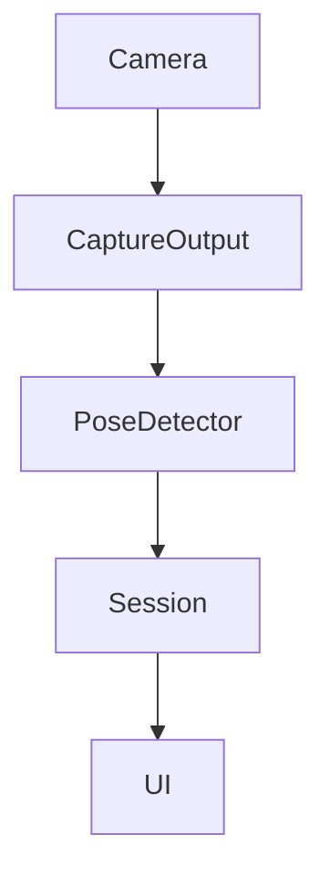
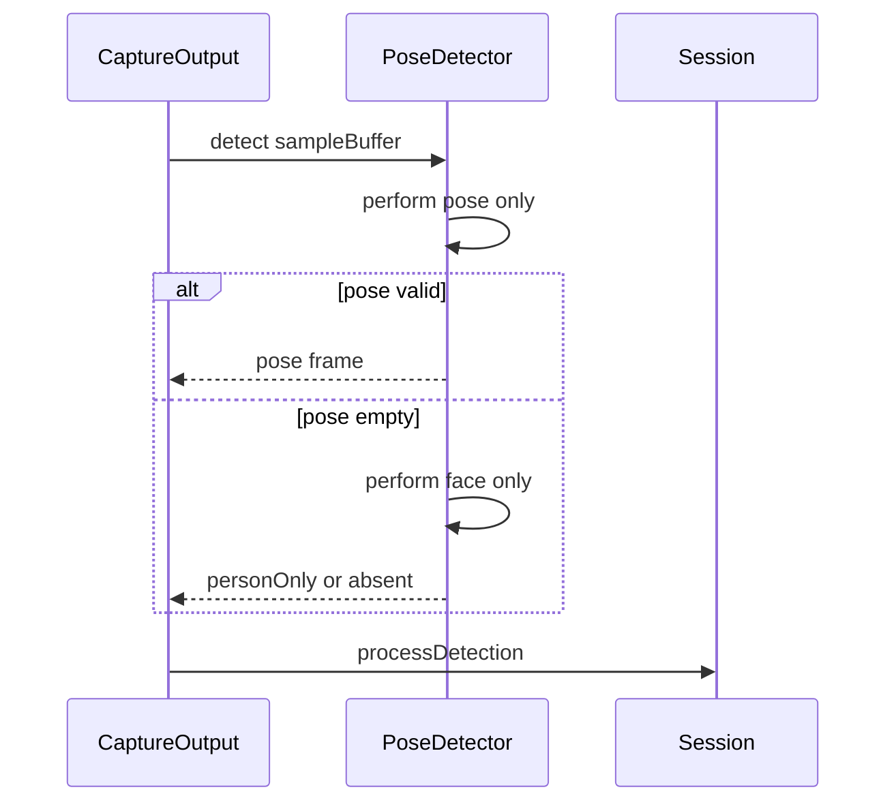
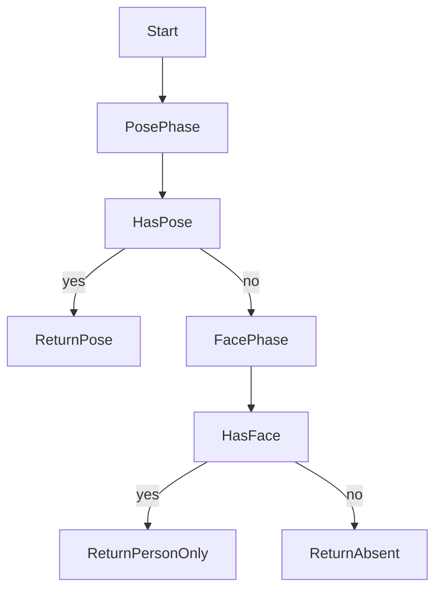

# Design: vision-face-conditional

## Overview

本機能はPoseDetector内部のVision推論実行順序を変更し、人体姿勢が有効な結果を返したフレームでは顔検出を省略する。人物検出の意味（姿勢あり・人物あり姿勢不明・人物不在の3値）は現行と同一に保ち、呼び出し側とスレッド構造には触れない。

**Purpose**: 本機能は長時間監視中の不要な顔推論を削減し、姿勢検知精度を維持したままバッテリー消費を抑える価値を利用者に届ける。

**Users**: 長時間の姿勢監視を行うデスクワーカーが、操作変更なしに省電力の恩恵を受ける。効果を検証する開発者が、成功経路と失敗経路の推論回数・推論時間を実測で把握する。

**Impact**: PoseDetector.detect内部の無条件2リクエスト同時実行を、姿勢優先の二段階実行に変える。公開署名と3値の意味は不変である。

### Goals

- 姿勢有効フレームでの顔推論を省略し、人物検出の意味を現行と同一に保つ
- キーポイント不足時のみ顔検出で人物有無を判定し、接写俯き等の誤不在判定を防ぐ
- 成功経路と失敗経路の推論回数・推論時間を実測で記録する

### Non-Goals

- 推論頻度の制限・間引き（vision-fps-throttleの範囲）
- 検出実行スレッド構造やMainActor hopの変更（mainactor-throttleの範囲）
- 顔検出の完全削除、判定ロジック自体の変更、表示・通知・暗転・動作検知の変更

## Boundary Commitments

### This Spec Owns

- PoseDetector.detect内部のリクエスト実行順序と条件分岐（姿勢優先・顔フォールバック）
- 顔フェーズへ進む条件の定義（姿勢観測ゼロ件のみ）
- 推論回数・推論時間の計測値の所有と読み出し形式
- 条件付き実行後の3値意味の同一性保証とその検証

### Out of Boundary

- カメラ映像の取得頻度・推論FPS制御
- captureOutputのスレッド配置とMainActorへの受け渡し方式
- snapshot更新・UI表示・通知音・暗転・動作検知の最適化
- 角度・距離閾値・3秒確定・信頼度閾値・近側選択則の変更

### Allowed Dependencies

- 上流制約としてnekoze-fix仕様§3.4・§4の人物検出意味と判定前提（変更は許さない）
- VisionとAVFoundationの既存利用（新規依存の追加は許さない）
- Session層のprocessDetectionと既存テスト（呼び出し互換を保つ）

### Revalidation Triggers

- detectの公開署名や3値の意味の変更は、下流の間引きspecとhop削減specの再検証を要する
- 顔フェーズ条件に信頼度や点数の持ち込みは、人物検出意味の変更として再検証を要する
- 計測値の形式変更は、下流specへの引き渡しの再確認を要する
- Session層の閾値・猶予・遷移への波及は、本specの範囲外として別specでの扱いを要する

## Architecture

### Existing Architecture Analysis

現行はcaptureOutput（detectionQueue上の同期実行）がPoseDetector.detectを呼び、detectは顔と姿勢の2リクエストを同一performで実行する。結果合成は姿勢結果優先であり、姿勢観測が1件でもあれば顔結果は破棄される。検出層は信頼度フィルタを持たず全点を保持し、向き別閾値はSession層が適用する。依存方向はTypes → Domain → Services → Session → UIであり、本変更はServices層のPoseDetector内部に閉じる。

### Architecture Pattern & Boundary Map



**Architecture Integration**:

- Selected pattern: 二段階条件実行（姿勢フェーズ成功時は顔フェーズ短絡）
- Domain/feature boundaries: 実行順序の所有はPoseDetector、意味解釈の所有はSessionの既存則、表示の所有はUIの既存則
- Existing patterns preserved: 姿勢結果優先の合成順序、中央人物選択、信頼度のSession層適用、detectionQueue同期実行＋MainActor受け渡し
- New components rationale: 計測値を錠付き小構造体に隔離し、推論点での取りこぼしをなくす
- Steering compliance: 新規依存なし、実測なき効果記載なし、3秒確定の意味不変、依存方向の維持

### Technology Stack

| Layer | Choice / Version | Role in Feature | Notes |
|-------|------------------|-----------------|-------|
| Services / Vision | 既存の人体姿勢・顔矩形検出 | 二段階実行の対象 | 新規導入なし、版上げなし |
| Services / 計測 | 標準の錠と時刻取得 | 回数と時間の記録 | 永続化なし、送出なし |

## File Structure Plan

### Directory Structure

変更は既存2ファイルに局在し、新規ファイルは作らない。

### Modified Files

- `NekozeFix/Services/PoseDetector.swift` — 姿勢優先の二段階実行への変更、顔フェーズ条件の定義、錠付き計測値の追加
- `NekozeFixTests/PoseDetectorTests.swift` — 条件分岐と計測の検証追加、既存の意味保存検証の維持
- `NekozeFix/Session/PostureSessionManager.swift` — 変更なし（呼び出し互換の確認対象）

## System Flows





- 姿勢フェーズの成否は観測の有無のみで決め、信頼度や点数は用いない
- 姿勢リクエスト失敗時は顔フェーズへ進み、現行の顔フォールバック到達性を保つ
- 実行例外時は人物不在を即返しする現行則を維持する

## Requirements Traceability

| Requirement | Summary | Components | Interfaces | Flows |
|-------------|---------|------------|------------|-------|
| 1.1 | 姿勢有効時の顔省略 | 条件実行器 | 検出契約 | 二段階フロー |
| 1.2 | 有効連続中の省略継続 | 条件実行器 | 検出契約 | 二段階フロー |
| 1.3 | 省略時の結果同一性 | 条件実行器 | 検出契約 | 二段階フロー |
| 1.4 | 全nil姿勢の顔省略（grill Q2） | 条件実行器 | 検出契約 | 二段階フロー |
| 2.1 | 不足時の顔実行 | 条件実行器 | 検出契約 | 顔フォールバック |
| 2.2 | 顔のみの人物あり姿勢不明 | 条件実行器 | 検出契約 | 顔フォールバック |
| 2.3 | 両方なしの人物不在 | 条件実行器 | 検出契約 | 顔フォールバック |
| 2.4 | 複数人時の中央選択 | 条件実行器 | 検出契約 | 二段階フロー |
| 3.1 | 人物不在警告の維持 | 呼出互換 | 検出契約 | 変更なし |
| 3.2 | 向き別信頼度閾値の維持 | 呼出互換 | 検出契約 | 変更なし |
| 3.3 | 片側継続の維持 | 呼出互換 | 検出契約 | 変更なし |
| 3.4 | 近側選択則の維持 | 呼出互換 | 検出契約 | 変更なし |
| 3.5 | 肩欠測猶予則の維持 | 呼出互換 | 検出契約 | 変更なし |
| 4.1 | 未検出時の校正完了抑止 | 呼出互換 | 検出契約 | 変更なし |
| 4.2 | 3秒確定意味の維持 | 呼出互換 | 検出契約 | 変更なし |
| 4.3 | 即時改善の維持 | 呼出互換 | 検出契約 | 変更なし |
| 4.4 | 基準復帰の維持 | 呼出互換 | 検出契約 | 変更なし |
| 4.5 | 猶予・保持・平滑の維持 | 呼出互換 | 検出契約 | 変更なし |
| 5.1 | 成功経路の省略回数計数 | 推論計測器 | 計測契約 | 計測読出 |
| 5.2 | 失敗経路の実行回数計数 | 推論計測器 | 計測契約 | 計測読出 |
| 5.3 | 両経路の推論時間記録 | 推論計測器 | 計測契約 | 計測読出 |
| 5.4 | 実測なき効果記載の禁止 | 推論計測器 | 計測契約 | 検証記録 |
| 6.1 | 算出結果の非回帰 | 条件実行器、呼出互換 | 検出契約 | 二段階フロー |
| 6.2 | 監視体験の非回帰 | 呼出互換 | 検出契約 | 変更なし |
| 6.3 | 他用途顔利用の保護 | 条件実行器 | 検出契約 | 調査済み |

## Components and Interfaces

| Component | Domain/Layer | Intent | Req Coverage | Key Dependencies (P0/P1) | Contracts |
|-----------|--------------|--------|--------------|--------------------------|-----------|
| 条件実行器 | Services / PoseDetector | 姿勢優先の二段階実行と同一意味合成 | 1.1, 1.2, 1.3, 1.4, 2.1, 2.2, 2.3, 2.4, 6.1, 6.3 | Session呼出互換 (P0) | Service |
| 推論計測器 | Services / PoseDetector | 両経路の回数と時間の記録 | 5.1, 5.2, 5.3, 5.4 | 条件実行器 (P0) | State |
| 呼出互換 | Session / 既存則 | 3値処理と遷移則の維持 | 3.1, 3.2, 3.3, 3.4, 3.5, 4.1, 4.2, 4.3, 4.4, 4.5, 6.2 | 条件実行器 (P0) | State |

### Services / PoseDetector

#### 条件実行器

| Field | Detail |
|-------|--------|
| Intent | 姿勢フェーズ成功時は顔を省略し、観測ゼロ件時のみ顔を実行する |
| Requirements | 1.1, 1.2, 1.3, 1.4, 2.1, 2.2, 2.3, 2.4, 6.1, 6.3 |

**Responsibilities & Constraints**

- 姿勢リクエスト単独の実行と観測有無の判定を担う
- 観測ゼロ件時のみ顔リクエスト単独を実行する
- 観測あり・4点全nilのPoseFrameも成功経路とみなして顔を省略し、.pose経路（ホールド継続）で処理して.personOnly経路とは別扱いを維持する（grill Q2・ADR-0021）
- 合成順序は現行と同一（姿勢優先、次に顔有無）とし、信頼度や点数を分岐に持ち込まない

**Dependencies**

- Inbound: Session層のcaptureOutput — 検出呼び出し（P0）
- Outbound: Vision推論 — 姿勢と顔の段階的実行（P0）

**Contracts**: Service [x] / API [ ] / Event [ ] / Batch [ ] / State [ ]

##### Service Interface

```swift
func detect(sampleBuffer: CMSampleBuffer, orientation: CGImagePropertyOrientation) -> Detection
```

- Preconditions: 有効な画像バッファを受け取る。無効時は人物不在を返す
- Postconditions: 姿勢観測ありは姿勢結果、顔のみは人物あり姿勢不明、両方なしは人物不在を返す。姿勢有効時は顔推論を実行しない
- Invariants: 公開署名不変。複数人時は中央人物選択。信頼度フィルタはSession層に残す

**Implementation Notes**

- Integration: 呼び出し側の変更なし。detectionQueue同期実行とMainActor受け渡しは維持する
- Validation: 両経路の到達性と合成同一性をテストで検証する
- Risks: 分岐への信頼度混入は意味変更になるため、観測有無のみに限定する

#### 推論計測器

| Field | Detail |
|-------|--------|
| Intent | 成功経路と失敗経路の推論回数・推論時間を記録する |
| Requirements | 5.1, 5.2, 5.3, 5.4 |

**Responsibilities & Constraints**

- 顔省略回数、顔実行回数、各フェーズの累積推論時間を錠で保護して保持する
- 読み出しは複写で行い、永続化と外部送出は行わない

**Dependencies**

- Inbound: 条件実行器 — 実行点での計数（P0）
- Outbound: なし（検証時の読み出しのみ）（P2）

**Contracts**: Service [ ] / API [ ] / Event [ ] / Batch [ ] / State [x]

##### State Management

- State model: 省略回数、顔実行回数、姿勢推論累積時間、顔推論累積時間
- Persistence & consistency: プロセス内メモリのみ。錠による一貫性確保
- Concurrency strategy: 検出スレッドからの更新と検証時の読み出しを錠で直列化する

**Implementation Notes**

- Integration: 計測の有無で検出結果を変えない
- Validation: 両経路の計数が進むことを単体検証し、実機で両経路の実測を記録する
- Risks: 実測前の削減率記載は禁止し、未計測項目は明記する

### Session / 既存則

#### 呼出互換

| Field | Detail |
|-------|--------|
| Intent | 3値処理と校正・監視遷移則を現行のまま維持する |
| Requirements | 3.1, 3.2, 3.3, 3.4, 3.5, 4.1, 4.2, 4.3, 4.4, 4.5, 6.2 |

**Responsibilities & Constraints**

- 本specでの変更対象外であり、呼び出し互換の確認対象である

**Dependencies**

- Inbound: 条件実行器 — 3値の受け取り（P0）

**Contracts**: Service [ ] / API [ ] / Event [ ] / Batch [ ] / State [x]

##### State Management

- State model: 既存のsnapshot・ゲート・猶予則を維持する
- Persistence & consistency: 変更なし
- Concurrency strategy: 変更なし

**Implementation Notes**

- Integration: processDetectionの3経路処理は無変更である
- Validation: 既存テストの回帰で確認する
- Risks: 変更の波及が見つかれば本specの範囲外として扱う

## Data Models

本機能は新規の領域情報を作らない。計測値は上記の推論計測器の状態に閉じ、検出結果の型と3値の意味は現行のままである。

## Error Handling

### Error Strategy

現行の失敗到達性を維持し、失敗時に顔フォールバックの機会を奪わない。

### Error Categories and Responses

- 姿勢リクエスト内の個別失敗: 記録して顔フェーズへ進み、人物有無の判定機会を保つ
- 実行全体の例外: 人物不在を即返す現行則を維持する
- 無効バッファ: 人物不在を返す現行則を維持する

### Monitoring

推論計測器の回数と時間により、成功経路と失敗経路の到達を検証時に確認する。

## Testing Strategy

- Unit Tests: 姿勢観測ありでの顔省略、観測ゼロ件での顔実行、両方なしでの人物不在、中央人物選択の維持、両経路の計数進行
- Integration Tests: processDetectionの3経路（姿勢・人物のみ・不在）の回帰、校正完了抑止と監視遷移の維持
- E2E/UI Tests: 該当なし（表示変更なし）
- Performance/Load: 実機での両経路の推論回数・推論時間の実測記録、入力FPSと推論回数の独立確認（NFR 8.1との整合は検証で確認し推定記載しない）
