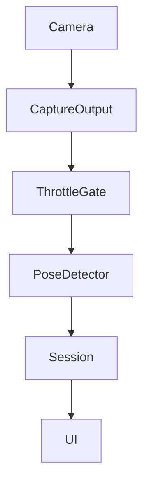
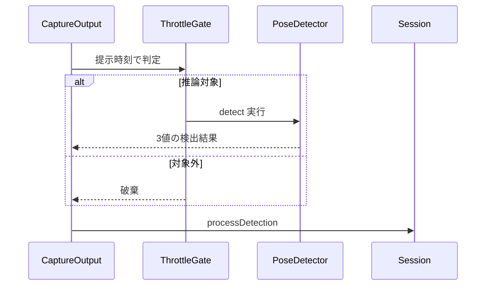
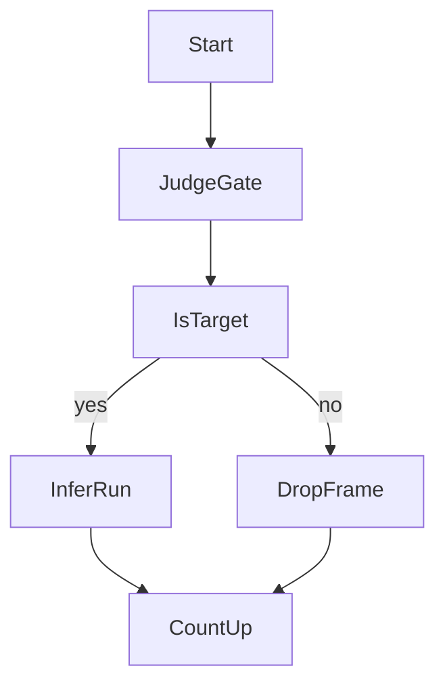

# Design: vision-fps-throttle

## Overview

本機能は共有呼出点 `captureOutput` の先頭に時刻基準の間引き判定を置き、推論対象外フレームを検出実行前に破棄する。カメラ入力はネイティブレートのまま維持し、Vision推論の実行頻度だけを上限以下に抑えることで、3秒確定判定の意味と判定算出を変えずに不要な推論を削減する。

**Purpose**: 本機能は判定に不要な高頻度推論によるバッテリー消費を抑え、入力FPSと推論FPSの実測に基づく省電力の土台を利用者に届ける。

**Users**: 長時間の姿勢監視を行うデスクワーカーが、操作変更なしに省電力の恩恵を受ける。効果を検証する開発者が、入力FPSと推論FPSを区別して実測で把握する。

**Impact**: 全フレームで検出を実行する現行の呼出点を、間引き通過フレームのみ検出する呼出点に変える。検出結果の3値の意味と呼び出し互換は不変である。

### Goals

- カメラ入力FPSとVision実行FPSを独立に制御・計測する
- 時刻基準の早期破棄により推論FPSを上限以下に抑える
- 推論待ち蓄積なく最新フレーム優先で動作し、重複実行を起こさない
- 現状実測値・15FPS・10FPSの比較に基づき制限値を選定する

### Non-Goals

- 顔条件化ロジック自体の変更（vision-face-conditionalの範囲）
- 検出実行スレッド構造やMainActor受け渡しの変更（mainactor-throttleの範囲）
- 3秒確定・角度／補正・カメラ解像度・プリセットの変更
- スナップショット書込み頻度・UI更新の間引き、動作検知・画面暗転モードの変更

## Boundary Commitments

### This Spec Owns

- 呼出点先頭の時刻基準の間引き判定と推論対象外フレームの早期破棄
- 入力FPS・推論FPSの個別計測値の所有と読み出し形式
- FPS制御状態の停止・再開時の初期化
- 推論FPS上限の設定方法と実測比較による選定

### Out of Boundary

- 顔検出の要否判断ロジック（vision-face-conditionalが所有し、本specは通過フレームを渡すのみ）
- 検出実行スレッド配置とMainActorへの受け渡し方式
- 3秒確定ゲート・0.5秒系猶予・ホールド・平滑化・信頼度閾値・近側選択則の変更
- カメラ解像度・プリセット・遅延破棄の運用、通知音・暗転・動作検知の変更

### Allowed Dependencies

- 上流制約としてnekoze-fix仕様§4.2・NFR 8.1・0.5秒系定数（変更は許さない）
- vision-face-conditionalの検出契約（3値の意味と呼出互換、処理順序は間引き→条件化）
- AVFoundationの提示時刻と既存の検出・セッション層（新規依存の追加は許さない）

### Revalidation Triggers

- 間引き判定の基準が時刻以外に変わる場合は、下流の条件化specとhop削減specの再検証を要する
- 計測値の形式変更は、下流specへの引き渡しの再確認を要する
- 処理順序「間引き→条件化」の変更は、本specの前提崩壊として再検証を要する
- 判定系の猶予・平滑への波及は、本specの範囲外として別specでの扱いを要する

## Architecture

### Existing Architecture Analysis

現行はcaptureOutput（detectionQueue上の同期実行）が全フレームで `PoseDetector.detect` を呼び、結果をMainActorへhopしてprocessDetectionへ渡す。入力経路はネイティブレートで動作し、alwaysDiscardsLateVideoFramesが遅延破棄を担うが、推論FPSの上限は存在しない。確定ゲートと全猶予則は時刻差分で駆動し、フレーム到着回数に依存しない。依存方向はTypes → Domain → Services → Session → UIであり、本変更はSession層の呼出点と新規の純粋ロジックに閉じる。

### Architecture Pattern & Boundary Map



**Architecture Integration**:

- Selected pattern: 呼出点先頭の時刻ゲートによる早期破棄（入力は素通し、推論のみ制限）
- Domain/feature boundaries: 間引き判定の所有は新規の判定器、検出意味の所有は既存の条件化、遷移則の所有は既存のSession則
- Existing patterns preserved: 検出キュー同期実行とMainActor受け渡し、姿勢優先の合成順序、時刻差分駆動の確定・猶予則
- New components rationale: 判定則を純粋な値型に隔離し、カメラなしで単体検証できるようにする
- Steering compliance: 新規依存なし、実測なき効果記載なし、3秒確定の意味不変、依存方向の維持

### Technology Stack

| Layer | Choice / Version | Role in Feature | Notes |
|-------|------------------|-----------------|-------|
| Services / AVFoundation | 既存の取得基盤 | 提示時刻の提供 | 新規導入なし |
| Session / Swift | 既存の呼出点と新規の判定器 | 間引き結線と計測 | 新規依存なし |

## File Structure Plan

### Directory Structure

変更はSession層に局在し、新規ファイルは判定器の1件のみである。

### Modified Files

- `NekozeFix/Session/FrameThrottle.swift` — 新規。時刻ゲート判定・計数・初期化を持つ値型
- `NekozeFix/Session/PostureSessionManager.swift` — captureOutput先頭へのゲート結線、停止・再開経路からの初期化呼び出し
- `NekozeFix/Services/CameraSessionManager.swift` — 変更なし（入力経路と遅延破棄運用の確認対象）
- `NekozeFix/Services/PoseDetector.swift` — 変更なし（条件化契約の確認対象）
- `NekozeFixTests/FrameThrottleTests.swift` — 新規。判定則・初期化・計数の単体検証
- `NekozeFixTests/PostureSessionManagerTests.swift` — 結線と非回帰の検証追加

## System Flows





- 間引き判定は提示時刻の間隔基準で行い、到着順序や推論所要時間には従属しない
- 無効時刻のフレームは推論実行側に倒し、検出欠落を起こさない
- 判定状態の初期化は停止・再開経路から検出キューへ配送し、同一キュー上で「FrameThrottle.reset() → MainHopGate.reset()」の順に直列実行する

## Requirements Traceability

| Requirement | Summary | Components | Interfaces | Flows |
|-------------|---------|------------|------------|-------|
| 1.1 | 入力FPS計測 | FPS計測器 | 計測契約 | 計測読出 |
| 1.2 | 推論FPS計測 | FPS計測器 | 計測契約 | 計測読出 |
| 1.3 | 計測値読出し | FPS計測器 | 計測契約 | 計測読出 |
| 2.1 | 早期破棄 | 間引き判定器、呼出統合 | 判定契約 | 間引きフロー |
| 2.2 | 時刻間隔基準 | 間引き判定器 | 判定契約 | 間引きフロー |
| 2.3 | 上限遵守 | 間引き判定器 | 判定契約 | 間引きフロー |
| 2.4 | 間引き後条件化 | 間引き判定器、呼出統合 | 判定契約 | 呼出順序 |
| 3.1 | 最新優先 | 呼出統合 | 判定契約 | 間引きフロー |
| 3.2 | 重複実行防止 | 間引き判定器 | 判定契約 | 間引きフロー |
| 3.3 | 遅延破棄維持 | 呼出統合 | 判定契約 | 変更なし |
| 4.1 | 3秒確定維持 | 判定非回帰 | 既存契約 | 変更なし |
| 4.2 | 算出非回帰 | 判定非回帰 | 既存契約 | 変更なし |
| 4.3 | 猶予平滑維持 | 判定非回帰 | 既存契約 | 変更なし |
| 4.4 | 解像度不変 | 判定非回帰 | 既存契約 | 変更なし |
| 5.1 | 実測比較選定 | 間引き判定器 | 設定契約 | 検証記録 |
| 5.2 | 固定禁止 | 間引き判定器 | 設定契約 | 検証記録 |
| 5.3 | NFR整合検証 | FPS計測器 | 計測契約 | 検証記録 |
| 6.1 | 停止再開初期化 | 間引き判定器、呼出統合 | 判定契約 | 初期化順序 |
| 6.2 | 実行場所維持 | 呼出統合 | 判定契約 | 変更なし |
| 6.3 | 周辺振舞維持 | 呼出統合 | 判定契約 | 変更なし |
| 6.4 | 書込間引きなし | 呼出統合 | 判定契約 | 変更なし |
| 7.1 | 計測記録 | FPS計測器 | 計測契約 | 検証記録 |
| 7.2 | 推定記載禁止 | FPS計測器 | 計測契約 | 検証記録 |
| 7.3 | 未計測明記 | FPS計測器 | 計測契約 | 検証記録 |

## Components and Interfaces

| Component | Domain/Layer | Intent | Req Coverage | Key Dependencies (P0/P1) | Contracts |
|-----------|--------------|--------|--------------|--------------------------|-----------|
| 間引き判定器 | Session / FrameThrottle | 時刻間隔による推論対象選定と上限遵守 | 2.1, 2.2, 2.3, 2.4, 3.2, 5.1, 5.2, 6.1 | 呼出統合 (P0) | Service, State |
| FPS計測器 | Session / FrameThrottle | 入力と推論の計数と読出し | 1.1, 1.2, 1.3, 5.3, 7.1, 7.2, 7.3 | 間引き判定器 (P0) | State |
| 呼出統合 | Session / PostureSessionManager | 呼出順序と最新優先と初期化結線 | 2.1, 2.4, 3.1, 3.3, 6.1, 6.2, 6.3, 6.4 | 間引き判定器 (P0) | State |
| 判定非回帰 | Session・Domain / 既存則 | 確定・猶予・算出の現行維持 | 4.1, 4.2, 4.3, 4.4 | 呼出統合 (P0) | State |

### Session / FrameThrottle

#### 間引き判定器

| Field | Detail |
|-------|--------|
| Intent | 提示時刻の間隔により推論対象を選定し、上限を超える実行を抑える |
| Requirements | 2.1, 2.2, 2.3, 2.4, 3.2, 5.1, 5.2, 6.1 |

**Responsibilities & Constraints**

- 前回推論時刻との間隔が上限間隔以上ある場合のみ推論対象とする
- 無効時刻は推論対象として扱い、検出欠落を起こさない
- 同一フレームに対する二重判定を行わず、判定は呼出ごとに1回のみである
- 上限切替えは `setLimit(_:)` で受け付け、前回推論時刻を維持したまま次回判定から新上限間隔を適用する（dim-mode-savingからの判定中切替え受口）

**Dependencies**

- Inbound: 呼出統合 — 提示時刻の受取り（P0）
- Outbound: 条件化 — 通過フレームの検出実行（P0）

**Contracts**: Service [x] / API [ ] / Event [ ] / Batch [ ] / State [x]

##### Service Interface

```swift
struct FrameThrottle {
    mutating func shouldInfer(at timestamp: TimeInterval) -> Bool
    mutating func setLimit(_ fps: Double)
    mutating func reset()
}
```

- Preconditions: 提示時刻を秒単位で受け取る。無効値は推論対象として扱う。上限値は正のFPSとして受け取る
- Postconditions: 対象時は前回推論時刻を更新し、対象外時は状態を変えない。切替え時は前回推論時刻を維持し、次回判定から新上限間隔で評価する
- Invariants: 上限切替えは検出キュー経由で直列適用され、判定途中で割り込まない

##### State Management

- State model: 前回推論時刻、上限間隔（`setLimit(_:)` による切替え可）
- Persistence & consistency: プロセス内メモリのみ。検出キューへの閉じ込めで一貫性を保つ
- Concurrency strategy: 判定経路は検出キュー直列実行のため錠不要、初期化と上限切替えは同キューへ配送し直列適用する

**Implementation Notes**

- Integration: 検出呼出しの直前で判定し、通過分のみ条件化へ渡す
- Validation: 間隔境界・無効時刻・初期化直後および上限切替え後の振る舞いを単体検証する
- Risks: 基準の時刻以外への変更は下流の再検証を要する

#### FPS計測器

| Field | Detail |
|-------|--------|
| Intent | 入力到達と推論実行を区別して数え、検証時に読み出せるようにする |
| Requirements | 1.1, 1.2, 1.3, 5.3, 7.1, 7.2, 7.3 |

**Responsibilities & Constraints**

- 入力到達数、推論実行数、破棄数、推論累積時間を保持する
- 読み出しは複写で行い、永続化と外部送出は行わない
- 実測前の削減率記載には用いない

**Dependencies**

- Inbound: 間引き判定器 — 判定点での計数（P0）
- Outbound: なし（検証時の読み出しのみ）（P2）

**Contracts**: Service [ ] / API [ ] / Event [ ] / Batch [ ] / State [x]

##### State Management

- State model: 入力到達数、推論実行数、破棄数、推論累積時間
- Persistence & consistency: プロセス内メモリのみ。錠による一貫性確保
- Concurrency strategy: 検出スレッドからの更新と検証時の読み出しを錠で直列化する

**Implementation Notes**

- Integration: 計測の有無で検出結果と呼出順序を変えない
- Validation: 両計数の進行と読出しの複写性を単体検証し、実機で計測シナリオを記録する
- Risks: CPU使用率は計測器の対象外とし、外部計測で記録する

### Session / PostureSessionManager

#### 呼出統合

| Field | Detail |
|-------|--------|
| Intent | 間引き→条件化の順序で結線し、最新優先と初期化を保証する |
| Requirements | 2.1, 2.4, 3.1, 3.3, 6.1, 6.2, 6.3, 6.4 |

**Responsibilities & Constraints**

- 呼出点先頭で判定器を呼び、対象外フレームを検出実行前に破棄する
- 推論待ちの無制限蓄積を作らず、遅延破棄の既存運用を維持する
- 停止・再開経路から判定器の初期化を検出キューへ配送し、同一キュー上で「FrameThrottle.reset() → MainHopGate.reset()」の順に直列実行する（順序の正本は本specとし、mainactor-throttle側から参照する）

**Dependencies**

- Inbound: カメラ入力 — フレーム配信（P0）
- Outbound: 条件化 — 通過フレームの検出（P0）

**Contracts**: Service [ ] / API [ ] / Event [ ] / Batch [ ] / State [x]

##### State Management

- State model: 判定器の所有と初期化の配送（既存のsnapshot・ゲート・猶予則は不変）
- Persistence & consistency: 変更なし
- Concurrency strategy: 判定は検出キュー、結果受け渡しは既存のMainActor hopを維持する。停止・再開時の二重リセットは同一検出キューへ配送し「FrameThrottle.reset() → MainHopGate.reset()」の順で直列実行する

**Implementation Notes**

- Integration: 検出実行スレッド配置と結果受け渡しは現行のまま保つ
- Validation: 呼出順序・最新優先・再開直後の振る舞いを結合検証する
- Risks: 初期化の配送遅延は次フレーム基準で吸収される

### Session・Domain / 既存則

#### 判定非回帰

| Field | Detail |
|-------|--------|
| Intent | 確定・猶予・算出の既存則を現行のまま維持する |
| Requirements | 4.1, 4.2, 4.3, 4.4 |

**Responsibilities & Constraints**

- 本specでの変更対象外であり、呼び出し互換と算出同一性の確認対象である

**Dependencies**

- Inbound: 呼出統合 — 間引き通過後の検出結果の受け取り（P0）

**Contracts**: Service [ ] / API [ ] / Event [ ] / Batch [ ] / State [x]

##### State Management

- State model: 既存の確定ゲート・猶予・ホールド・平滑則を維持する
- Persistence & consistency: 変更なし
- Concurrency strategy: 変更なし

**Implementation Notes**

- Integration: 時刻差分駆動のため間引きで意味が変わらないことを回帰で確認する
- Validation: 既存テストの回帰に加え、間引き下での3秒確定と猶予則を検証する
- Risks: 変更の波及が見つかれば本specの範囲外として扱う

## Data Models

本機能は新規の領域情報を作らない。判定器の状態（前回推論時刻・上限間隔）と計測値（到達数・実行数・破棄数・推論累積時間）は FrameThrottle に閉じ、検出結果の型と3値の意味は現行のままである。

## Error Handling

### Error Strategy

検出機会の欠落を起こさず、既存の失敗到達性を維持する。

### Error Categories and Responses

- 無効な提示時刻: 推論実行側に倒し、検出機会を保つ
- 初期化配送の遅延: 次フレームの判定基準で吸収し、例外扱いしない
- 検出実行全体の例外: 人物不在を返す現行則を維持する

### Monitoring

FPS計測器の到達数・実行数・破棄数により、間引きの動作を検証時に確認する。

## Testing Strategy

- Unit Tests: 間隔境界での対象選定、無効時刻の実行側倒し、初期化直後および上限切替え後の振る舞い、両計数の進行と読出しの複写性
- Integration Tests: 呼出順序（間引き→条件化）の維持、停止・再開時の初期化、間引き下での3秒確定・猶予・ホールド則の回帰、遅延破棄運用の維持
- E2E/UI Tests: 該当なし（表示変更なし）
- Performance/Load: 実機での計測シナリオ（通常・暗転・不在・復帰・猫背・長時間）における入力FPS・推論FPS・推論時間・待ち時間・CPU使用率の記録、現状・15・10の比較、NFR 8.1との整合確認（推定記載なし、未計測明記）
